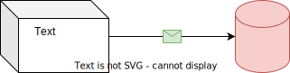

# OGS
Operator guidance system

## Documentation

The documentation is automatically generated from the ./doc subfolder using mkdocs (see [link](https://medienstudio.net/development-en/documentation-in-github-pages-with-mkdocs-readthedocs-theme/) for the setup) and published at [https://haller-erne.github.io/ogs/](https://haller-erne.github.io/ogs/).


## Editor and contributor notes

- To use the github web-based editor, press the `.` key (for more options, see [github.dev web-based editor](https://docs.github.com/en/codespaces/the-githubdev-web-based-editor)). Some hints:

    - If the (vscode-drawio)[https://github.com/hediet/vscode-drawio] extension is installed, adding `.drawio.svg`-files allows interactively editing these inside the editor (the `*.svg`-file can be linked using the `` in a markdown file to integrate a diagram).
    - See a sample here:  

- The documentation uses [MkDocs]() with the incredibly powerful [Material for MkDocs]() theme. Here are some quick hints:

   - [MkDocs Material Reference](https://squidfunk.github.io/mkdocs-material/reference/)
   - [Mkdocs Docmarks Cheat Sheet](https://yakworks.github.io/docmark/cheat-sheet/) - note, that this actually refers to the `Docmarks` theme and not the `Material` theme, but is nevertheless helpful.
   - Remember, that MkDocs can also render flowchats, (UML)diagrams, etc using [meremaid](https://mermaid.js.org/) - the following is a simple mermaid sequence diagram, for more details, see [MkDocs-Material Meremaid diagrams integration](https://squidfunk.github.io/mkdocs-material/reference/diagrams/)

      ``` mermaid
      sequenceDiagram
      autonumber
      Alice->>John: Hello John, how are you?
      loop Healthcheck
            John->>John: Fight against hypochondria
      end
      Note right of John: Rational thoughts!
      John-->>Alice: Great!
      John->>Bob: How about you?
      Bob-->>John: Jolly good!
      ```


