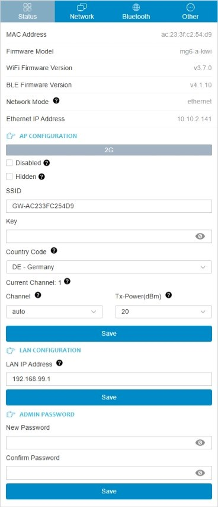
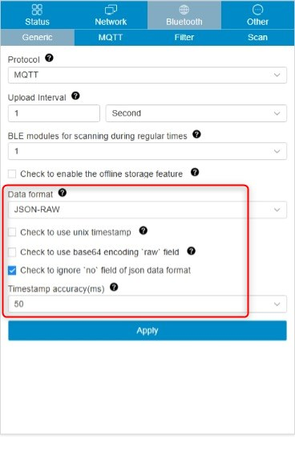
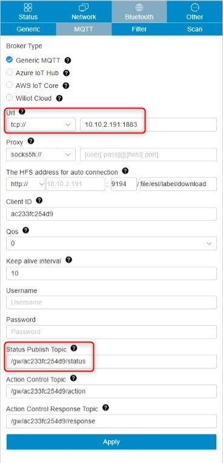
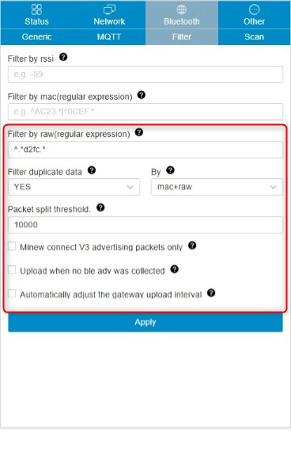
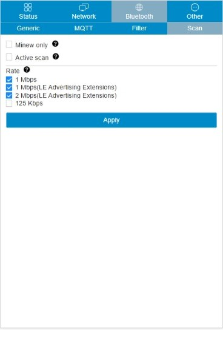

# Using Minew MG6 4G BLE Gateway for OGS

Using the [Minew MG6 4G Bluetooth Stellar Gateway](https://www.minew.com/product/mg6-4g-lorawan-stellar-gateway/) for OGS (e.g. to connect the [Shelly BLU Button](https://us.shelly.com/products/shelly-blu-button1-blue) or other [BTHome devices](https://bthome.io/)) has a lot of advantages compared to directly connected bluetooth low energy hardware:

- Deploy multiple Gateways to cover larger areas
- Compared to BLED112 (BlueGiga) USB dongles, no additional hardware needs to be attached to the PC running OGS (especially, if you are running OGS on tablet hardware)
- Compared to using builtin BLE hardware with the Windows BLE stack, it is much more reliable and not dependent on manufacturers Windows driver support.

## Prerequisites

The [Minew MG6 4G Bluetooth Stellar Gateway](https://www.minew.com/product/mg6-4g-lorawan-stellar-gateway/) works by sending BLE data to a MQTT broker. Therefore an MQTT broker must be installed somewhere in the network. All Gateway devices and all OGS stations will connect to this central server.

A commonly used MQTT broker is [Eclipse Mosquitto](https://mosquitto.org), which is available for all major operating systems.

## Wifi/LAN and MQTT configuration

After a factory reset, the Minew MG6 gateway device creates an open soft access point using the integrated wifi interface. For the initial configuration, connect to this AP (SSID name is `GW-xxxxxxxxxxxx`) and open a webbrowser at the default http://192.168.99.1 address. Log on as `admin` with a blank password.

The main page will show the current configuration - adjust the network settings (on the network tab) as needed for your environment:

## Configure MQTT output

Configuring the MQTT output is son in the `Bluetooth` menu in the `Generic` and `MQTT` pages.

The `Generic` page defines the main parameters, such as the protocol type (set to `MQTT`), the timing and the data format (make sure to select the `JSON-RAW` format). For a working configuration, see the following screenshot:

The `MQTT` page defines where to send the data - here you configure the MQTT broker address and connection parameters as well as the topic, where BLE advertisments are published. See the following screenshot for a working configuration:

## Configure BLE parameters

By default, the Gateway is preconfigured for the Minew devices and protocols. To use it with [BTHome](https://bthome.io/) type devices (like the [Shally BLU button](https://shelly-api-docs.shelly.cloud/docs-ble/Devices/BLU/button)), a few adjustments must be made to the default configuration. Also a filter should be set, so only the BTHome advertisments are received (to minimize network overhead).

The tabs `Filter` and `Scan` allow setting the relevant parameters.

The `Filter` page must use the regular expresson `^.*d2fc.*` to filter the raw advertisment data for the `BTHome` device class. Also duplicate events should be discarded - here is a working configuration:

Finally, the `Scan` page defines the type of BLE scan the device is using - for BTHome, only passive scans are needed. Here is a working configuration:

## OGS configuration

tbd.

