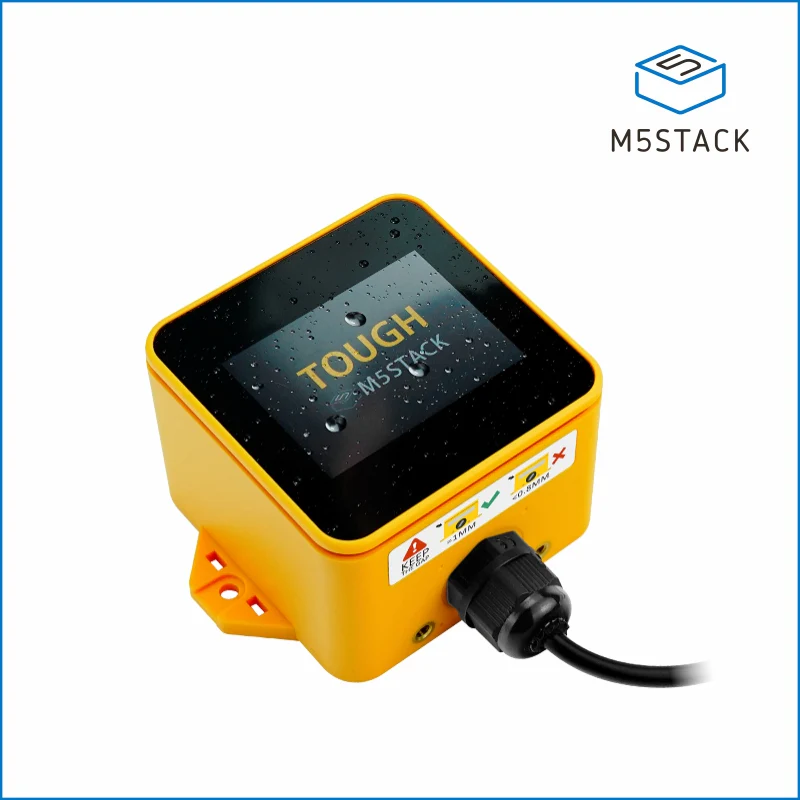
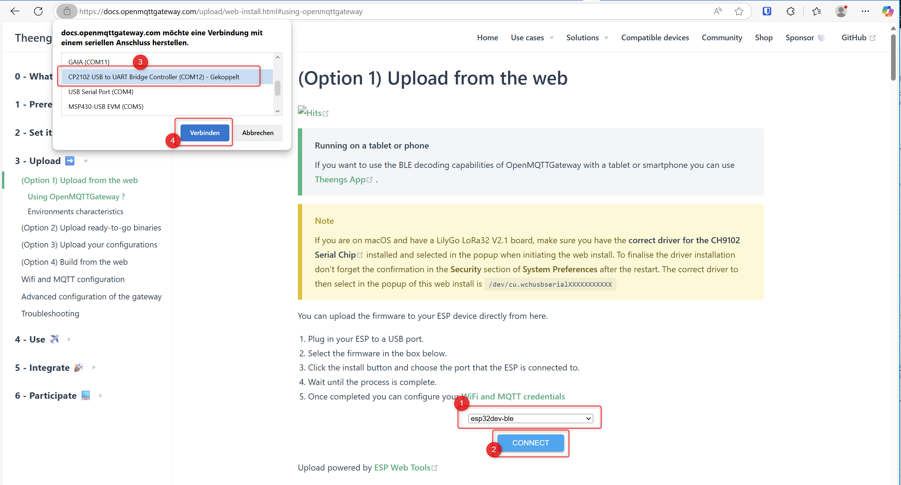

# Using OpenMQTTGateway for OGS

Using [OpenMQTTGateway](https://docs.openmqttgateway.com/) for OGS (e.g. to connect the [Shelly BLU Button](https://us.shelly.com/products/shelly-blu-button1-blue) or other [BTHome devices](https://bthome.io/)) has a lot of advantages compared to directly connected bluetooth low energy hardware:

- Deploy multiple OpenMQTTGateways to cover larger areas
- Compared to BLED112 (BlueGiga) USB dongles, no additional hardware needs to be attached to the PC running OGS (especially, if you are running OGS on tablet hardware)
- Compared to using builtin BLE hardware with the Windows BLE stack, it is much more reliable and not dependent on manufacturers Windows driver support.

The OpenMQTTGateway software uses widely available hardware and not only supports BLE, but also 433MHz, Lora, etc. (see [OpenMQTTGateway documentation](https://docs.openmqttgateway.com/)).

## Prerequisites

The OpenMQTTGateway works by sending BLE data to a MQTT broker. Therefore an MQTT broker must be installed somewhere in the network. All OpenMQTTGateway devices and all OGS stations will connect to this central server.

A commonly used MQTT broker is [Eclipse Mosquitto](https://mosquitto.org), which is available for all major operating systems.

## Gateway hardware preparation

Choose a suitable ESP32 device device from the [supported devices documentation](https://docs.openmqttgateway.com/prerequisites/board.html). As an example, we use an [m5Stack tough ESP32 module](https://shop.m5stack.com/products/m5stack-tough-esp32-iot-development-board-kit):

See the official documentation [here](https://docs.openmqttgateway.com/setitup/ble.html#compatible-parts) for a similar device setup.

Also (depending on your use case) POE devices are available, e.g. [ESP32-POE2](https://www.olimex.com/Products/IoT/ESP32/ESP32-POE2/) and the[enclosure BOX-ESP32-POE2](https://www.olimex.com/Products/IoT/ESP32/BOX-ESP32-POE2/):

## Firmware installation

To install the OpenMQTTGateway firmware, connect the device to your PC using the USB port. This should install a COM port in the PC as follows:

If you get an error connecting the device, then install the apropriate COM port device driver (see you hardware manual).

To install the firmware, go to the [OpenMQTTGateway web installer](https://docs.openmqttgateway.com/upload/web-install.html), select the correct firmware (the "standard" `esp32dev-ble` is the correct choice for most ESP32 boards with BLE support).

Click the "Connect" button to select the COM port and start connecting:

If the connection was successfully established, select the "INSTALL OPENMQTTGATEWAY" button to download the firmware:

If asked to erase the device, do so and acknowledge the firmware update, so the firmware update can start (apporx. 2 minutes):

## Wifi/LAN and MQTT configuration

After the firmware was installed, click the `LOGS & CONSOLE`button to open the device console. Now hit the `RESET DEVICE` button to reboot.

The log will now show the bootup messages:

This indicates, that the device is not connected to your wifi yet (or to the LAN for ethernet devices), so it needs to be configured.

This is done by connecting to the SSID provided in the logs (by default `OMG_ESP32_BLE`). So use your phone to connect to the given SSID. The Phone should ask you to "login to wlan" and redirect you to the `WIFIManager` page (if not, then manually connect to http://192.168.1.4 - or whatever is shown in the console logs above).

On the webpage, click the "Configure Wifi" button to set the wifi parameters and connecto to your network:

After connecting to the wifi network, the MQTT configuration can now be set:

## Configuring MQTT output

By default, the OpenMQTTGateway tries to connect to BLE devices. As we only need the advertisment data (for BTHome), we can configure the MQTT output by publishing the following data 

    {"pubadvdata":true, "onlysensors":true, "bleconnect":false}

to the configuration topic ()    

    home/OMG_ESP32_BLE/commands/MQTTtoBT/config

The change is reflected in the `BTtoMQTT` topic of the gateway device and the advertised data is immediately shown (see sample wiht RSSI change/button press for a BTHome device):

## OGS configuration

tbd.

