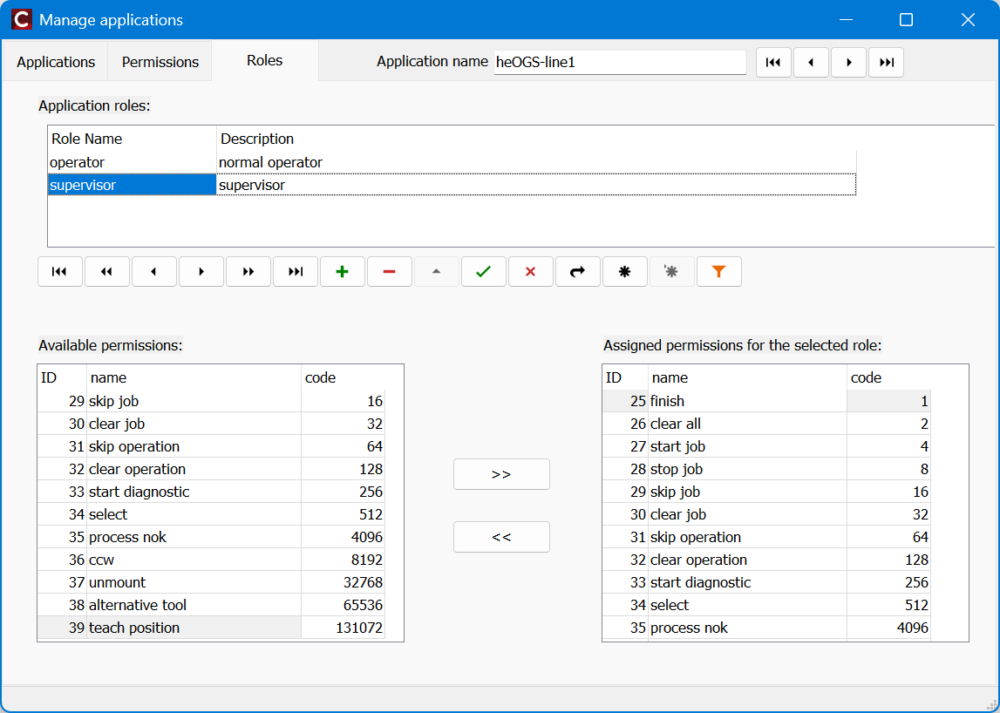

# OGS using heUserManager

For centralized user, group, role and rights management for OGS, heUserManagers central SQL database can be used.

This documents describes the steps needed for setting up the OGS end of things and explains the default behaviour and configuration options available.

## Feature overview

Using heUserManager allows centrally managing users and their rights. heUserManager uses the following entites to allow OGS to determine a users rights for the application:

- Rights: A right is some specific feature in an application, which can be enabled or disabled according to what a user is allowed to do. OGS has a fixed set of rights, which are added to the database (see below), so heUserManager can show verbose names.
- Roles: A role defines a set of rights of a single application. Each role has a distinct name and can be assigned to a user. 
- Application: An application defines roles, which consist of a set of rights. Note, that OGS allows to specify the "application name" in `station.ini`, so different stations can use different heUserManager applications for user management. 
- User: a user and his properties (like name, RFID card/tag, password). A user can have a number of roles assigned to him. The overall set of roles defines the rights of a user to access the applications.

## Prerequisites

The main task needed before OGS can use the cnetral heUserManager database for authentication are:

- Installing heUserManager database schema
- Installing heUserManager
- Adding an OGS application, rights and define roles

### Installing heUserManager

Download the latest version of heUserManager from [https://files.haller-erne.de/archive](https://files.haller-erne.de/archive?p=%2FSoftware%2FheUserManager). This mainl includes the following:

- `heUserManager.exe`: The user editor application. See the included pdf file for howto use it
- `heUserManager*.pdf`: The editor manual
- `heUserManager-Vx.y-schema.sql`: The database schema needed on the SQL server database
- `.\OGS`: Additional files for use with OGS:
    
    - `OGS Permissions Table.sql`: SQL script to add OGS permissions (see below)
    - `station [USER].ini`: sample ini file you can use for copy&paste into your OGS `station.ini` configuration
    - `*.lua`: the LUA files needed by OGS for using the heUserManager database
    
### Create the OGS application

After the database schema is installed, running heUserManager for the first time will add a superuser for the heUserManager application. For use with OGS it is recommended, that you create additional applications to define the OGS rights (add multiple applications, if you want to have different rights for the same user in different stations/lines/groups).

Although you can manually (using heUserManager) create the applications and rights, the following is faster:

1. Use heUserManager to create new applications (e.g. name it `OGS`, `OGS-Line1`, ...). Make a note of the application_ids generated by heUserManager. Then close heUserManager.
2. Open the `OGS Permissions Table.sql` file downloaded above and modify the application_id column to match your new OGS application name(s). Run the insert commands to add the list of OGS rights to the OGS application definition.
3. Open heUserManager again to create your roles (got to `Setup applications --> Roles` tab). Note that you can create as many roles as you like for each application - roles only group a set of rights and can be assigned to a user later.

Here is a sample how this should look:



## OGS setup

To setup OGS, copy the two LUA files into your projects folder:

- `user_manager_db.lua`: the high level LUA interface to be added to the `requires` table in `config.lua` 
- `user_db_heUserManager.lua`: the low-level SQL database access for user management

The `config.lua` file in you project should replace the `user_manager.lua` with the `user_manager_db.lua` as follows:

``` lua hl_lines="6" title="config.lua"
-- add the shared folder (..\shared)
OGS.Project.AddPath('../shared')

requires = {
	"barcode",
	"user_manager_db",           -- (1)!
    -- possibly more...
}
current_project.logo_file = '../shared/logo-rexroth.png'
current_project.billboard = 'billboard.html'
```

1.  Add this line to include the `user_manager_db.lua` heUserManager interface in the project.

In `station.ini` you can now use additional settings to define the database connection and logon behaviour. Update your `[USER]` section is `station.ini` as follows:

``` ini title="station.ini"
[USER]

; Define, if users should be logged out automatically after a configured 
; inactivity time (given in minutes). If autologoff is defined and set 
; to a nonzero value, users will be loggerd off automatically.
; Note, that the autologon user will never be logged out automatically!
autologoff=10

; Defines a connection string (may be encrypted, see docs) to connect to 
; the heUserManager database for centralized login information.
; If not defined or empty, then only local logon (password/rfid) is 
; (by default) available.
; NOTE: you should encrypt the connection string or use active directory
;       authentication (Trusted_Connection=yes) to avoid storing
;       credentials in plain text!
logonserver=Provider=SQLOLEDB.1;Persist Security Info=False;User ID=sys3xx;Password=sys3xx;Initial Catalog=heUserManager01;Data Source=QUALITYR

; Defines an additional user group parameter to check when querying the
; database. 
; If not defined or empty, then additional group membership is not checked.
logongroup=

; Defines the application ID to use when querying the heUserManager
; database. If not defined or empty, then application rights/roles are not
; used. 
; Leave empty to use the "old" behaviour (users OGSlevel is used instead
; application rights)
logonappid=heOGS-line1

; Defines, if the user cannot log on, if he is already logged on at
; another station. This requires that the heUserManager database is used
; (i.e. logonserver is defined) and that the database has the DB_LOCK_GET,
; DB_LOCK_RELEASE and DB_LOCK_REQUEST procedures
logonlock=1

```

## Notes and hints

- Fallback behaviour if no roles are assigned: uses the OGS level set in the users property.
- You can still use the `user=password,level,cardid` in the `[USER]` section for static accounts (but this is not recommended!).
