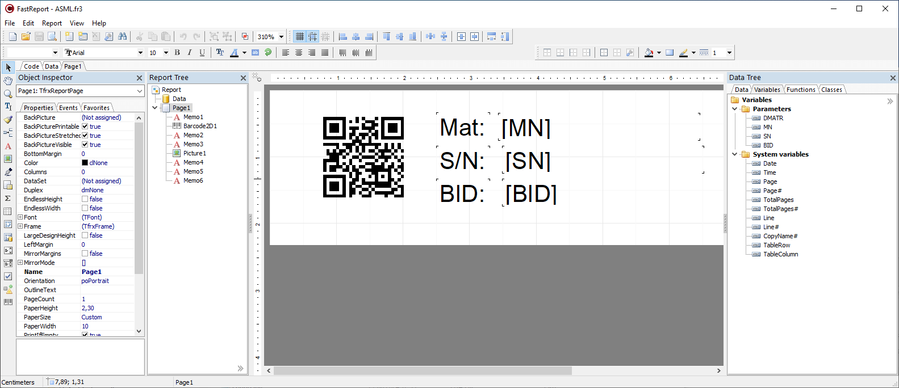

# Printout and label printing

## Overview

There is actually no direct support for printout in the OGS station runtime (monitor.exe). However, as printing is a pretty common use case (primarily
Label printouts or end-of-line result report sheets), there is support for
printing using a report generator.

This is usually used in one of the following ways:

- As a custom LUA tool which prints a label at some step in a workflow.
- As a pdf file creator (or sheet printout) at the end of the workflow to
  document al process steps done (station-build report or end-of-line
  report (with [Databanking](/docs/appnotes/databanking.md))).

Both features use either the `heLabelPrinter.exe` or the `locate.exe` helper applications shipped with OGS. `heLabelPrinter.exe` is mainly used, if no
SQL queries from the OGS `station.fds` database are needed, else `locate.exe`
is used. Both applications can run in two modes:

- Commandline mode: If called from a LUA file, commands and variables for 
  the reports are passed over the command line. The application does not show 
  a GUI window, but creates a file or a printout and exits after everything
  was completed.
- Interactive/GUI mode: For `heLabelPrinter.exe`, this allows to interactively
  edit the printing template. `locate.exe` also supports this, but can also
  be used to show data stored in the `station.fds` database - and create
  printing template with complex SQL queries.

Both applications use the [FastReport VCL](https://www.fast-report.com/public_download/docs/FRVCL/online/de/FastReportVCL/UserManual/de-DE/Designer.html) report generator to create and print/save the documents. See the [FastReport Online help](https://www.fast-report.com/public_download/docs/FRVCL/online/de/FastReportVCL/UserManual/de-DE/Designer.html) on how to create and test reports and how to create reusable report templates.

## Usage

### heLabelPrinter.exe

#### Design a report

To design a label, run the executable `heLabelPrinter.exe` without parameters. Click the button "Edit label template" to open the [FastReport template designer](https://www.fast-report.com/public_download/docs/FRVCL/online/de/FastReportVCL/UserManual/de-DE/Designer.html). 

The following screenshot shows a typical template with some variables (to be provided by a LUA script from OGS over the command line) and a generated 2D-barcode:



To add the report variables (as text) to the design surface, simply drag&drop from the "Variables" tab (on the right hand side). To create new variables, use the main menu `Report --> Variables...`. This will show the variable editor, where you can then add new variables.

To test the newly created report, got to `File --> Preview...`.

#### Execute a report (with variables)

To execute a report from the command line, the following syntax is used:

	heLabelPrinter.exe [key1=value1]...[keyN=valueN]

The following key values are defined:

- `form=`: Defines the report template to use
- `show=`: If set to `YES` then show the console progress window. 
- `output=`: Defines the printer name for printing the report or the output
   file name for saving the report (in pdf format)

All other key values are used as variable values for the report variables. If you specify e.g. `MN=123`, then the report variable `MN` will be set to `123` - this will then replace the template field accordingly.

Typical command lines are:

``` cmd
@rem Generate a pdf report and show it. Use INT_VAR1=12345 and STR_VAR2=YES
heLabelPrinter.exe [form=label.fr3][show=YES][INT_VAR1=12345][STR_VAR2=YES][output=C:\\tmp\\mumu.pdf]

@rem Print the same report on printer KYOCERA FS1900. Use INT_VAR1=12345 and STR_VAR2=YES
heLabelPrinter.exe [form=label.fr3][show=YES][INT_VAR1=12345][STR_VAR2=YES][output=KYOCERA FS1900]

```

### locate.exe

Compared with `heLabelPrinter`, `locvate` requires a `station.fds` database with workflow result data. Whereas `heLabelPrinter` can be easily used for simple print jobs (like labels), `locate.exe` is used for build-, tool- and partdata-reports.

#### Design a report

To design a label, run the executable `locate.exe` without parameters. Choose a database to work with andcheck the "design" checkbox in the top row. To open the [FastReport template designer](https://www.fast-report.com/public_download/docs/FRVCL/online/de/FastReportVCL/UserManual/de-DE/Designer.html), click either the "print" button or the "..." (ellipsis) button next to the "design" checkbox.

Compared to the `heLabelPrinter` gui, you will see the data tab populated with the OGS station database tables. You can use these to build queries and create
reports. For more details, please request the database schema documentation.

#### Execute a report

To execute a report from the command line, the following syntax is used:

	locate.exe [key1=value1]...[keyN=valueN]

The following key values are defined:

- `db=`: full path to a database file (station.fds)
- `sn=`: current serial number (required)
- `form=`: Defines the report template to use
- `show=`: If set to `YES` then show the console progress window. 
- `output=`: Defines the printer name for printing the report or the output
   file name for saving the report (in pdf format)

All other key values are used as variable values for the report variables. If you specify e.g. `MN=123`, then the report variable `MN` will be set to `123` - this will then replace the template field accordingly.

NOTES:
- Variables can also be used in SQL queries!
- the paramete `sn` is mandatory, as `locate.exe` is typically used for reading
  the current parts data.

Typical command lines are:

``` cmd
@rem Generate a pdf report and show it. Use INT_VAR1=12345 and STR_VAR2=YES
locate.exe [db=station.fds][sn=123456][form=label.fr3][show=YES][INT_VAR1=12345][STR_VAR2=YES][output=C:\\tmp\\mumu.pdf]

@rem Print the same report on printer KYOCERA FS1900. Use INT_VAR1=12345 and STR_VAR2=YES
locate.exe [db=station.fds][sn=123456][form=label.fr3][show=YES][INT_VAR1=12345][STR_VAR2=YES][output=KYOCERA FS1900]

```

## LUA integration

### Automatically execute a report at the end of a workflow

To automatically generate a report and save or print it at the end of a workflow, add the [print.lua](https://github.com/haller-erne/ogs/raw/refs/heads/main/samples/printout/print.lua) module to your projects `config.lua`. 

!!! Info

    As the functionality for automatic printing is shared with the XML file output (see [End-of-process (XML) file](./xmlfile.md)), make sure to add the `print` module to the end of the `requires = {}`-list in `config.lua`!

Then add a `[PRINTER]` section to the projects `station.ini` as follows:

``` ini
[PRINTER]
; Set ENABLED=1 to automatically generate a report at the end of a workflow
ENABLED=1
; Define the *.frx template file to use to generate the report
FORM=
; Set PDF=<pdf output folder> for pdf file generation
;PDF=<pdf output folder>
; Set PRINTER=<name of printer> for automatic printout
PRINTER=<name of printer>
```

!!! Info

    Note that you can define when a file/printout is generatesd by setting the 
    parameters `Result_OK`, `Result_Nok` and `Result_incomplete` in the `[GLOBAL]` section of `station.ini`. As automatic printout uses the same
    functionality as XML-file creation, see the documentation at [End-of-process (XML) file - Define when a file is generated](./xmlfile.md#define-when-a-file-is-generated) for more details.


### Typical code to run a report

Typical LUA code to run a report (save pdf or print) is as follows:

``` lua
-- prepare the command line
local fmt = 'heLabelPrinter.exe [form=%s][show=NO][MN=%s][SN=%s][output=%s]'
local cmd = string.format('label.fr3', 'MNum', 'SNum', 'output.pdf')

-- execute the command (with a hidden window)
local err = CreateProcess(cmd, 134217728) -- CREATE_NO_WINDOW flag 0x8000000
if err then
	SetLuaAlarm('PRINTER', 'Print failed! Error='..param_as_str(err))
end	

```

### Hints

When working with printers, a lot of errors can happen (paper jam, out of paper, printer shutdown or disconnected). As a lot of them cannot be detected through the Windows API, it is good practice to allow reptinting a label, when the operator notices, that the printout has failed.

A simple way to implement this is to define a LUA tool, which does the actual printout, then use it as a pre-task aktion. Assign an acknowledge action as the final task. This will result in the following behaviour:

- If the tast is executed, it will first execute the print (through the pre-task LUA tool print action). 
- It will then immediately show the acknowledge button - if the label printout was ok, this can be acknowledged "ok" by the operator. If there is some problem with the printout, then the operator shall use the "nok" acknowledge. 
- If the "nok" acknowledge is selected, the default retry behavior kicks in - it deletes the current state of the task and restarts it - effectively executing the pre-task action again (and therefore printing another label).

