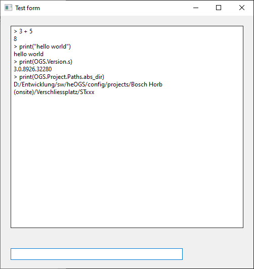

# Debugging LUA scripts

OGS ships with a debugging helper script (`<instdir>/lualib/libdebug`), which is intended to be used with [Visual Studio Code](https://code.visualstudio.com/) and Tom Blinds / lsmoths [Second local LUA debuger](https://marketplace.visualstudio.com/items?itemName=ismoh-games.second-local-lua-debugger-vscode).

## Debugging with VSCode

To use the LUA debugger, the following steps are required:

1. Install  [Visual Studio Code](https://code.visualstudio.com/) and Tom Blinds / lsmoths [Second local LUA debuger](https://marketplace.visualstudio.com/items?itemName=ismoh-games.second-local-lua-debugger-vscode) extension (search for `local lua debugger` in Visual Studio Code extensions or install from the link)
2. Add a debugging configuration (see below for a [sample debugging configuration](#sample-vscode-debugging-configuration))
3. Load the debugger from one of the LUA scripts executed by OGS (requires adding one line, see below for a [sample](#start-the-debugger-backend-from-your-lua-script)).

To actually start debugging, open your OGS project folder (something like `c:\OGS projects\sample configuration`), create the debugging configuration there and hit `F5` to start debugging.

!!! info

    Currently Tom Blinds / lsmoths [Second local LUA debuger](https://marketplace.visualstudio.com/items?itemName=ismoh-games.second-local-lua-debugger-vscode) does not directly support changing breakpoints while the code is running. Either make sure to set some breakpoints before you start the application therefore or cyclically call `lldebugger.pullBreakpoints()` from your application code (see [pullBreakpointsSupport](https://github.com/tomblind/local-lua-debugger-vscode/pull/67))


### Sample VSCode debugging configuration

Here is a sample debugging (launch) configuration for VSCode (`./vscode/launch.json`) - replace `<instdir>` with the full path where OGS is installed (typically `C:/Program Files (x86)/Bosch Rexroth AG/OGS/V3.0`)

``` json title=".vscode/launch.json"
    {
        "version": "0.2.0",
        "configurations": [
            {
                "name": "OGS (local lua debugger)",
                "type": "lua-local",
                "request": "launch",
                "program": {
                    "command": "<instdir>/monitor.exe",
                    "communication": "stdio"
                },
                "args": [
                ],
                "scriptRoots": [
                    "<instdir>",
                    "<instdir>/lualibs",
                ],
                "stopOnEntry": true,
                "pullBreakpointsSupport": true,
                "cwd": "<instdir>",
                "verbose": false,
                "integratedTerminal": true
            }
        ]
    }
```    

### Start the debugger backend from your LUA script

To make the debugger work, it is required to run the debugger backend (VSCode only provides the "frontend" GUI) from your LUA code. 

To do so, add the following line to one of the LUA files loaded by OGS:

``` lua
    require('lua-local-debugger')
```

Best is to add it into `<yourproject>/config.lua` somewhere at the top.

!!! info

    When starting monitor.exe through VSCode, it will automatically break at the end of `lua-local-debugger.lua` (if the launch.json settings include "stopOnEntry": true). You can now set breakpoints or step out into the code where you added the require line.

For more details, see https://github.com/tomblind/local-lua-debugger-vscode (lua local debugger) or https://github.com/tarantool/tarantool-lua-debugger-vscode (tarantool lua debugger).

### Known issues and workarounds

Although the debugger is easy to install and configure, it has some known issues:

- Sometimes it is needed to clear the vscode workspace userdata at
  %appdata%\Code\User\workspaceStorage (see https://github.com/tomblind/local-lua-debugger-vscode/issues/57)
- A working LUA repl seems is not available, even if a console is actually avaliable - see https://github.com/tomblind/local-lua-debugger-vscode/issues/81 on how to enable it.

## REPL

An interactive REPL is available when [debugging with VSCode](#debugging-with-vscode), see [Known issues and workarounds above](#known-issues-and-workarounds). 

An alternative is to use [vclua](https://sourceforge.net/projects/vclua/) (see also [vclua on github](https://github.com/hipBali/vclua) and [vclua form designer](https://github.com/hipBali/vclua-tools/tree/initial-v1/vt-form)) and build your own. There is a simple sample available for use with OGS ([debug-repl-vcl.lua](https://github.com/haller-erne/ogs/blob/main/samples/debugging/debug-repl-vcl.lua)). To use it with OGS, include `debug-repl-vcl` in the `requires` list in `config.lua`. 

This will then show an additional top level window with a textbox and an edit control. You can enter commands into the edit control and execute them by hitting the enter button.

Here is a sample screenshot:



