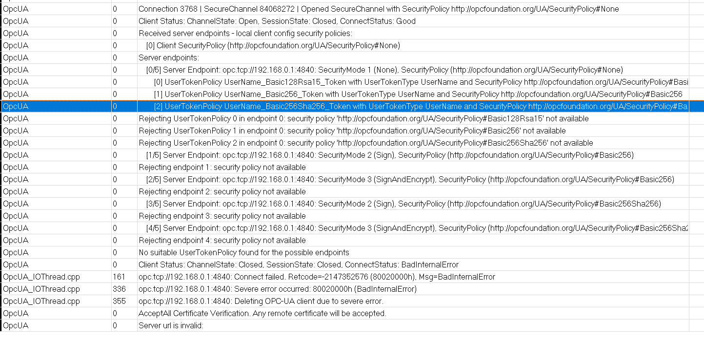

# lua-opcua

This is a lua wrapper for the open62541 library, see [https://github.com/ogsadmin/open62541-lua](https://github.com/ogsadmin/open62541-lua).

## Notes

### Username/Password authentication

Username/password authentication over an unencrypted channel (security mode = NONE) is usually not allowed by servers (for good reasons) - so a client certificate is almost always needed to use username/password authentication (technically, the enpoints provided by the server does not include any token policy without encryption for the SecurityPolicy#NONE endpoint) 

Here is a log from the Open62541 client trying to connect to a Siemens S7-1500 PLC server using username/password without encryption - and failes:



!!! note

    On a first glance, `SecurityMode#NONE` and `UserName` Authentication seems to work with other clients (like the [Softing OPC-UA Explorer](https://industrial.softing.com/products/opc-ua-and-opc-classic-sdks/opc-ua-demo-client.html)), but actually these are creating a default certificate and using this to enrypt username/password according to one of the accepted security/user-token policies provided by the server.

To correctly create a connection with username/password authentication, for most servers therefore a client certificate is needed to encrypt the credentials, so use the following:

``` lua
-- Sample configuration for authenticating with username/password
-- and SecurityMode#NONE for a Siemens PLC 
-- Note, that you **must** provide a (selfsigned) certificate for this
-- to work!
local connInfoLine_Siemens_UserPass_NONE = {
    URL = "opc.tcp://192.168.0.1:4840",         -- Siemens PLC
    NAMESPACE = 3,
    TO_PLC_VAR = '"DB_OPCUA"."st01"."line"."ogs_to_plc"',
    TO_OGS_VAR = '"DB_OPCUA"."st01"."line"."plc_to_ogs"',
	SECURITYMODE = 0,	-- 0 = SecurityMode#NONE
	CERTFILE = 'd:/temp/localhost_cert.der',
	KEYFILE = 'd:/temp/localhost_key.der',
    SERVER_USERNAME = 'OGSInterfaceUser',
    SERVER_PASSWORD = 'OGSPassword1',
    --DEBUG=3
}
local connInfo = connInfoLine_Siemens_UserPass_NONE

-- Create the client instance and configure security properties
cyclicio = opcua.CyclicIO.new(
    connInfo.SECURITYMODE or 0, 
    connInfo.CERTFILE, 
    connInfo.KEYFILE)
--local tbl, tmp = cyclicio:getInfo()

-- update the client configuration
local cfg = cyclicio.config
cfg:setTimeout(5000)
cfg:setSecureChannelLifeTime( 10 * 60 * 1000 )

-- start the client and the cyclic IO exchange
cyclicio:start(
    connInfo.URL or connInfo.SERVER_URL, 
    connInfo.NAMESPACE or connInfo.SERVER_NAMESPACE,
    connInfo.TO_PLC_VAR, '',
    connInfo.TO_OGS_VAR, '',
    100, 
    connInfo.SERVER_USERNAME or '', 
    connInfo.SERVER_PASSWORD or ''
    )

```

### Create self-signed certificates

For testing, one can use the `create-selfsigned.py` script from [https://github.com/ogsadmin/open62541/tree/master/tools/certs](https://github.com/ogsadmin/open62541/tree/master/tools/certs).

You can also direclty use openssl to generate the files as follows:

``` bash
# create localhost.cer (certificate) and localhost.key (private key)
openssl req -new -nodes -x509 -sha256 -newkey rsa:2048 -keyout localhost.key -days 365 -subj "/C=DE/O=open62541/CN=open62541Server@localhost" -out localhost.crt
# convert to x509 binary encoded der format
openssl x509 -in localhost.crt -outform der -out localhost_cert.der
openssl rsa -inform PEM -in localhost.key -outform DER -out localhost_key.der
# delete pem format files
rm localhost.key
rm localhost.crt
```

Use the *.der files in the lua-opcua initialization.