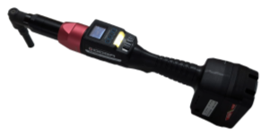
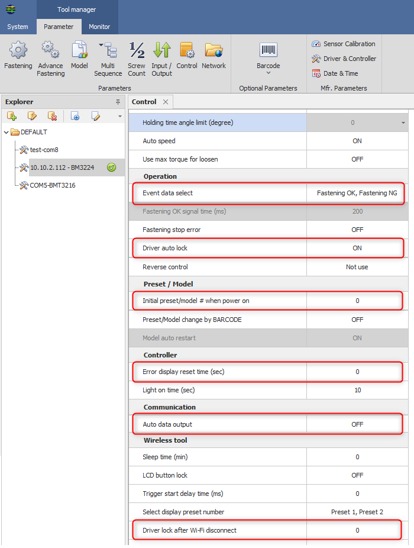

# Doga BM/BMH/BMT-series wireless tools

The [Doga BM/BMH/BMT-series wireless tools](https://www.doga.fr/en/assembly-technology/assembly-tools/wireless-dc-tools) use Modbus/TCP for controlling tightening operations and reporting events, data and graphs. Also PSet modification are possible over Modbus/TCP.



OGS provides the `heDogaTool.dll` to implement the Doga communication protocol.

## Installation and configuration

### Installation

For OGS versions < V3.1, the Doga tool driver is not included in the OGS installer, so the `heDogaTool.dll` must be copied manually into the OGS installation folder (usually `c:\program files(x86)\Bosch Rexroth AG\OGS V3.0`). 

### OGS project configuration

The `Doga` driver is implemented in `heDogaTool.dll`. To use it with OGS, the driver must be loaded in the `[TOOL_DLL]` section of the projects `station.ini` configuration file (see also [Tool configuration](/docs/tools/README.md)).

A typical configuration of the `[TOOL_DLL]` section looks like the following:

```ini
[TOOL_DLL]
; Load and enable the Doga tool interface DLL:
heDogaTool.dll=1
; ... other tool drivers ...
```

### Tool registration and configuration

All `Doga`-tools are registered in the `[DOGA]` section of the projects `station.ini` file.

The `[DOGA]` section mixes the tool parameters and the channel mapping (due to historic reasons) by combining the channel number and the parameter name/value in the `station.ini` entry. 

Each parameter is prefixed with the channel number and followed by parameter name as follows:

    CHANNEL_<two-digit channel>_<param name>=<param value>

Where
- `<two-digit channel>` is the channel number in the range 01...99 (the channel number maps 1:1 to the tool number from the workflow configuration) 
- `<param name>` is the parameter name (see below)
- `<param value>` is the actual parameter value for the given parameter

Valid parameters (`<param name>`) are:

- `CHANNEL_<channel>`: Define the IP address used to communicate with the tool.
- `CHANNEL_<channel>_PORT`: Define the Modbus/TCP port number (note, Doga uses port 5000 instead of the default 502) for Doga communication.

A sample `OpenProtocol` tool configuration (channel 01) would therefore look similar to the following:

```ini
; Setup Doga tool channels
[DOGA]
; Define communication parameters for OGS tool #6
CHANNEL_06=10.10.2.112
CHANNEL_06_PORT=5000
; ... more tools ...
```

## Tool configuration

### Prerequisites

The BM/BMH/BMT-series wireless tools are configured using the `ParaMonEx` software (available on request from the Doga support).  The firmware version of the tool must be >= V4.00.2. 

**WARNING**: <span style="color:red">Firmware versions < V4.00.2 are not supported by OGS, as they use an incompatible Modbus register mapping! This also applies to the Doga configuration software: DO NOT USE ParaMon or ParaMon III to configure the tools, only use ParaMonEx!</span>

### Control parameters

The recommended settings for the tool using ParaMonEx are:



The following parameters should be set in the `Controller` section (please note, that due to translation issues, the term `driver` is used instead of `tool`):

- Event data select: Only enable `Fastening Ok` and `Fastening Nok` to prevent overwriting the result buffer with other data
- Driver auto lock: Set to `ON` to automatically disable the tool after a rundown.
- Initial Preset/model # when power on: Set to zero to prevent the tool after reeboot to operate without control.
- Error display reset time: Set to zero to block the tool until the error has been acknowledged. As the tool throws an error also for a NOK tightening, this would else allow unacknowledged NOK rundown to slip through without notice. 
- Auto data output: Set to `OFF` to disable spontaneous data output (as this violates the Modbus protocol and can interfere with other communication).
- Driver lock after Wifi disconnect: Set to `ON` to disable the tool automatically, if the Wifi communication gets lost.


