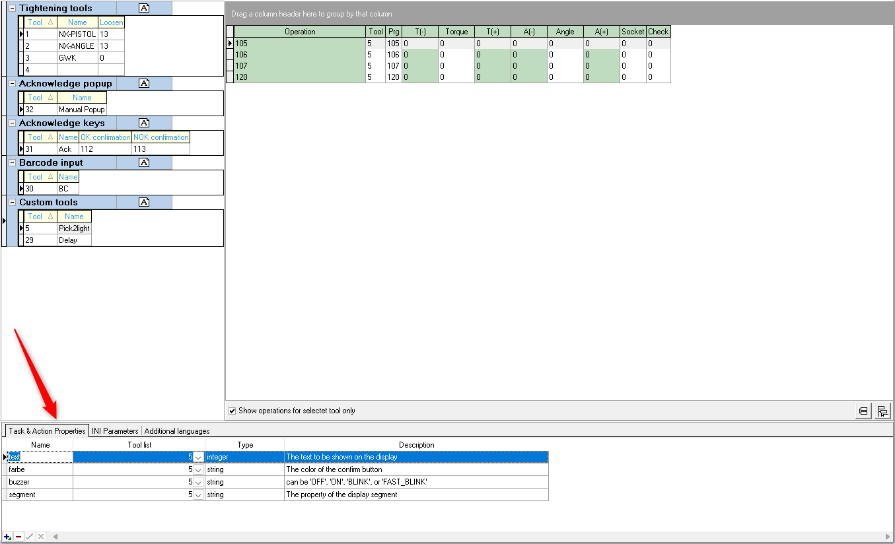
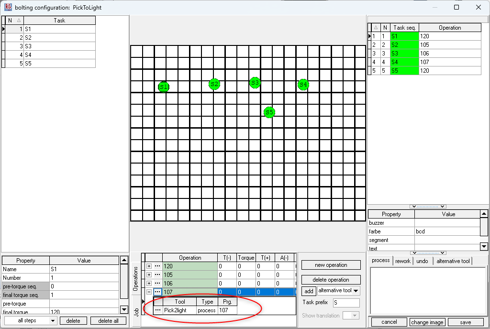
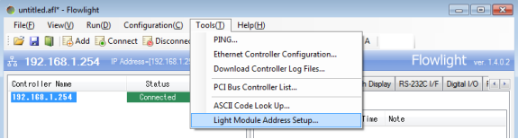
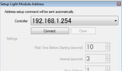
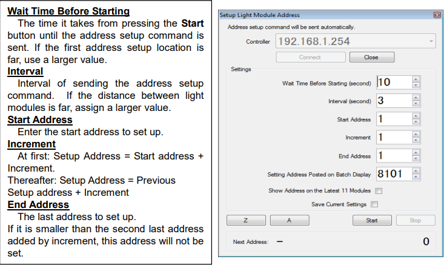

# AIOI Pick2Light tool

The AIOI Pick2Light system is an interactive tool that helps operators by clearly indicating the specific shelf location and, when needed, the quantity of items to be picked or placed. Available in several models, each unit features colored LEDs and a single confirmation button, offering versatile configurations to efficiently manage tasks. <!--links? to aioi H/W setup-->

## Installation and configuration

### OGS project configuration

OGS has an interface to add additional tool drivers by adding Windows-DLLs to the `[TOOL_DLL]` section in `station.ini`. To simplify the creation of custom tool drivers, OGS offers the heLuaTool.dll, which enables the development of tool drivers using pure LUA. With this functionality, the AIOI Pick2Light tool is seamlessly integrated into OGS, see [Lua custom tools](../../v3/lua/customtools.md) for more info.

### Tool registration and configuration

According to the instructions provided in the [Lua custom tools](../../v3/lua/customtools.md), a standard configuration for the `[LuaTool_Pick2Light]` section in `station.ini` is as follows:

``` ini
[TOOL_DLL]
heLuaTool.dll=1 

[CHANNELS]
20=LuaTool_Pick2Light 

[LuaTool_Pick2Light]
DRIVER=heLuaTool
TYPE=LUA_FLOWLIGHT
IPADDR=controller_IPADDR
IPPORT=controller_IPPORT
```

The typical parameters are:

- `DRIVER`: The name of the windows dll that implements tool drivers.
- `TYPE`: The name of the tool driver specified in your custom LUA tool driver.
- `IPADDR`: Specify the IP address used for communication with the controller. 
- `IPPORT`: Specify the port number used for communication with the controller (the default port number is 5003).


## Editor configuration

### Configuring the tool

In the Tools section of the Editor, create a new tool with a name of your choice (e.g., Pick2light) and assign it to the appropriate channel (ensure the channel number matches the one specified in the `station.ini` file).Next, under the Task & Action properties section, define the following properties:
- `text`: The text to be shown on the tool's display
- `farbe`: The color of the confirm button
- `buzzer`: The buzzer sound setting, which can be set to 'OFF', 'ON', 'BLINK', or 'FAST_BLINK'
- `segment`: The property of the display segment

Assign a tool number to each property, as shown in the reference image below. You may also indicate the "type" for each property and provide a brief description.




### Creating a job

To set up a job and task with the appropriate operations and tools, follow the steps below:

1. In the Jobs catalog of the Editor create a new job and then add a new task. 
2. In the operation section below, add an operation by selecting "new operation."
    -  To assign an existing operation along with its tool, click the three dots next to the operation and select from the window that opens.
    -  To add a new operation, provide a name for the operation and assign a tool by clicking the three dots next to the tool, which will open the tools window. From there, select the "Pick2Light" tool. 
3. It is **crucial** to set the program (Prg) value to the Pick2Light tool address (also known as the bin number, which is explained in detail in the following section). Afterward, assign the newly created operation to the task, as shown in the image below. 
4. Finally, ensure that the correct values are assigned to the properties for each task. Default values for each property are already specified in case no input is provided. The values for each of the properties are discussed in the next section.




In the Family tab of the Editor, create a new family. In the section below, configure the `Model` and `Barcode mask`, then link the newly created job to the family.


## Configuring the AIOI Pick2light Tool and Its Features

### Setting Up the Tool Using Flowlight
Configure the tool by sending the address setup command through the Flowlight application.


1. On the Flowlight application, go to Tools and select **Light Module Address Setup**.


2. Select and connect the controller

    

3. Make adjustments to the setup values and press the Start button



4. After pressing the Start button for the duration you have configured, the address setup command will be sent to the first address. Keep the CONFIRM button on the first light module pressed during this time.  
5. When the first light module emits a “peep” sound and its CONFIRM button flashes briefly, it indicates that the address has been successfully set. Following the specified address setup intervals, press the CONFIRM button on the next light module.  
6. Once the last light module address has been configured, a command will be sent to illuminate all the light modules. You can verify the address by pressing the CONFIRM button on each light module. This address, known as the **bin address**, is crucial for communication with the tool. It should be added as the program number when configuring the tool in the Editor for OGS to communicate effectively with the tool.

### Tool Properties
The AIOI pick2light systems provide a confirmation button with LED functionality, featuring high-intensity multicolor LEDs (up to 7 colors). These LEDs guide operators to the correct position and serve as a confirmation indicator. They can be set to either a fixed or blinking mode.

Buzzer features include various sound options such as no sound, high-pitched, beeping, and fast beeping. Segment options include- off, on, flash, and fast flash settings.


