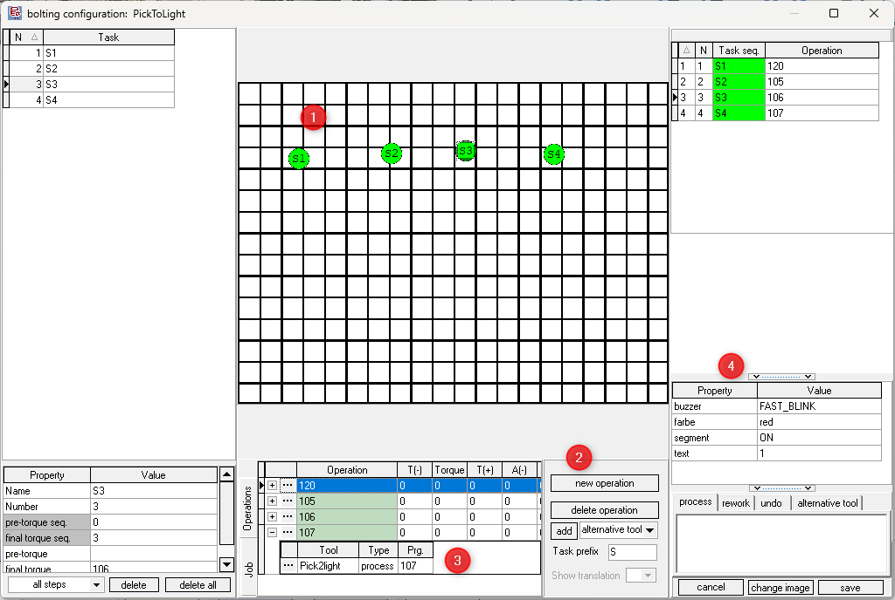

# AIOI Pick2Light tool

The AIOI Pick2Light tools are interactive communication devices associated with each shelf location, guiding the operator by clearly indicating the exact position and, if necessary, the quantity of units to be picked or placed. The hardware comes in multiple models, each featuring colored LEDs integrated into a single confirmation button. This design allows for various operational configurations, offering more flexible ways to manage tasks. For example, it enables multiple workers to operate simultaneously in the same area, with each worker assigned a unique color. It also supports preparing multiple orders at once by a single operator, with different colors assigned to each order. (links? to aioi H/W setup )

## Installation and configuration

### OGS project configuration

OGS has an interface to add additional tool drivers by adding Windows-DLLs to the `[TOOL_DLL]` section in `station.ini`. To simplify the creation of custom tool drivers, OGS offers the heLuaTool.dll, which enables the development of tool drivers using pure LUA. With this functionality, the AIOI Pick2Light tool is seamlessly integrated into OGS, see [Lua custom tools](../README.md).

### Tool registration and configuration

According to the instructions provided in the [Lua custom tools](../README.md), a standard configuration for the `[LuaTool_Pick2Light]` section in `station.ini` is as follows:

``` ini
[TOOL_DLL]
heLuaTool.dll=1 

[CHANNELS]
20=LuaTool_Pick2Light 

[LuaTool_Pick2Light]
DRIVER=heLuaTool
TYPE=LUA_FLOWLIGHT
IPADDR=controller_IPADDR
IPPORT=controller_IPPORT
```

The typical parameters are:

- `TYPE`: The name of the tool driver specified in your custom LUA tool driver.
- `IPADDR`: Specify the IP address used for communication with the controller.
- `IPPORT`: Specify the port number used for communication with the controller.


## Editor configuration

In the Tools section of the Editor, add a new tool named Pick2light and assign it to the appropriate channel (ensure the channel number matches the one specified in the `station.ini` file). Provide a name for the tool and, under the Task & Action properties section, define the following attributes:

- `text`: The text to be displayed on the display
- `farbe`: The color of the confirm button
- `buzzer`: The buzzer sound setting, which can be set to 'OFF', 'ON', 'BLINK', or 'FAST_BLINK'
- `segment`: 

Assign the tool number to each property, see reference image below.


Next, in the Jobs catalog, create a new job and add a task. Then, add the operation by selecting "new operation" and provide the operation and tool names. It is **crucial** to set the program (Prg) value to the tool address (also known as the bin number), see below image . For each task, ensure that the correct values are assigned to the properties.




