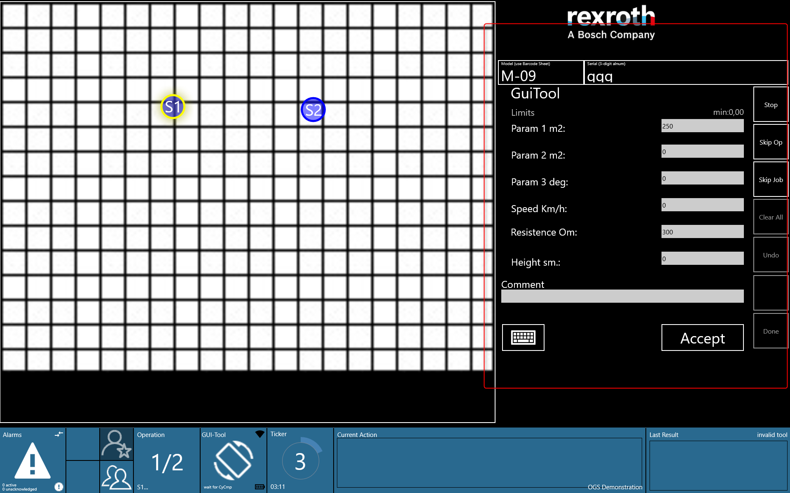
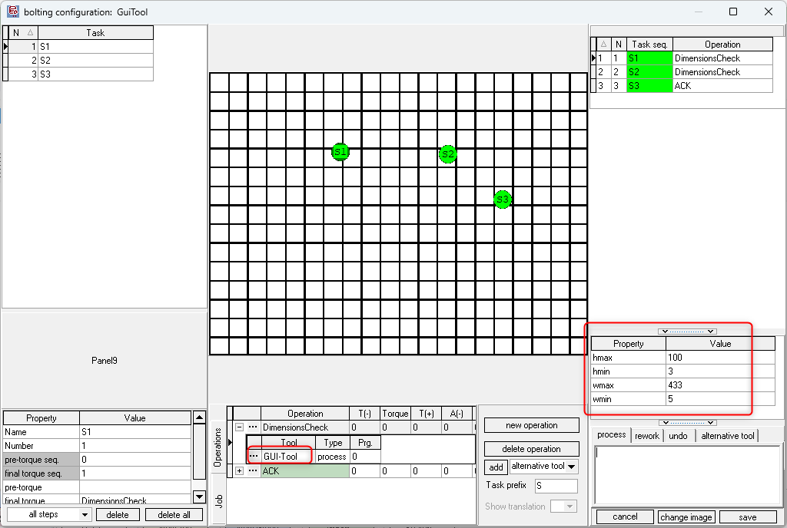

# GUI Input Tool
 
The GUI Input tool is a custom interface that allows the operator to input values for a set of predefined parameters. It validates the entered values against their allowed ranges, and once the operator clicks the "Accept" button, the result is displayed, indicating whether the values are within the valid range or not. The GUI can accommodate up to 6 parameters for value entry. See the reference image below:
<!--should I add how result is saved in OGS?-->



## Installation and Configuration with OGS

### OGS project configuration

OGS has an interface to add additional tool drivers by adding Windows-DLLs to the `[TOOL_DLL]` section in `station.ini`. To simplify the creation of custom tool drivers, OGS offers the heLuaTool.dll, which enables the development of tool drivers using pure LUA. With this functionality, the GUI Input tool is seamlessly integrated into OGS, see [Lua custom tools](../../v3/lua/customtools.md).

### Tool registration and configuration

According to the instructions provided in the [Lua custom tools](../../v3/lua/customtools.md), a standard configuration of the `station.ini` is as follows:


``` ini
[TOOL_DLL]
heLuaTool.dll=1 

[CHANNELS]
2=LuaTool_GUI_Input 

[LuaTool_GUI_Input]
DRIVER=heLuaTool
TYPE=gui_input
Param1 = { "name": "Param 1 m2:", "type": 'float', "default": '250', "min": 'heightmin', "max": 'heightmax'}
Param2 = { "name": "Param 2 m2:", "type": 'float', "default": '0', "min": 'widthmin', "max": 'widthmax'}
Param3 = { "name": "Param 3 m2:", "type": 'int', "default": '0', "min": 'vmin', "max": 'vmax'}
Param4 = { "name": "Param 4 m2:", "type": 'int', "default": '0', "min": 'v1min', "max": 'v1max'}
Param5 = { "name": "Param 5 m2:", "type": 'float', "default": '300', "min": 'v2min', "max": 'v2max'}
Param6 = { "name": "Param 6 m2:", "type": 'float', "default": '0', "min": 'v2min', "max": 'v2max'}
```

The typical parameters are:

- `DRIVER`: The name of the windows dll that implements tool drivers.
- `TYPE`: The name of the tool driver specified in your custom LUA tool driver.
- `Param1 .. Param6`: When creating GUI parameters, ensure that **only upto 6 parameters** are defined, though fewer than six is acceptable. For each parameter, specify the **name**, **type** (e.g., float or int), **min** and **max** values, and a **default** value. These defined properties will be displayed on the GUI for the user to input their values accordingly. The **type** will determine the format of the value (e.g., numeric or integer), while the **min** and **max** values define the valid range for the input. These limits are configured as properties of the tool within the **Editor**, and the corresponding property names (e.g., heightmin, heightmax, widthmin, widthmax) must be defined in the ini file for the min and max values. The **default** value will be pre-filled if no user input is provided.


## Editor Configuration

- **Creating a Tool**: In the Tools section of the Editor, create a new tool with a name of your choice and assign it to the appropriate channel (ensure the channel number matches the one specified in the `station.ini` file). Next, under the Task & Action Properties section, create new properties for the minimum and maximum limits, and link these properties to the tool.


- **Creating a Job**: To set up a job and task with the correct operations and tools, follow the steps below:

  1. In the Jobs catalog, create a new job and add a new task.
  2. In the operation section, add an operation by selecting "new operation".
     - To assign an existing operation with its tool, click the three dots next to the operation and select from the window that appears.
     - To create a new operation, provide a name for the operation and assign a tool by clicking the three dots next to the tool, which will open the tools window. From there, select the tool created in the previous step. Afterward, assign the newly created operation to the task, as shown in the image below.
  3. Enter values for the newly added action properties that define the min and max limits. These configured limits will then be visible on the Monitor.




- **Creating a Family**: In the Family tab of the Editor, create a new familyFor the family, setup `Model` and `Barcode mask` in the section below, then assign the newly created job to the family.


