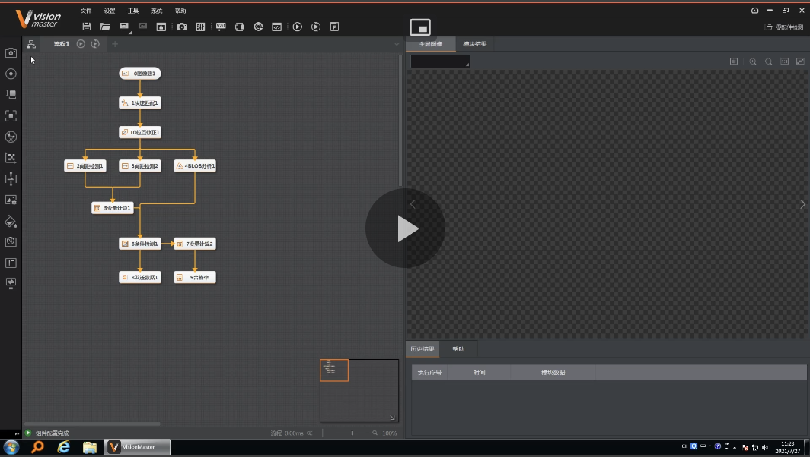
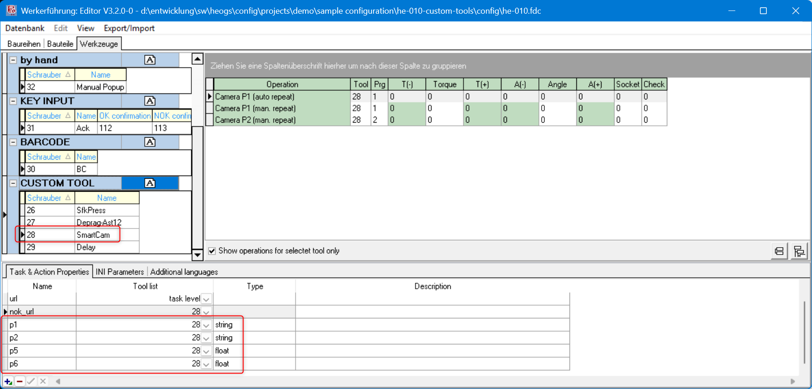
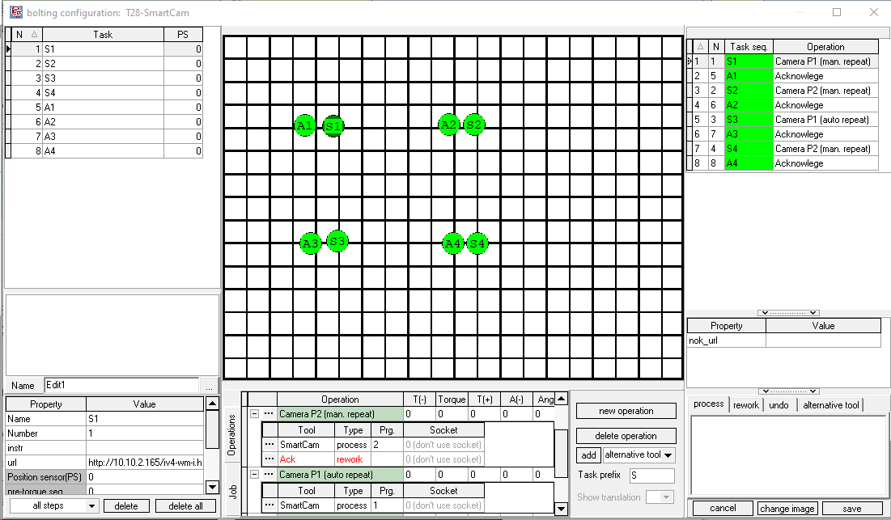

# HikRobot VisionMaster TCP camera interface

{ align=right }
HikRobots VisionMaster is a machine vision software that is committed to providing customers with algorithm tools to quickly build vision applications and solve visual inspection problems. Can be used in various applications such as visual positioning, size measurement, defect detection, and information recognition. The software works with all HikRobot industrial cameras and provides a TCP based interface to connect to other systems (like OGS). You can find more details on the [HikRobot VisionMaster](https://www.hikrobotics.com/en/machinevision/visionmaster/).

OGS controls the vision application over the TCP-interface provided by the VisionMaster software. 

## Tool configuration

The camera system is configured using the [HikRobot VisionMaster](https://www.hikrobotics.com/en/machinevision/visionmaster/) software. Please see the manual for details about how to setup the camera in general.

## Installation and Configuration with OGS

### Tool registration and configuration

As the Hikrobot VisionMaster driver is implemented as LUA custom tool, the instuction provided in the [Lua custom tools documentation](../../v3/lua/customtools.md) applies. A sample configuration for the lua driver `camera_hikrobot_vm` in `station.ini` looks as follows:

``` ini
[TOOL_DLL]
heLuaTool.dll=1 

[CHANNELS]
28=LuaTool_HikRobot_VM

[LuaTool_LuaTool_HikRobot_VM]
DRIVER=heLuaTool
TYPE=camera_hikrobot_vm
; IP address and port of the VisionMaster TCP server interface
HOST=127.0.0.1
PORT=10001
; Response timeout in seconds (default = 1 s)
;TO_RESPONSE=5

;
; Define the path where to read the (Nok) camera image from
; If not given, then don't save
IMAGE_PATH=c:\monitor\camera\image.jpg
;
; debug level:
DEBUG=0
```

The parameters are:

- `DRIVER` (required): Must be set to `heLuaTool`
- `TYPE` (required): Must be set to `camera_hikrobot_vm`
- `HOST`: Specify the IP address of the VisionMaster camera TCP server
- `PORT`: Specify the IP listening port of the VisionMaster camera TCP server
- `DEBUG`: Set the debug level for the EtherNet/IP communication.
- `IMAGE_PATH` (optional): If given, then the image will be used to show the NOK result. 

To load the driver, see below (OGS >= V3.1.10 ship the driver, so there is no need to load it manually anymore).

=== ">= V3.1.10"

    The driver for the camera is automatically loaded.
    

=== "< V3.1.10"

    To load the camera driver, add `lua_tool_camera_hikrobot_vm` to the `requires` table in the `config.lua` file in your project folder. Here is a sample `config.lua` file:

    ```  lua hl_lines="7"
    -- add the shared folder (..\shared)
    OGS.Project.AddPath('../shared')

    requires = {
        "barcode",
        "user_manager",
        "lua_tool_camera_hikrobot_vm",      -- (1)
    }
    current_project.logo_file = '../shared/logo-rexroth.png'
    current_project.billboard = 'http://127.0.0.1:60000/billboard.html'
    ```

    1.  Add this line to include the `lua_tool_camera_hikrobot_vm.lua` driver in the project.


## Editor configuration

### Configuring the tool

In the Tools section of the Editor, create a new tool with a name of your choice (e.g. `HikRobotVM` or `SmartCam`) in the `custom tools` section and assign it to the appropriate channel (ensure the channel number matches the one specified in the `station.ini` file).



The tool driver supports up to 8 parameters, where parameter 1-4 are string parameters, parameters 5-8 are numeric parameters, so add the parameters in the "Task & Action properties" accordingly (see screenshot above).


### Using the tool in a job

To use the camera in a job, add a task and assign an operation with the camera tool (e.g. `SmartCam`, as you've defined earlier).

When the task gets active, OGS will select the program number as defined in the operation and trigger the camera. By default, if the camera tool is used in a final-task action, OGS repeats the action on tool NOK. In case of the camera, this would then immediately retrigger the camera until it returns an OK reading - without giving the operator a chance to fix the NOK cause. This is usually not what you want, so typically you will setup the camera tools operation with an added rework operation.

Here is a sample:


There are two operations shown:
- `Camera P2 (man. repeat)`: This adds a rework operation using a manual acknowledge button. If the main process (camera) reports NOK, then the manual acknowledge gets active, basically waiting for the operator to hit the button and repeat the camera measurement (or abort). This also gives the oerator a chance to look at the annotated camera result view (see the `url` task property set to the cameras result image webpage), fix the issue and hit the button to repeat. 
- `Camera P1 (auto repeat)`: This only uses a main process (camera) tool. Therefore it will automatically repeat triggering the camera until it succeeds. Use this only in combination with a NOK retry counter - this can then e.g. try three times and then needs a supervisor to log in and complete.

!!! hint 

    Sometimes it can be useful to add a "pre-task" step or an additional task before the actual camera operation using an acknowledge button. This will give the operator some time (maybe also add some instruction text) to prepare the part under the camera - when he has everything ready, then hitting the buttonwill start the camera check.

!!! hint 

    You can setup a task URL to show a webpage with the NOK result image. 

!!! hint 

    If you want to capture the camera image, then add a `grabimage` tool task after the Keyence camera task. Set it up to grab the jpeg image from the cameras image URL and store it on disk (and upload to a data collection server). 

