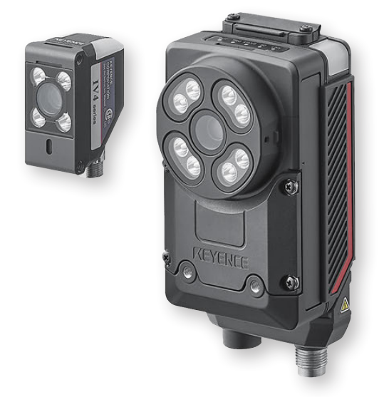
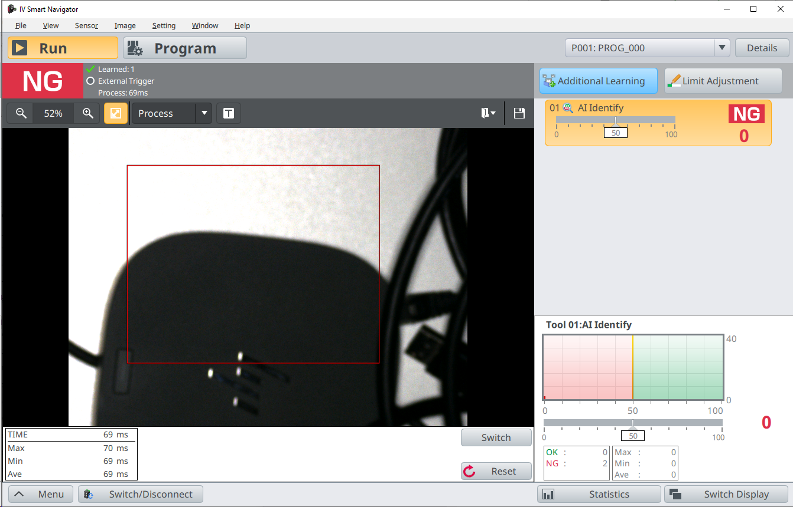
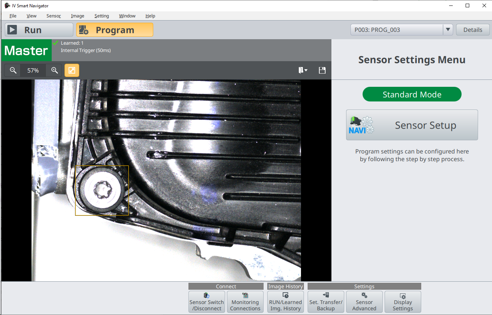
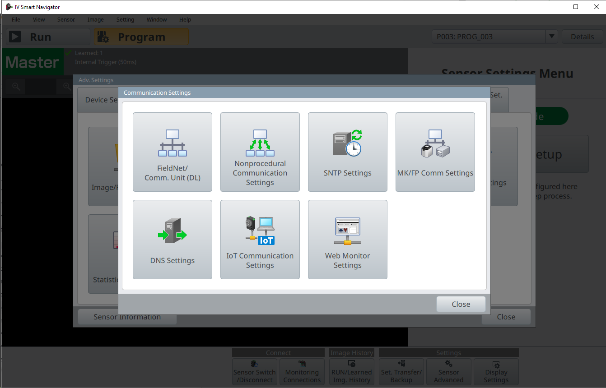
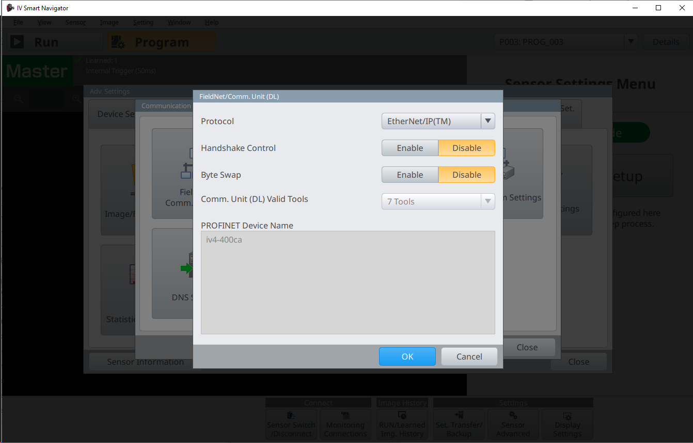
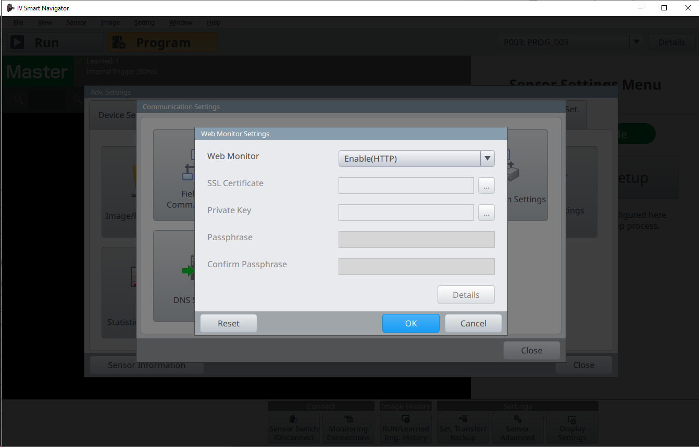
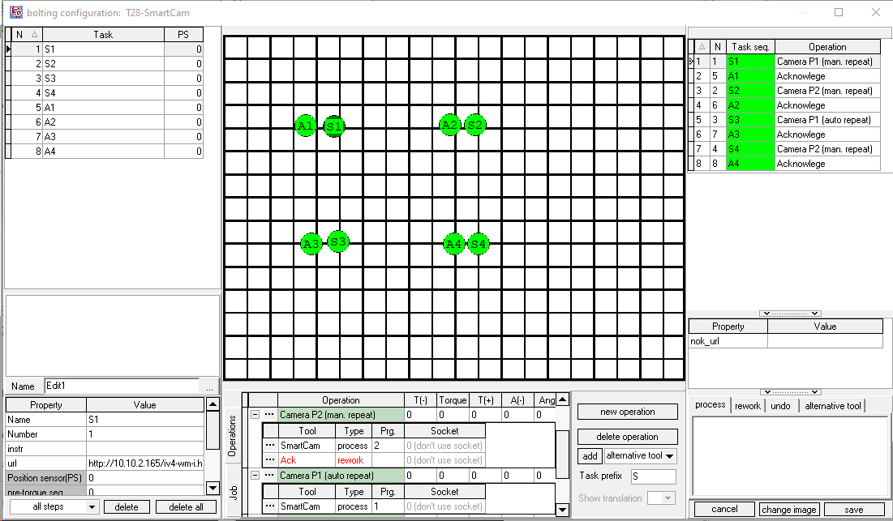

# Keyence IV4 AI Vision Sensor

{ align=right }
The Keyence IV4 is a samrt vision sensor with added AI capabilities. It can detect parts without using position adjustment, can check if the correct amount of parts are in their proper location, and can read and count targets under tough conditions. You can find more details on the [Keyence IV4 AI Vision Sensor product page](https://www.keyence.co.uk/products/sensor/vision-sensor/iv4/).
The IV Series is known for its simplicity to set up and overall good detection results, supporting increased brightness, wide-and-narrow field-of-view options. The IV4 is highly stable against environmental concerns like ambient lighting or slight finish changes, so even applications that are difficult for conventional vision sensors can be solved reliably with the IV4 and its improved AI tools.

OGS controls the camera over the integrated EtherNet/IP interface. 

## Tool configuration

The camera system is configured using the Keyence `IV Smart Navigator` software. Please see the tools manual for details about how to setup the camera in general.

To change the cameras configuration, start the `IV Smart Navigator` software, go to `Settings and Configuration` and connect to (or search for) the camera. You will then typically see the following screen:



Click the `Program` button in the top command bar to switch the device to setup mode (if not already active). You will then see the following screen:



All configuration is now accessible through the buttons on the bottom bar.

!!! warning

    Make sure to switch the device back into `Run` mode, else OGS will not be able to select a program! 

### EtherNet/IP and Web Monitor settings

To configure the EtherNet/IP interface, switch the camera to setup mode and click the `Sensor Advanced` button (or select `Window --> Sensor advanced`from the main menu), then select the `Utility` tab and click the `Communication Settings` button. This will then allow to configure the different communication options:



By clicking the button labeled `FieldNet/Comm. Unit (DL)`, the EtherNet/IP settings must be set as follows:



To enable web monitoring (so you can show NOK results on the OGS screen), click the `Web Monitor settings` and configure as follows (see the Keyence manuals, if you want https instead of http):



### I/O configuration for external program selection

To allow selecting the active program through EtherNet/IP, make sure to check the `Program Switching Method` to be set to `Panel/PC/Network/AUTO`. The setting can be found at `Sensor Advanced --> I/O Settings --> Input Settings --> Program Switching Method`

!!! note

    Make sure to configure the IP address of the device correctly (check `Sensor Advanced --> Device Settings --> Network Settings`) 


## Installation and Configuration with OGS

### Tool registration and configuration

As the Keyence IV4 AI Smart Sensor driver is implemented as LUA custom tool, the instuction provided in the [Lua custom tools documentation](../../v3/lua/customtools.md) applies. A sample configuration for the lua driver `camera_keyence` in `station.ini` looks as follows:

``` ini
[TOOL_DLL]
heLuaTool.dll=1 

[CHANNELS]
20=LuaTool_KeyenceIV4 

[LuaTool_KeyenceIV4]
DRIVER=heLuaTool
TYPE=camera_keyence
ENIP_DEVICE=10.10.2.165
;URL=http://10.10.2.165/iv4-wa.html
;URL=http://10.10.2.165/iv4-wm.html
;URL=http://10.10.2.165/iv4-wm-i.html
```

The parameters are:

- `DRIVER` (required): Must be set to `heLuaTool`
- `TYPE` (required): Must be set to `camera_keyence`
- `ENIP_DEVICE`: Specify the IP address of the camera 

To load the Keyence camera driver, add `lua_tool_camera_keyence` to the `requires` table in the `config.lua` file in your project folder. Here is a sample `config.lua` file:

```  lua hl_lines="7"
-- add the shared folder (..\shared)
OGS.Project.AddPath('../shared')

requires = {
	"barcode",
	"user_manager",
	"lua_tool_camera_keyence",      -- (1)
}
current_project.logo_file = '../shared/logo-rexroth.png'
current_project.billboard = 'http://127.0.0.1:60000/billboard.html'
```
1.  Add this line to include the `lua_tool_camera_keyence.lua` driver in the project.


## Editor configuration

### Configuring the tool

In the Tools section of the Editor, create a new tool with a name of your choice (e.g. `KeyenceIV4`) in the `custom tools` section and assign it to the appropriate channel (ensure the channel number matches the one specified in the `station.ini` file). 

### Using the tool in a job

To use the Keyence camera in a job, add a task and assign an operation with the Keyence camera tool (e.g. `KeyenceIV4`, as you've defined earlier).

When the task gets active, OGS will select the program number as defined in the operation and trigger the camera. By default, if the camera tool is used in a final-task action, OGS repeats the action on tool NOK. In case of the camera, this would then immediately retrigger the camera until it returns an OK reading - without giving the operator a chance to fix the NOK cause. This is usually not what you want, so typically you will setup the camera tools operation with an added rework operation.

Here is a sample:


There are two operations shown:
- `Camera P2 (man. repeat)`: This adds a rework operation using a manual acknowledge button. If the main process (camera) reports NOK, then the manual acknowledge gets active, basically waiting for the operator to hit the button and repeat the camera measurement (or abort). This also gives the oerator a chance to look at the annotated camera result view (see the `url` task property set to the cameras result image webpage), fix the issue and hit the button to repeat. 
- `Camera P1 (auto repeat)`: This only uses a main process (camera) tool. Therefore it will automatically repeat triggering the camera until it succeeds. Use this only in combination with a NOK retry counter - this can then e.g. try three times and then needs a supervisor to log in and complete.

!!! hint 

    Sometimes it can be useful to add a "pre-task" step or an additional task before the actual camera operation using an acknowledge button. This will give the operator some time (maybe also add some instruction text) to prepare the part under the camera - when he has everything ready, then hitting the buttonwill start the camera check.

!!! hint 

    If you want to capture the camera image, then add a `grabimage` tool task after the Keyence camera task. Set it up to grab the jpeg image from the cameras image URL and store it on disk (and upload to a data collection server). 

