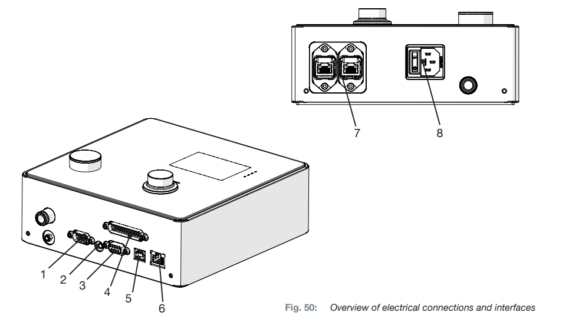
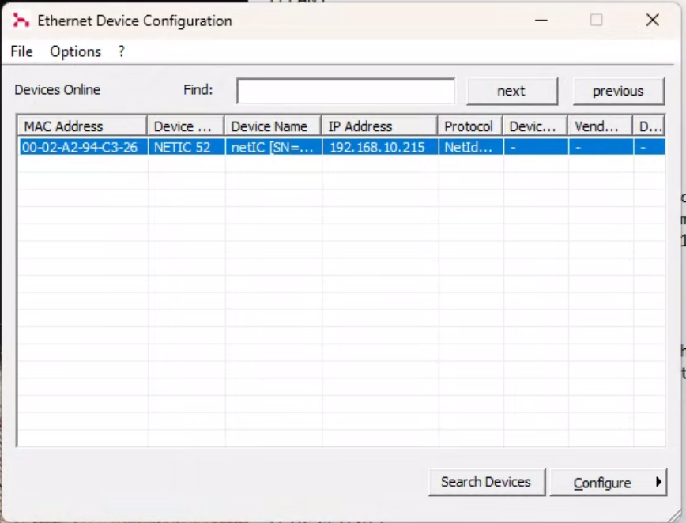
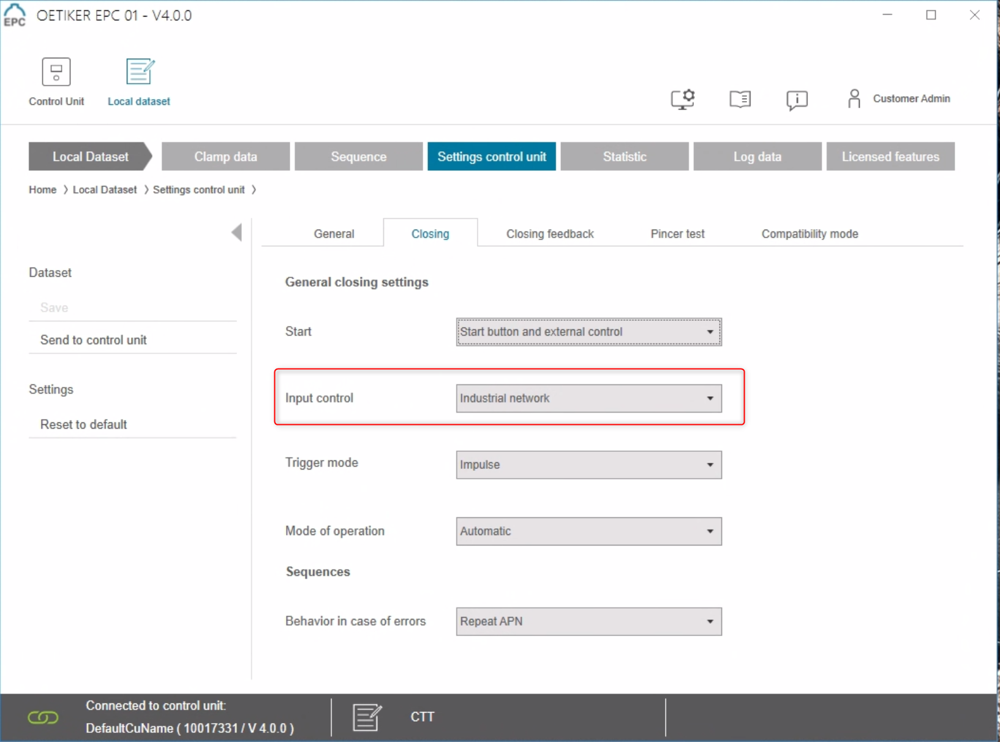
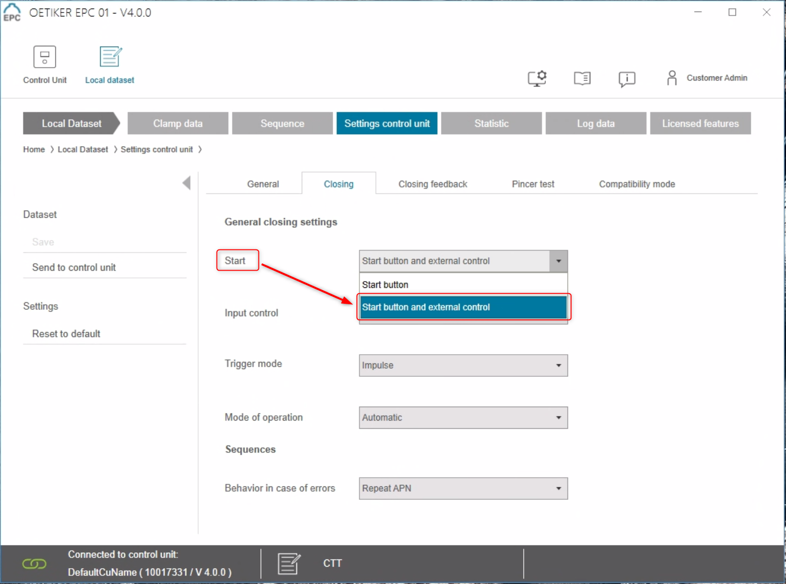
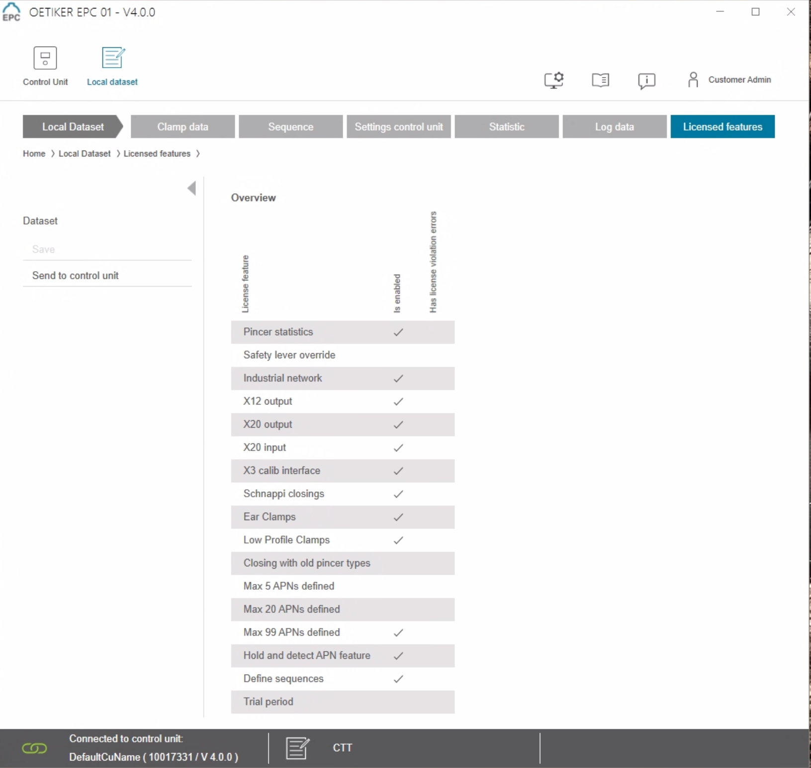
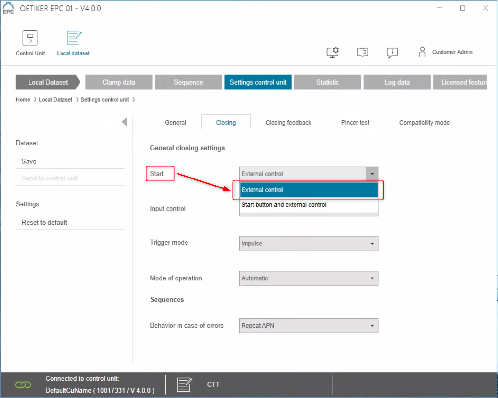
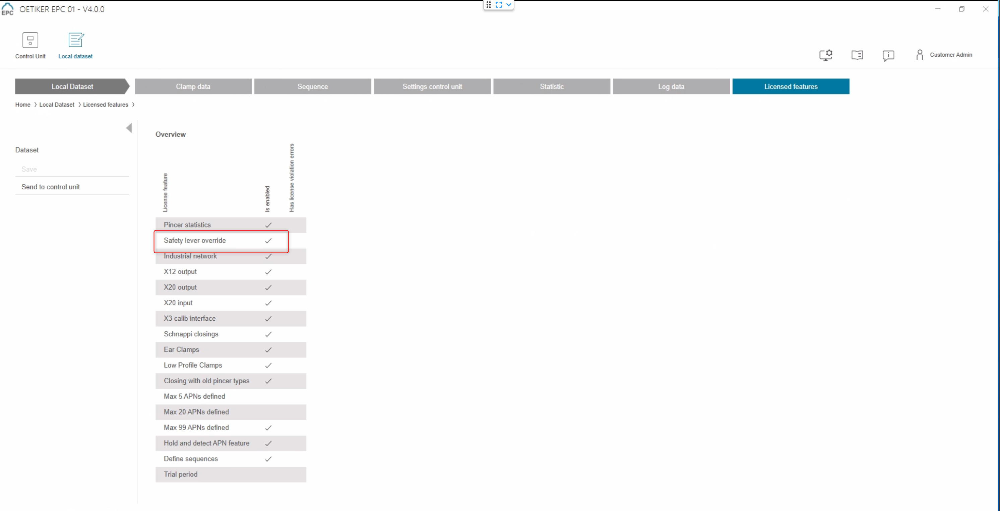

# Oetiker EPC01 Electro-Pneumatic Pincer

{ align=right }
The EPC 01 is a high quality pincer system developed by Oetiker. It ensures the uniform and reliable assembly of Oetiker clamps by providing verified and traceable connection installation and ensuring the highest quality standards through accurate and precise process control.

It combines Electro-Pneumatic Controls and Trigger Units for the full range of environment - from test labs to fully automated high-volume production cells. A wide range of pincer body sizes and pincer heads allows for optimal adaption to any requirement.

Find the full specification at the [Oetiker EPC01 product page](https://www.oetiker.com/en-us/products/assembly-tools/electronically-controlled-pneumatic-pincers/electro-pneumatic-controller-epc-01
) and the YouTube playlist with the [EPC 01 Step by Step guide](https://www.youtube.com/playlist?list=PLzN7Kyf0Yw4r68r-xakjDy8g8OeY74Hpn).

## Requirements

OGS controls the device over its integrated EtherNet/IP interface, so the `PLC` option is required. Connect OGS and the EPC01 tool over Ethernet by using one of the  the fieldbus interfaces (7):


Depending on your trigger option needs, different licenses may be needed to use the tool in `automatic` or `fully automatic` mode. Please contact Oetiker for more information.

## Tool configuration

The main configuration for connecting the EPC01 device to OGS is to setup the communication interface.

### Fieldbus interface configuration

The fieldbus interface IP address cannot be configured through the Oetiker configuration application - instead use the Hilscher Ethernet Device Configuration tool to setup the IP address of the EtherNet/IP interface:



To enable controlling the tool over the fieldbus, open the Oetiker configuration application. Then got to the `Settings control unit --> Closing` page and set the `Input Control` parameter to `Industial Network`. Here is a sample screenshot:



### Trigger configuration

The EPC01 provides two options for triggering (starting) the clamping process:

1. Start by pushing the tool integrated start switch. In this mode, OGS only enables the tool, the operator activtes the pincer process by pushing the safety lever and the start button on the tool.
2. Start using an external start switch (like a foot pedal). As the EPC01 device does not support enabling through the fielsbus and starting through a 24V input signal at the saame time, OGS provides both signals through the fieldbus interface. In this mode, OGS  starts the pincing process when it gets an input signal from the external start switch. The operator still needs to push the safety lever for the tool to actually start pincing.

#### Trigger settings for integrated start button mode

In this mode, OGS only send an enable command to the tool. The tool is only started, if the operator pushes the safety lever and the start button.

The following screenshot shows the configuration setting needed in this mode - set the `Start` parameter to `Start button and external control`:



Note, that you will need the following licenses:



#### Trigger settings in external start mode

In this mode, OGS send an enable command to the tool first, then also starts the tool operation. Note, that the tool is started, even if the operator does not push the safety leaver, so make sure safety is ensured otherwise!

The following screenshot shows the configuration setting needed to control the EPC01 device - set the `Start` parameter to `External control`:



!!! note

    If the `External control` option is not visible, then you will need a larger license (see below, the option `safety leaver override` is required)!

Note, that you will need the following licenses:



## Installation and Configuration with OGS

### Tool registration and configuration

As the Keyence IV4 AI Smart Sensor driver is implemented as LUA custom tool, the instuction provided in the [Lua custom tools documentation](../../v3/lua/customtools.md) applies. A sample configuration for the lua driver `camera_keyence` in `station.ini` looks as follows:

``` ini
[TOOL_DLL]
heLuaTool.dll=1 

[CHANNELS]
20=LuaTool_Oetiker 

[LuaTool_Oetiker]
DRIVER=heLuaTool
TYPE=pincer_oetiker
; IP-Address of the EPC01 pincer controller
ENIP_DEVICE=10.10.2.123
; optionally set a debug level
DEBUG=3
```

The parameters are:

- `DRIVER` (required): Must be set to `heLuaTool`
- `TYPE` (required): Must be set to `pincer_oetiker`
- `ENIP_DEVICE`: Specify the IP address of the EPC01 controllers fieldbus interface
- `DEBUG`: Set the debug level for the EtherNet/IP communication.

To load the Oetiker EPC01 pincer driver, see below (OGS >= V3.2 ships the driver, so there is no need to load it manually anymore).

=== ">= V3.2"

    The driver for the Oetiker EPC01 controller is automatically loaded.
    

=== "< V3.2"

    To load the Oetiker EPC01 controller driver, add `lua_tool_pincer_oetiker` to the `requires` table in the `config.lua` file in your project folder. Here is a sample `config.lua` file:

    ```  lua hl_lines="7"
    -- add the shared folder (..\shared)
    OGS.Project.AddPath('../shared')

    requires = {
        "barcode",
        "user_manager",
        "lua_tool_pincer_oetiker",      -- (1)
    }
    current_project.logo_file = '../shared/logo-rexroth.png'
    current_project.billboard = 'http://127.0.0.1:60000/billboard.html'
    ```

    1.  Add this line to include the `lua_tool_pincer_oetiker.lua` driver in the project.

!!! note

    Note, that using the external start mode requires custom LUA code to start the tool. Contact us for sample with e.g. external foot switch or other input devices.

## Editor configuration

### Configuring the tool

In the Tools section of the Editor, create a new tool with a name of your choice (e.g. `OetikerEPC01`) in the `custom tools` section and assign it to the appropriate channel (ensure the channel number matches the one specified in the `station.ini` file). 

### Using the tool in a job

To use the EPC01 pincer in a job, add a task and assign an operation with the Keyence camera tool (e.g. `OetikerEPC01`, as you've defined earlier).

When the task gets active, OGS will select the program number as defined in the operation and enable the device. By default, if the tool is used in a final-task action, OGS repeats the action on any tool NOK result. 


