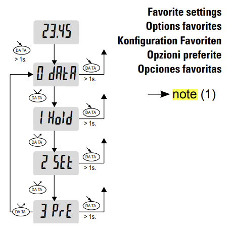

# Sylvac Bluetooth low energy tools

The AIOI Pick2Light system is an interactive tool that helps operators by clearly indicating the specific shelf location and, when needed, the quantity of items to be picked or placed. Available in several models, each unit features colored LEDs and a single confirmation button, offering versatile configurations to efficiently manage tasks. <!--links? to aioi H/W setup-->

## Quick setup

To provide Bluetooth connectivity for the Sylvac tools, the Sylvac BLE USB dongle (BLED112) is used. To connect a tool, please follow these steps:

1. Reset the tools Bluetooth connection: (short) click the 'MODE' button until the display shows `bt`. Then (short) click the `SET` button until the display shows `reset`. Now click the `DATA` button to actually reset the settings
2. Set (or check) the BLE communication mode to paired by clicking and holding the `MODE` button until the display shows `unit`. Then (short) click the `MODE` button until the display shows `bt.CFG`. Then (short) click the `SET` button until the display shows `PAIR`. Click the `DATA` button to select the paired mode.


## Oeration modes (favorites)

{ align=right; width=200px; }

The Sylvac tools can operate in different operation modes, where the function of the `DATA`-button can be defined as well as the bluetooth send behaviour:

- `0 Data`: Send a bluetooth "indication", if the `DATA`-button on the device is pressed. Use this mode, if you want to only send data to OGS, when the `DATA`-button is clicked. Note, that a "notification" is still send on any value change (if the notification is enabled from OGS), so make sure to disable this in OGS, if you only want the clicked value.
- `1 Hold`: The `Data`-button toggles the hold-state. While the hold state is active, moving the caliper does not change the display value, not is any data sent over bluetooth. 
- `2 Set`: Send the data over bluetooth with every value change, clicking the button will zero the value (for relative measurements).
- `3 Pre`: Same as `2 Set` (for simple calipers).

For detailed instructuins, download the configuration sheet from [the Sylvac product page](https://www.sylvac.ch/wp-content/uploads/2024/01/MAN_S_Cal_EVO_SYL_EFDIS_681.295.04_WEB.pdf).

Notes:
- All modes support sending data changes over bluetooth (if the "notifications" are enabled)
- To only get data over bluetooth, when the `DATA`-button on the device is clicked, "notifications" must be disabled and the "indication" must be enabled.

Note, that `0 Data` is the only mode, where the bluetooth data is not sent with every change of value. In mode `0 Data` the `DATA`-button must be clicked for a value transmission.  

## Installation and Configuration with OGS

### OGS project configuration

OGS has an interface to add additional tool drivers by adding Windows-DLLs to the `[TOOL_DLL]` section in `station.ini`. To simplify the creation of custom tool drivers, OGS offers the heLuaTool.dll, which enables the development of tool drivers using pure LUA. With this functionality, the Sylvac tool is seamlessly integrated into OGS, see [Lua custom tools](../../v3/lua/customtools.md) for more info.

### Tool registration and configuration

According to the instructions provided in the [Lua custom tools](../../v3/lua/customtools.md), a standard configuration for the `[LuaTool_Sylvac]` section in `station.ini` is as follows:

``` ini
[TOOL_DLL]
heLuaTool.dll=1 

[CHANNELS]
20=LuaTool_Sylvac 

[LuaTool_Sylvac]
DRIVER=heLuaTool
TYPE=sylvac
; The following setup is for Calipers of type S_CAL Evo with old bluetooth module.
; These devices do not support "paired mode" and "cyclic mode". Data is read whenever
; the data button is clicked on the tool.
; To identify the tool, press the MODE button for 2 seconds. Old devices will not enter
; a menu.
BLE_PORT=COM3
BLE_MAC=f7:c5:d3:10:52:4b
; Define the correct (device-specific) bluetooth protocol here. Note, that
; two "generic" protocols are available to support all current devices:
;   SYLVAC_GATT_SDS: standard data service (report value on every change)
;   SYLVAC_GATT_SMS: Synology Metrology service (cable replacement)
BLE_TOOLTYPE=SYLVAC_GATT_SMS
;BLE_TOOLTYPE=SYLVAC_GATT_SDS
GUI_LABEL=Length [mm]
```
<!--
The typical parameters are:

- `DRIVER`: The name of the windows dll that implements tool drivers.
- `TYPE`: The name of the tool driver specified in your custom LUA tool driver.
- `IPADDR`: Specify the IP address used for communication with the controller. 
- `IPPORT`: Specify the port number used for communication with the controller (the default port number is 5003).


``` ini
[LuaTool_SYLVAC]
;DRIVER=heLuaTool
; NOTE: for custom LUA too000000000lsMSN0000ls implemented through "heLuaTool", the LUA script
;       file used to provide the implementation of the tool interface is 
;       identified through the "TYPE" set here.
; To use the TYPE=BLE_SYLVAC, you should also add "lua_tool_ble_sylvac" in config.lua
;TYPE=BLE_SYLVAC
;BLE_PORT=COM3
;BLE_MAC=c1:04:68:b0:14:a4
; NOTE: If BLE_CYCLIC_READ is nonzero, then the given handle is read cyclically.
;       Note also, that the GUI then switches to "manual input", i.e. the cyclic
;       data read is displayed in the panel and the user must acknowledge the value
;       to continue to the next step.
;BLE_TOOLTYPE=SYL250_OLD_BUTTON
;BLE_CYCLIC_READ=0
; If cyclic read is active (therefor the GUI is shown), you can set a measure label here:
;GUI_LABEL=Measure [mm]
; NOTE: for "new" Sylvac calipers, devices in "paired" mode required "encrypted" communication
;BLE_ENCRYPT=0
; 0 = public, 1 = (default) random
;BLE_MAC_TYPE=1

; The following setup is for Calipers of type S_CAL Evo with old bluetooth module.
; These devices do not support "paired mode" and "cyclic mode". Data is read whenever
; the data button is clicked on the tool.
; To identify the tool, press the MODE button for 2 seconds. Old devices will not enter
; a menu.
DRIVER=heLuaTool
TYPE=BLE_SYLVAC
BLE_PORT=COM5
BLE_MAC=c1:04:68:b0:14:a4
; Define the correct tooltype here:
BLE_TOOLTYPE=SYL250_OLD_BUTTON
BLE_CYCLIC_READ=0
GUI_LABEL=Length [mm]
BLE_ENCRYPT=0
``` 
-->
