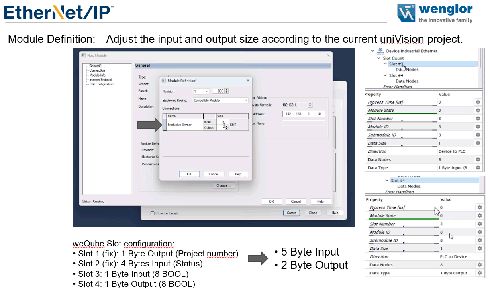

# Wenglor weQube Smart Camera

## IO configuration

!!! warning

    The Wenglor I/O fieldbus interface has consistency issues with data updates,
    the manual indicates that each slot is updated seperately, so not all updates
    happen at the same time!
    
!!! important 

    The weQube camera does not configure the field bus interface globall, it is
    configured as part of the program. This requires **all** programs to have the
    identical IO configuration, else the fieldbus interface will not work correctly
    and switching programs will fail!
        
!!! important

    Changing the field bus interface or data mapping requires a reboot of the camera.
    Double check, that all program use the identical fieldbus setting and data mapping!

Wenglor uses slots (like in Profinet) to configure the input and output data, but has some quite severe limitations. 

Slot 1 and Slot two are fixed as follows:

- Slot 1: `PLC -> Camera` [1 Byte output] Project number
- Slot 2: `PLC <- Camera` [4 Bytes input] Status

As there are some issues with data consistency (see the Wenglor weQube EtherNet/IP manual), slots 5 and 6 must be configured as follows (only slots 3 and slots 4 are usable for custom data):

- Slot 5: `PLC -> Camera` [1 Byte output (8 Bool)] with the following settings:
    * Bit 0 = Device Camera Trigger
- Slot 6: `PLC <- Camera` [16 Byte input (4 DINT)] with the following mapping
    * Integer 1 = Toggle Bit
    * Integer 2 = Run Counter
    * Integer 3 = Result Ok/Nok (1 = ok)

The remaining two slots 3 and 4 can be configured for parameter and output (measurement) data. By default they should be configured as follows:

- Slot 3: `PLC -> Camera` [16 Byte output (4 Real)] 
- Slot 4: `PLC <- Camera` [16 Byte input (4 Real)] 

