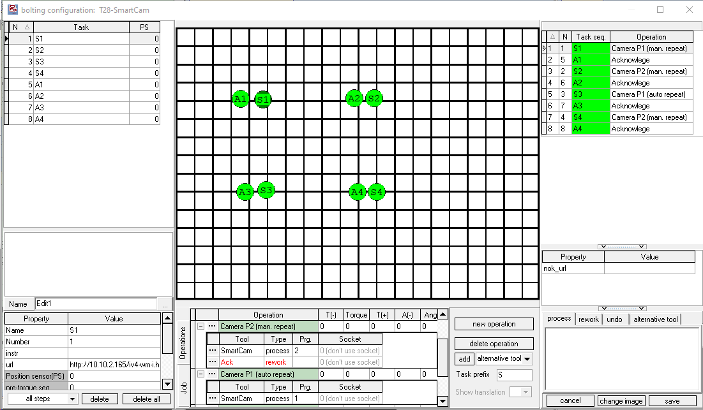

# Wenglor weQube Smart Camera

{ align=right }
The Wenglor weQube B50 is available as a smart camera, vision sensor and OCR reader and solves a wide range of industrial image processing tasks in real time. The highly modular hardware platforms in combination with high-performance machine vision software enable tailored adjustment for all machine vision applications. You can find more details on the [Wenglor weQube B50 product page](https://www.wenglor.com/en/Machine-Vision/Smart-Cameras-and-Vision-Sensors/weQube-B50/c/cxmCID221376).

OGS controls the camera over the integrated EtherNet/IP interface. 

## Tool configuration

The camera system is configured using the `Wenglor uniVision 2` software. Please see the tools manual for details about how to setup the camera in general.

### IO configuration

!!! warning

    The Wenglor I/O fieldbus interface has consistency issues with data updates,
    the manual indicates that each slot is updated seperately, so not all updates
    happen at the same time!
    
!!! warning 

    The weQube camera does not configure the field bus interface globally, it is
    configured as part of the program. This requires **all** programs to have the
    identical IO configuration, else the fieldbus interface will not work correctly and switching programs will fail!
        
!!! warning

    Changing the field bus interface or data mapping requires a reboot of the camera.
    Double check, that all program use the identical fieldbus setting and data mapping!

Wenglor uses slots (like in Profinet) to configure the input and output data, but these cannot be flexibly used due to some internal restrictions of the fieldbus implementation. To make the camera fieldbus interface realiably work, the following mapping and configuration **must** be used: 

Slot 1 and Slot two are fixed as follows:

- Slot 1: `PLC -> Camera` [1 Byte output] Project number
- Slot 2: `PLC <- Camera` [4 Bytes input] Status

As there are some issues with data consistency (see the Wenglor weQube EtherNet/IP manual), slots 5 and 6 must be configured as follows (only slots 3 and slots 4 are usable for custom data):

- Slot 5: `PLC -> Camera` [1 Byte output (8 Bool)] with the following settings:
    * Bit 0 = Device Camera Trigger
- Slot 6: `PLC <- Camera` [16 Byte input (4 DINT)] with the following mapping
    * Integer 1 = Fixed value set to the program number (manually)
    * Integer 2 = Toggle Bit
    * Integer 3 = Run Counter
    * Integer 4 = Result Ok/Nok (1 = ok)

The value of `Integer 1` **must be manually set to the programs number** (the first three digits of the program name) - as the camera does not have a built-in variable to report the currently active program and there is no handshake which reports the camera is ready again after changing a program (other than doing it manually using the `Integer 1`) - see the Wenglor weQube fieldbus manual for details.

!!! warning

    To allow selecting programs over fieldbus, the program names must start with the 3-digit program numer and an underscore, i.e. `001_MyProgram`, `002_MyOtherProgram`!


The remaining two slots 3 and 4 can be configured for parameter and output (measurement) data. By default they should be configured as follows:

- Slot 3: `PLC -> Camera` [16 Byte output (4 Real)] 
- Slot 4: `PLC <- Camera` [16 Byte input (4 Real)] 

Overall:
- `PLC -> Camera`: 1 + 1 + 16 = 18 bytes
- `PLC <- Camera`: 4 + 16 + 16 = 36 bytes

!!! warning

    The Wenglor EtherNet/IP implementation requires you to manually define the module types (again, seems that this is a non-optimized HMS AnyBus implementation). 

As outlines above, slots 5 and 6 must be configured as module type 8 and 1 respectively, slots 3 and 4 by default as 7 and 2. Here is a sample screenshot from a CoDeSys controller:


Here is the table from the official manual:


Note, that either data size or module types do not match, the EtherNet/IP connection will not be successful (and there is **no** diagnosics on the cameras web interface) !

### Webbrowser access

The camera provides an integrated webserver which allows access to the current camera image as well as a (configurable) visualization page with the last analysis result and even configuration.

#### Current image

The cameras current image can be accessed through the URL `http://<camera-ip>/liveimage.htm` (or the image as jpg at `http://<camera-ip>/live_image.jpg`):


#### Analysis result

The latest analysis result can be accessed through the URL `http://<camera-ip>/Visualization/`:


#### Device settings

The device settings can be accessed through `http://<camera-ip>/device.htm`.

Default username and passwords are:
- user: admin
- password: admin

!!! warning

    Changing the DHCP settings does not work reliably from within the web page device settings, nor does it work through the cameras display/buttons. The only way to reliably change the network settings was using the windows application `uniVision 2` and selecting the `properties` button in the start dialog, then changing the parameters there.

## Installation and Configuration with OGS

### Tool registration and configuration

As the Wenglor weQube Smart Sensor driver is implemented as LUA custom tool, the instuction provided in the [Lua custom tools documentation](../../v3/lua/customtools.md) applies. A sample configuration for the lua driver `camera_wenglor` in `station.ini` looks as follows:

``` ini
[TOOL_DLL]
heLuaTool.dll=1 

[CHANNELS]
20=LuaTool_WenglorWeQube

[LuaTool_WenglorWeQube]
DRIVER=heLuaTool
TYPE=camera_wenglor
; IP-Address of the camera
ENIP_DEVICE=10.10.2.165
; Define the custom slots (3, 4) I/O module type
; If not defined, uses the default (4xREAL in and out)
; Note, that changing the slot type also requires cusom LUA code!
;SLOT3=
;SLOT4=
;
; Define a path to save the image
; If not given, then don't save
IMAGE_PATH=c:\monitor\camera
;
; Define the URL to grab the image from (by default is http://<ENIP_DEVICE>/iliveimage.jpg)
; Must be chaned, if you use https for the camera!
;IMG_URL=http://10.10.2.165/live_image.jpg
;
; (optional) define an NOK-URL
;NOK_URL=http://10.10.2.165/Visualization/
; ethernet/ip debug level:
DEBUG=3
```

The parameters are:

- `DRIVER` (required): Must be set to `heLuaTool`
- `TYPE` (required): Must be set to `camera_wenglor`
- `ENIP_DEVICE`: Specify the IP address of the camera
- `SLOT3`, `SLOT4`: Define  the module type for slot 3 and slot  (see [weQube IO configuration](#io-configuration) for details)
- `DEBUG`: Set the debug level for the EtherNet/IP communication.
- `IMAGE_PATH` (optional): If given, then an image file is written for each camera result taken to the given path. The file name is using the tool ID code (including model, serial and whatever else is defined in `BarCode_GetOperationID`) and gets an appended timestamp.
- `IMG_URL` (optional): If `IMAGE_PATH` is given, by default the URL to download the camera image is `http://<ENIP_DEVICE>/live_image.jpg`. By setting `IMG_URL` you can override this URL and specify your own (e.g. if using `https`)
- `NOK_URL` (optional): If given, then switches the process view webserver to the given URL, if the camera returns an NOK reading. Note that his can be overriden with the àction_property `nok_url`. Note also, that the webbrowser must be enabled for the task for this to work (set the `url` property for the task).

To load the Wenglor weQube camera driver, see below (OGS >= V3.1.6 ship the driver, so there is no need to load it manually anymore).

=== ">= V3.1.6"

    The driver for the camera is automatically loaded.
    

=== "< V3.1.6"

    To load the camera driver, add `lua_tool_camera_wenglor` to the `requires` table in the `config.lua` file in your project folder. Here is a sample `config.lua` file:

    ```  lua hl_lines="7"
    -- add the shared folder (..\shared)
    OGS.Project.AddPath('../shared')

    requires = {
        "barcode",
        "user_manager",
        "lua_tool_camera_wenglor",      -- (1)
    }
    current_project.logo_file = '../shared/logo-rexroth.png'
    current_project.billboard = 'billboard.html'
    ```

    1.  Add this line to include the `lua_tool_camera_wenglor.lua` driver in the project.


## Editor configuration

### Configuring the tool

In the Tools section of the Editor, create a new tool with a name of your choice (e.g. `SmartCam`) in the `custom tools` section and assign it to the appropriate channel (ensure the channel number matches the one specified in the `station.ini` file). 

### Using the tool in a job

To use the camera in a job, add a task and assign an operation with the camera tool (e.g. `SmartCam`, as you've defined earlier).

When the task gets active, OGS will select the program number as defined in the operation and trigger the camera. By default, if the camera tool is used in a final-task action, OGS repeats the action on tool NOK. In case of the camera, this would then immediately retrigger the camera until it returns an OK reading - without giving the operator a chance to fix the NOK cause. This is usually not what you want, so typically you will setup the camera tools operation with an added rework operation.

Here is a sample:


There are two operations shown:
- `Camera P2 (man. repeat)`: This adds a rework operation using a manual acknowledge button. If the main process (camera) reports NOK, then the manual acknowledge gets active, basically waiting for the operator to hit the button and repeat the camera measurement (or abort). This also gives the oerator a chance to look at the annotated camera result view (see the `url` task property set to the cameras result image webpage), fix the issue and hit the button to repeat. 
- `Camera P1 (auto repeat)`: This only uses a main process (camera) tool. Therefore it will automatically repeat triggering the camera until it succeeds. Use this only in combination with a NOK retry counter - this can then e.g. try three times and then needs a supervisor to log in and complete.

!!! hint 

    Sometimes it can be useful to add a "pre-task" step or an additional task before the actual camera operation using an acknowledge button. This will give the operator some time (maybe also add some instruction text) to prepare the part under the camera - when he has everything ready, then hitting the buttonwill start the camera check.

!!! hint 

    If you want to capture the camera image, then add a `grabimage` tool task after the camera task. Set it up to grab the jpeg image from the cameras image URL and store it on disk (and upload to a data collection server). 

