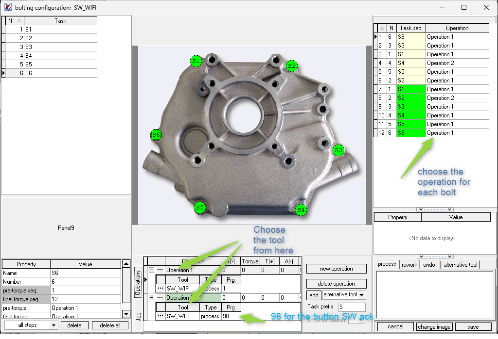

# Stahlwille Manoskop 766 WiFi Torque Wrench

The Stahlwille Manoskop 766 is an electromechanical torque wrench that provides precise torque control with visual and audible feedback. The tool features a color display and WiFi connectivity, allowing seamless integration with OGS for guided tightening operations.


## Installation and Configuration with OGS

### OGS Project Configuration

OGS has an interface to add additional tool drivers by adding Windows-DLLs to the `[TOOL_DLL]` section in `station.ini`. To simplify the creation of custom tool drivers, OGS offers the heLuaTool.dll, which enables the development of tool drivers using pure LUA. With this functionality, the Stahlwille WiFi torque wrench is seamlessly integrated into OGS. See [Lua custom tools](../../v3/lua/customtools.md) for more info.

### Tool Registration and Configuration

According to the instructions provided in the [Lua custom tools](../../v3/lua/customtools.md), a standard configuration for the `[LuaTool_Stahlwille_WiFi]` section in `station.ini` is as follows:

```ini
[TOOL_DLL]
heLuaTool.dll=1 

[CHANNELS]
20=LuaTool_Stahlwille_WiFi 

[LuaTool_Stahlwille_WiFi]
DRIVER=heLuaTool
Type=stahlwille_wifi
; TCP/IP connection parameters (direct WiFi connection)
IPADDR=10.10.2.166
IPPORT=4002
BUTTON_PRG=98
Debug=1
BUTTON_MSG={ "text":[ "Please press OK", "", "TO Confirm", "", "" ], "color":[ 6, 7, 1, 7, 7 ] }
PRG_01={ "name":"WiFi-JNT", "type":"JNT", "mode":"clic", "unit":"Nm", "elen":100.0, "t_min":6.1, "t_tgt":6.5, "t_max":7.5 }
PRG_02={ "name":"WiFi-JNA", "type":"JNA", "mode":"clic", "unit":"Nm", "elen":100.0, "t_thr":6.0, "a_min":5, "a_tgt":15, "a_max":25 }
PRG_03={ "name":"WiFi-JTA", "type":"JTA", "mode":"clic", "unit":"Nm", "elen":100.0, "t_min":6.1, "t_tgt":6.5, "t_max":7.5, "t_thr":5.0, "a_min":5, "a_tgt":15, "a_max":25 }
```

### Configuration Parameters

#### Tool Parameters

- `DRIVER`: The name of the Windows DLL that implements tool drivers (heLuaTool).
- `Type`: The name of the tool driver specified in your custom LUA tool driver (`stahlwille_wifi`).
- `IPADDR`: IP address for WiFi communication with the tool (e.g., `10.10.2.166`).
- `IPPORT`: Port number for communication (default: `4002`).
- `BUTTON_PRG`: Program number used for button confirmation operations (e.g., `98`).
- `Debug`: Enable debug logging (`1` = on, `0` = off).


#### Tightening Programs

The tool supports multiple tightening strategies with configurable parameters:

**Program Format:**
```ini
PRG_XX={ "name":"Name", "type":"TYPE", "mode":"clic", "unit":"Nm", "elen":100.0, ... }
```

**Common Parameters:**

- `name`: Program name (displayed to operator)
- `type`: Tightening strategy type (see below)
- `mode`: Feedback mode (`"clic"` for audible click)
- `unit`: Torque unit (`"Nm"` for Newton-meters)
- `elen`: Electronic angle measurement length (degrees)

**Tightening Strategy Types:**

##### 1. JNT (Joint Torque)
Pure torque-based tightening with min/target/max limits.

```ini
PRG_01={ "name":"WiFi-JNT", "type":"JNT", "mode":"clic", "unit":"Nm", "elen":100.0, "t_min":6.1, "t_tgt":6.5, "t_max":7.5 }
```

Parameters:
- `t_min`: Minimum acceptable torque (Nm)
- `t_tgt`: Target torque (Nm)
- `t_max`: Maximum acceptable torque (Nm)

##### 2. JNA (Joint Angle)
Torque threshold with angle monitoring.

```ini
PRG_02={ "name":"WiFi-JNA", "type":"JNA", "mode":"clic", "unit":"Nm", "elen":100.0, "t_thr":6.0, "a_min":5, "a_tgt":15, "a_max":25 }
```

Parameters:
- `t_thr`: Torque threshold to start angle measurement (Nm)
- `a_min`: Minimum acceptable angle (degrees)
- `a_tgt`: Target angle (degrees)
- `a_max`: Maximum acceptable angle (degrees)

##### 3. JTA (Joint Torque + Angle)
Combined torque and angle strategy for critical joints.

```ini
PRG_03={ "name":"WiFi-JTA", "type":"JTA", "mode":"clic", "unit":"Nm", "elen":100.0, "t_min":6.1, "t_tgt":6.5, "t_max":7.5, "t_thr":5.0, "a_min":5, "a_tgt":15, "a_max":25 }
```

Parameters:
- Combines all parameters from JNT and JNA strategies
- First evaluates torque limits, then angle limits

##### 4. JAT (Joint Angle + Torque)
Torque and angle evaluation where the tool first checks the programmed angle window and then verifies that the final torque remains inside the acceptable range. Use this strategy when the application is primarily angle-driven but still requires torque verification as a safety net.

```ini
PRG_04={ "name":"WiFi-JAT", "type":"JAT", "mode":"clic", "unit":"Nm", "elen":100.0, "t_min":6.1, "t_tgt":6.5, "t_max":7.5, "t_thr":5.0, "a_min":5, "a_tgt":15, "a_max":25 }
```

Parameters:
- Angle (`a_min`, `a_tgt`, `a_max`) is validated first once `t_thr` is reached.
- Final torque window (`t_min`, `t_tgt`, `t_max`) is checked after the angle requirement succeeds.

#### Display Message Configuration

The tool's color display supports 5 lines of text with customizable colors. Messages are configured using JSON format.

**Button Confirmation Message:**

For operations requiring operator confirmation (using `BUTTON_PRG`), you can configure a custom message:

```ini
BUTTON_MSG={ "text":[ "Please press OK", "", "TO Confirm", "", "" ], "color":[ 6, 7, 1, 7, 7 ] }
```


**Color Codes:**

| Code | Color |
|------|-------|
| 0 | Red/Black |
| 1 | Green/Black |
| 2 | Cyan/Black |
| 3 | Yellow/Black |
| 4 | Red/Grey |
| 5 | Green/Grey |
| 6 | Light Blue/Black |
| 7 | Grey/Black |
| 8 | Cyan/Grey |
| 9 | Dark Blue/Black |

**Note:** Line 3 uses a larger font, so keep text short for optimal display.

#### Program States

During operation, the tool reports the following program states:

| State | Description |
|-------|-------------|
| 0 | No joint in memory |
| 1 | Joint active (tightening in progress) |
| 2 | Joint inactive |
| 3 | Joint passed (successful tightening) |
| 4 | Joint failed (tightening outside limits) |
| 5 | Fixing detection |

## Editor Configuration

### Configuring the Tool

In the Tools section of the Editor, create a new tool with a name of your choice (e.g., "Stahlwille WiFi") and assign it to the appropriate channel (ensure the channel number matches the one specified in the `station.ini` file).


### Creating a Job

To set up a job and task with the appropriate operations:

1. In the Jobs catalog of the Editor, create a new job and add a new task.
2. Add an operation and assign the Stahlwille WiFi tool to it.
3. Set the **Program (Prg)** value to match the program number defined in `station.ini` (e.g., `1` for PRG_01, `2` for PRG_02, etc.).
4. For button confirmation operations, use the `BUTTON_PRG` value (e.g., `98`).



### Family Configuration

In the Family tab of the Editor, create a new family. Configure the `Model` and `Barcode mask`, then link the newly created job to the family.


## Operation

When a job is active, OGS will:

1. Load the configured tightening program to the tool
2. Display instructions on the tool's screen
3. Wait for the operator to perform the tightening
4. Validate the results against the configured limits
5. Display success or failure feedback


The tool provides immediate visual and audible feedback during tightening, guiding the operator to achieve the target torque and angle values.
