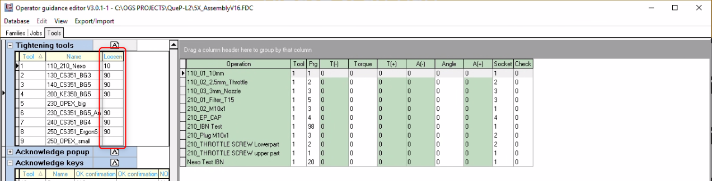

# OpenProtocol tools

## Overview

OGS supports connecting tools with `OpenProtocol` interface. As tools differ in functionality and also different tool vendors implement the `OpenProtocol` specification in slightly different ways, OGS has special protocol handlers for the following tools:

- Rexroth Nexo and Nexo 2 wireless tools (for more information, see [Nexo OpenProtocol](./nexo.md))
- Rexroth CS351 and KE350 system tools (for more information, see [KE350 OpenProtocol](sys350-ke350.md) and [CS351 OpenProtocol](sys350-cs351.md))
- Rexroth OPEXplus (for more information, see [OPEXplus OpenProtocol](opexplus.md))
- GWK Operator+ torque wrenches (for more information, see [GWK Operator+ OpenProtocol](./gwk.md))
- Crane TCI torque wrenches (for more information, see [Crane OpenProtocol](./crane.md))
- Gehmeyr Exact Wifi tools (for more information, see [Gehmeyr OpenProtocol](./gehmeyr.md))
- Sturtevant Richmont Global 400 MP connected Exacta 2 digital torque wrenches (for more information, see [Sturtevant Richmond OpenProtocol](./sturtevant.md))
- HS-Technik riveting tool

The overall configuration for these tools is similar and the actual driver has the same set of configuration parameters - described on this page.

To workaround various glitches in the tools concrete OpenProtocol implementation, the tools are identified by their MID0002 vendor string and their tool type name. For more details, see the [CHANNEL TYPE Parameter](#type) description in the [Channel parameter reference](#channel-parameter-reference) below. 

The supported tool types and vendor codes are:

| Tool type | Vendor code | Vendor | Comments |
| --- | ---- | ---- | ---- |
| NEXO | BRC | Bosch Rexroth | Wireless Nexo Tool |
| CS351 | BRC | Bosch Rexroth | Single channel Compact Box |
| KE350 | BRC | Bosch Rexroth | Multispindle system |
| OPEX | REX | Bosch Rexroth | OPEXplus torque wrench |
| CRANE | CEL | Crane Electronics | TCI Multi, Wrenchstar |
| GHM | GHM | Gehmeyr | GF-ION-EXACT |
| GWK | GWK | GWK | Operator+, Operator22 |
| CET | CET | Sturtevant Richmond | Global 400mt controller |
| BTC | BTC | HS-Technik | NutBee riveting tool |
| ATG | ATG | Cleco | Cleco wifi battery tool |

## Installation

The `OpenProtocol` driver is implemented in `OpConn.dll`. To use any `OpenProtocol` tool, the driver must be loaded in the `[TOOL_DLL]` section of the projects `station.ini` configuration file (see also [Tool configuration](/docs/tools/README.md)).

## Tool registration and configuration

All `OpenProtocol`-tools are registered in the `[OPENPROTO]` section of the projects `station.ini` file.

The `[OPENPROTO]` section mixes the tool parameters and the channel mapping (due to historic reasons) by combining the channel number and the parameter name/value in the `station.ini` entry. 

Each parameter is prefixed with the channel number and followed by parameter name as follows:

    CHANNEL_<two-digit channel>_<param name>=<param value>

Where
- `<two-digit channel>` is the channel number in the range 01...99 (the channel number maps 1:1 to the tool number from the workflow configuration) 
- `<param name>` is the parameter name (see [Channel parameter reference](#channel-parameter-reference))
- `<param value>` is the actual parameter value for the given parameter

In addition to the channel-specific parameters, there are also shared parameters. These act as default parameters for the channel-specific settings and can be overridden by the channel specific values.

For more details on the shared parameters, see [Shared parameter reference](#shared-parameter-reference)) below .

A sample `OpenProtocol` tool configuration (channel 01) would therefore look similar to the following:

``` ini
[OPENPROTO]
# Shared/default parameters
PORT=4545
# Channel/Tool 1 parameters
CHANNEL_01=10.10.2.163
CHANNEL_01_TYPE=NEXO
CHANNEL_01_CHECK_TIME_ENABLED=1
CHANNEL_01_CURVE_REQUEST=1
```

## Loosen modes

Typically tightening tools support tightening and loosening processes - often (for most tools except torque wrenches) by having an additional direction selection switch on the tool. The direction switch typically allows selecting between two differen PSets, which are used for running the tool when the start button on the tool is pushed:

- "primary" PSet (used for tightening)
- "secondary" PSet (used for loosening)

However, OpenProtocol has no support for this functionality bult-in natively - 
 it only supports selecting an "active" PSet (for the "primary" PSet). Depending on the tool type and vendor, there are different ways how the direction switch can be used with OGS, so OGS can control/prevent loosening:

- Tool reports direction switch position over OpenProtocol I/O signals (using MID500 or MID210/MID241)
- Tool allows blocking the loosening switch "secondary" position over OpenProtocol I/O signals (using MID504 or MID200/MID240)
- Tool forcibly selecting a PSet, if the direction switch is set to the "secondary" position
- Tool automatically selectiong a different PSet after NOK rundowns on the primary PSet
- ...

By default, OGS selects a specific PSet (using MID0018) for loosen as defined in the tools configuration in the heOpCfg editor:



For tools which support OpenProtocol I/O signals, OGS also provides an additional I/O signal which is set to true while the OGS is in tightening mode (and false while in loosening mode), which allows tailoring the behaviour even more (e.g. allow loosen with the direction switch set to CW, etc.). Also OGS can read an additional input signal reporting the state of the tools CW/CCW switch, so it can act accordingly and show a warning to the user eventually. See also below [`CHANNEL_<tool>_CCW_ACK`](#channel_tool_ccw_ack) for enforcing the direction switch setting.

Note, that OGS can also be configured to block loosening in general (see [user rights for loosen](#user-rights-for-loosen) below)!

### NOK behaviour and rework parameters

To undestand NOK behaviour, it is important to understand that each `Task` (for tightening this is tightening a bolt) configured and executed in OGS consists of (up to) four different operations:

- `main process`: This is the main operation defined in the configuration database. For a tightening task, this is tightening with a given PSet and eventually socket. This is the operation, which is normally executed, if the task state is "new" (untightened).
- `rework`: This is the operation, if the main operation failed or if the task state was "nok". For tightening this is typically using a loosen PSet to loosen the bolt.
- `undo`: Only used for special cases, by default the same as rework.
- `alternative tool`: Only used in alternative tool mode, by default this is not available.

For tightening tools, the `rework` operation is implicitely defined by the tool configuration in the configuration database and the projects `station.ini` file (but can be overridden by defining a seperate `rework` operation in the configuration database) - see the screenshot in the previous section. 

OGS has tree different basic NOK behaviours (set in the `[GENERAL]` section in `station.ini` in the `NOK_STRATEGIE` parameter):

- 0 (default): Stay on the task/bolt and automatically select the `rework` operation after a NOK 
    rundown. In this case OGS automatically selects the configured loosening program
    after a NOK rundown. This allows the operator to immediately loosen a bolt after NOK
    without the need to enable CCW operations (and optionally without the operator switching 
    the CW/CCW switch to CCW). 
   
    Note that the operator still needs to acknowledge the NOK rundown (if enabled in the tools 
    configuration) before he can start the loosening operation. Note also that the program used
    for the loosening operation must be defined in the tool configuration section of the 
    configuration editor

    Note that manual loosen on the tool (by using the CCW switch) is disabled in this mode by
    default (if `CHANNEL_<tool>_CCW_ACK` not set or = 0). 

- 1: Skip task after a NOK rundown. In this case the current bolt is marked NOK and the job 
    automatically continues immediately with the next bolt.

- 2: Stay on task after NOK rundown. In this case the job does not execute the `rework`operation,
    but restarts the `main process`. It therefore re-enables the tool after a NOK rundown, but stays
    on the current bolt. The next bolt is only selected after a OK rundown. 

Note that this behaviour can be overridden by implementing the LUA function `GetNokBehaviour(...)`.

### Sequence interlock between tightening and loosening

In a typical sequence of operations, there is a risk, that the operator does not recognize a NOK result.
Typically after a NOK rundown, a loosen operation is required - if the operator does not notice the NOK,
he might move on to the next bolt and start the tool - then with a loosen operation. This will lead to 
confusion and possibly corrupt the sequence of operations, even tightening on the wrong bolt.

To prevent this to happen, the tool is typically blocked after NOK and requires additional interaction
from the operator, so the NOK will not pass unnoticed. OGS provides the following options:

- Block the tool after a NOK rundown and require a supervisor to continue (four eye witness process)
- Block the tool and wait for the operator to switch to loosen (`CHANNEL_<tool>_CCW_ACK` set to 1 and
  CCWSel supported)
- Configure the tool to require a NOK acknowledge (tool configuration). Most tools support this by an 
  additional acknowledge button, which must be pressed after a NOK rundown to re-enable the tool

!!! note

    As a general rule for tightening tools, make sure to setup the parameters of the tightening
    programs to detect running the tool on a already fastened bolt and report this as a NOK
    rundown. This ensures OGS can stay in sync with the actual sequence and cannot easily be
    manipulated.

!!! note

    For higher level requirements, OGS suports tool position tracking - this ensures that a bolt
    cannot run twice and the operator cannot work on the "wrong" bolt.

!!! danger

    For hand held tools it is very important to enable the `CHANNEL_<tool>_CCW_ACK` feature and
    require the operator to switch to loosen before running the tool. Otherwise he might get suprised
    by the reaction force and could get injured!

### Wait for CCWSel input

If `CHANNEL_<tool>_CCW_ACK` is set to a non-zero value in the `station.ini` configuration for the tool, then OGS requires the tools direction switch position to be in the correct position according to the processes currently requested tightening mode (tighten/loosen). If not, an alert message will be shown to indicate that the operator should change the direction switch accordingly and the enable signal for the tool is inactive.

Note that this behaviour can be overridden by implementing the LUA function `GetNokBehaviour(...)`.

Please see the tool specific documentation on the available loosening modes and recommendations on how to setup the tool for use with OGS.

### CCWLock/CCWIgnore output

For tools which support OpenProtocol I/O signals, OGS also provides an additional I/O signal which is set to true while the OGS is in tightening mode (and false while in loosening mode). This signal can be used to block a CCW start while OGS expects tightening by assigning a corresponding controller signal (e.g. CCWLock or CCWIgnore for [KE350](sys350-ke350.md) or [CS351 ](sys350-cs351.md)). 

Note, that the signal is set to high (block loosen) only, if the current logged on user does not have the user right `CCW` assigned (see [OGS user rights](../../v3/lua/userrights.md) for more information).

!!! warning

    Without proper support for CCWLock/CCWIgnore, OGS cannot prevent the tool running a loosen program.
    In this case, tools which select an internally defined lossen program when the start switch is set
    to CCW should be configured such that the tool won't start (if the direction switch is set to CCW
    and the operator presses the start switch)!
    In addition, a on-tool NOK acknowledge should be configured and OGS must be set to select the loosen
    program (`CHANNEL_<tool>_CCW_ACK` mujst be set to 0). 


### User rights for loosen

OGS has two sepperate user rights related to loosen (see also [OGS user rights](../../v3/lua/userrights.md) and [NOK behaviour](#nok-behaviour-and-rework-parameters)):

- `processNOK`: This right defines, if an operator is allowed to execute the rework operation after a failed primary process operation. If this right is not given, then the operator is not allowed to execute the rework operation - in case of a tightening tool, this means he is not allowed to loosen (by default, a warning message is shown in this case, indicating to call a supervisor).
- `CCW`:  This right defines, if an operator is allowed to switch to CCW mode on the tool. If this right is given, the operator
   is allowed to loosen regardless of the OGS current process state. 


## OpenProtocol driver parameters reference

### Shared parameter reference

The shared parameters are used to change the global defaults for all OpenProtocol tools. If assigned, then these settings will override the built-in defaults. Note, that a channel-specific setting will take priority anyways.

#### PORT 
_(optional, defaults to 4545)_

Defines the TCP port used for OpenProtocol communication. By default uses the standard OpenProtocol port 4545. If the controller supports multiple tools through a single IP address, then typically this setting must be changed to correctly connect to the individual tool.

#### CHECK_TIME_INTERVAL 
_(optional, defaults to 5 [minutes])_

Defines the time [in minutes] when OGS shall check the tools clock. This setting is only used, if time synchronization is enabled for the tool (see [CHANNEL_[TOOL]_CHECK_TIME_ENABLED](#channel_tool_check_time_enabled) below).

#### TIME_TOLERANCE
_(optional, defaults to 5 [seconds])_

Defines the maximum allowed time difference [in seconds] before OGS corrects
the tools realtime clock. This setting is only used, if time synchronization is enabled for the tool (see [CHECK_TIME_ENABLED](#check_time_enabled) below).

#### EXTERNAL_IO_OFFSET
_(optional, defaults to 0)_

This setting enables custom IO access (through LUA) over the OpenProtocol interface. This can be used to read physical inputs and set physical outputs connected to the controller over OpenProtocol.

Depending on the tool, different MIDs are used - to enable this for CS351 and KE350, set it to 2.

### Channel parameter reference

For specific information about a tools settings or the tools configuration needed (on the tool side), please see the tool-specific information.

The parameter names are composed of the channel prefix `CHANNEL_` followed by the channel/tool number (1-32) and the actual parameter name (e.g. `TYPE`). - see the detailed description above. 

In general, the following parameters are available for a `OpenProtocol`-tool:

#### CHANNEL_[tool]_IP 
_(mandatory)_

This setting defines the IP address to use for communication with the tool.

#### CHANNEL_[tool]_PORT
_(optional, defaults to the shared parameter value)_

See [PORT](#port) in the [shared parameter reference](#shared-parameter-reference).

#### CHANNEL_[tool]_TYPE
_(mandatory)_

The allowed tool types and their default parameters are listed in the following table (see the [overview section](#overview) above for tool details):

| Tool type | Alive send rate | Response Timeout | Comments |
| ---   | ---- | ---- | ---- |
| NEXO  | 2 | 5  |  |
| CS351 | 5 | 15 |  |
| OPEX  | 2 | 5  | No MID0040 support, use MID0061 tool SN |
| KE350 | 5 | 15 |  |
| CRANE | 1 | 5  |  |
| GHM   | 2 | 5  | MID0060 Rev 999 only, no alarms |
| GWK   | 2 | 5  | No MID0040 support, use MID0061 tool SN |
| CET   | 2 | 5  | no alarms, incorrect (+1) result ID sequence |
| BTC   | 2 | 5  |  |
| ATG   | 2 | 5  |  |

NOTES:
- The Alive send rate and Response timeout default parameter values can be overridden by the [CHANNEL_[tool]_ALIVEXMTT](#channel__alivexmtt) and [CHANNEL_[tool]_RSPTIMEOUT](#channel__rsptimeout) parameters. 
- All tools use a slightly different set of MIDs to control operation, e.g. some do support alarms, others don't or allow different revisions of the MID commands.
- For Nexo with firmware < V1500, a Alive send rate of 1000ms or less is recommended to ensure stable WiFi operation
- For CS351 and KE350, do not use a Alive send rate less than 5 second, else the controller may become unresponsive 

#### CHANNEL_[tool]_CCW_ACK
_(optional, default = 0 (disabled))_

Defines, if the operator must select a loosen operation on the tool to start
a loosen process (for tools having a CW/CCW switch which is accessible over OpenProtocol).
Currently only Rexroth Nexo, CS351 and KE350 support this feature, but other tools supporting
I/O signals over OpenProtocol are possible.

The following settings are available:

- 0: Disabled. OGS select a CCW program automatically
- 1: Enabled. Operator must switch to CCW manually (possibly selecting the tools builtin loosen program instead of
    the loosen program defined in the configuration database)

#### CHANNEL_[tool]_ALIVEXMTT
_(optional, default defined by tool type (see above))_

Defines how often OGS shall send an `ALIVE` data packet (`MID9999`) to the tool to check for connectivity. The value is given in milliseconds.

If OpenProtocol communication is received from the tool within 3 times of
this time setting, then the connection with the tool is considered
disconnected. In this case, OGS shuts down the connection and tries to reconnect. 

#### CHANNEL_[tool]_RSPTIMEOUT
_(optional, default defined by tool type (see above))_

Defines how long OGS shall wait for an OpenProtocol command response from 
the tool before considering the connection as disconnected. The value is 
given in milliseconds.

If no answer for a command sent by OGS to the tool is received within this time setting, then the connection with the tool is considered disconnected. 
In this case, OGS shuts down the connection and tries to reconnect.

#### CHANNEL_[tool]_BARCODE_MID0051_REV
_(optional, default = 0 (disabled))_

If set to a nonzero value, the `MID0051` (ID-Code change) subscription is 
enabled. This can be used to read ID-Codes through a barcode scanner built into the tool (instead of using a seperate scanner).

See the tool-specific documentation about how to enable barcode scanning with
ID-Code forwarding.

#### CHANNEL_[tool]_CHECK_EXT_COND
_(optional, default = 0 (disabled))_

Defines, how the tool enable shall follow the OGS enable signal. The following 
options are available:

- 0: Only check the enable once for each tool operation. 
- 1: Cyclically check the enable while a tool operation is active. 

#### CHANNEL_[tool]_APPL_START
_(optional, default = 0 (single channel mode))_

If set to a nonzero value, OGS uses multispindle (fastening application) mode 
to control the tool. This also changes other behaviour for the communication,
e.g. uses `MID0100` to subscribe for results instead of `MID0060` (for single
channel results).

See [System 350 OpenProtocol](/docs/tools/openprotocol/sys350.md) for more info about multi-spindle mode and how to set it up.

#### CHANNEL_[tool]_CURVE_REQUEST
_(optional, default = 0 (disabled))_

If set to a nonzero value, OGS requests the tightening curve data after a 
rundown has completed. 

NOTES: 

- Depending on the tool type, this introduces significant delays for the
tightening operation!
- If curves are only needed for validation purposes, then [Tool mirroring/twins](#tool-mirroringtwins) can be set up with different parameters for the main and the mirrored tool!

#### CHANNEL_[tool]_CHECK_TIME_ENABLED
_(optional, default = 0 (disabled))_

If set to a nonzero value, OGS checks the tools realtime clock and adjusts it,
if the time delta between the OGS system time and the tools system time is tool large.

See the [shared parameter section](#shared-parameter-reference) for more parameters related to time synchronization.

#### CHANNEL_[tool]_IGNORE_ID
_(optional, default to the tool type)_

Set to a nonzero value to ignore the tightening result ID returned in the tightening results from the tool. OGS expects and validates, that each rundown
of a tool uses an incrementing tightening result ID to ensure no lost or out of
sync tightening results. However, some tools have a flaky implementation so there is an option to disable these checks.

#### Debugging settings

##### CHANNEL_[tool]_SHOWALIVE
_(optional, default = 0 (disabled))_

Set to nonzero to log `MID9999` (alive) messages in the OGS ETW logs.

##### CHANNEL_[tool]_PARAMS
_(internal, default depending on tool type)_

#### LUA settings

Please note, that other drivers can also access the `[OPENPROTO]` section, so
additional tool specific parameters might be added here, e.g.

- `CHANNEL_[tool]_NEXONAR_CHANNEL=
- `CHANNEL_[tool]_POSITIONING=


## Tool mirroring/twins

(tbd).
