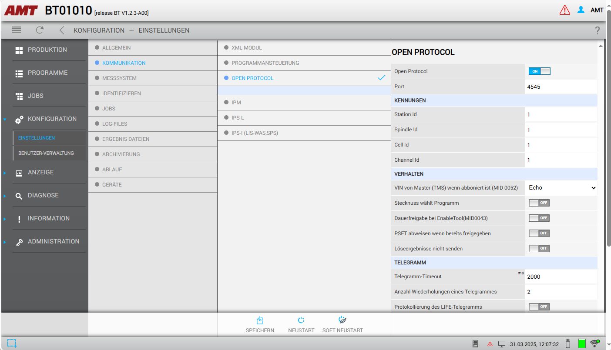
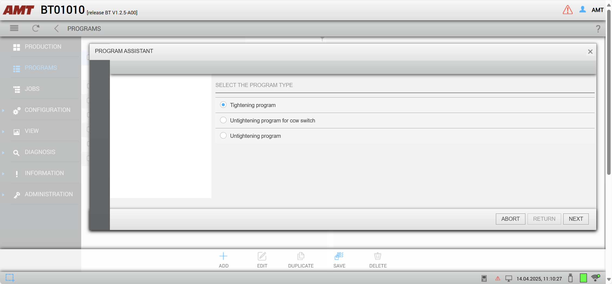
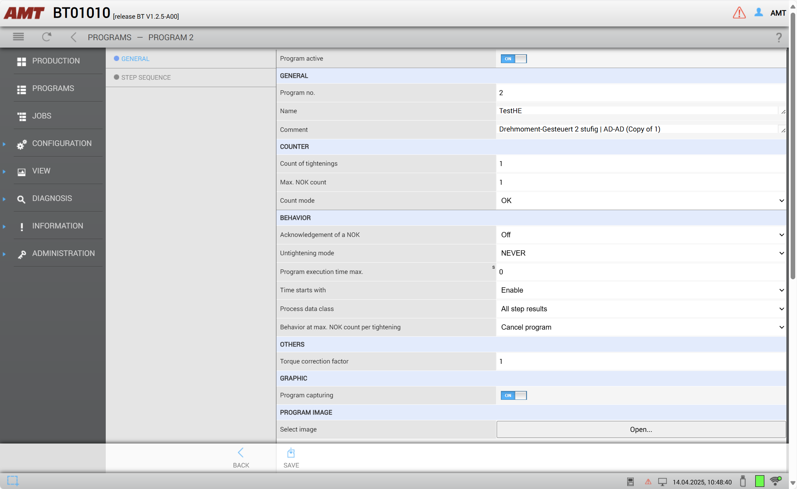
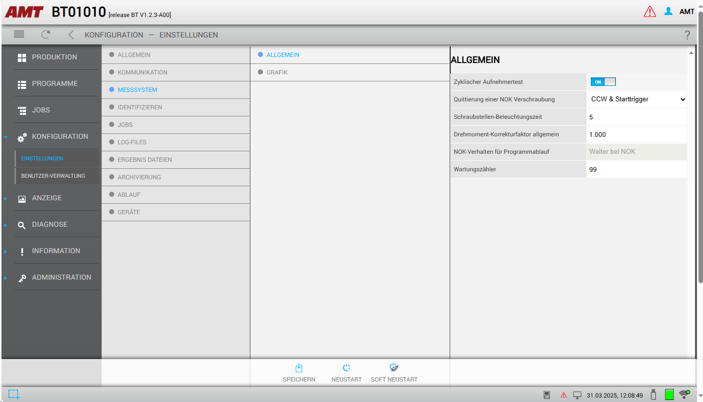
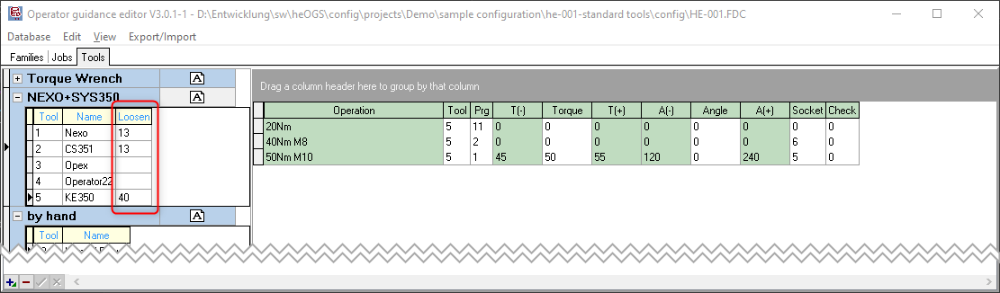

# AMT/EST SX Wifi battery tools

!!! warning

    This page is work in progress! Do not rely on anything written here!

!!! info

    This page describes the specifics for configuring the AMT/EST SX wifi battery tools to work with OGS, for general information about the OGS OpenProtocol configuration, see [OpenProtocol Tools](README.md).


## Overview

{ width="300", align=right }
The [AMT SX family of tightening tools from EST](https://amt.schmidgruppe.de/de/produkte/amt/schraubtechnik/akku-werkzeuge-hsxb.html) provide optimized ergonomic design and lightweight configuration to reduce operator strain. This leads to an increase in individual productivity and, as a result, a reduction in running production costs. The tools feature a build-in controller with web access for easy integration into a wifi infrastructure and stand-alone operation. The web server provides all functions needed for setting up, configuring, diagnostics and for monitoring the tools operation.

To access the configuration, open a web browser and connect it to the tools IP address (hint: press and hold the acknowledge button right next to the display until the text `Maintainence` is shown, then use the up/down buttons to the left of the display to scroll to the wifi menu to readout the current connection settings or to enable the internal wifi access point - the SSID is `xSXSBW_<sn>` with password `schrauber`). To initially configure the tool (before wifi is configured), remove the battery and connect a PC to the `CPU` port using a Micro-USB cable - this will load a new RNDIS USB network interface and allows connecting to the tool at the predefined IP address 192.168.252.33 (default user: admin/admin, amt/amt).

## OpenProtocol setup

To enable the OpenProtocol interface, connect to the tool using a webbrowser and navigate to `Configuration --> Settings --> Communication`. Then configure as follows:



## Program definition

### Nok/acknowledge/retry parameters 

To ensure, that the operator can not incorrectly loosen, typically a tightening program should be set up to not allow loosen (as this is handled by OGS). The AMT tool generally has three different types of tightening programs:

1. Clockwise tightening (pset > 0): Running with the direction switch set to CW and the direction set to "right turning" in the general section of the program parameters 
2. Counterclockwise tightening (pset > 0): Running with the direction switch set to CW and the direction set to "left turning" in the general section of the program parameters
3. Loosening (pset = 0): Running with the direction switch set to CCW

Here is an overview:


The tool internally requires an acknowledge after NOK which can be configured to automatically enable the loosening mode (PSet = 0) and requiring the user to switch the direction switch to CCW. 

For use with OGS there are currently (with firmware `LIB-OP V0.0.4.3`) two options to use with rework/loosen:

1. Don't use PSet 0 (let OGS automatically select a loosen PSet > 0 and start with CW direction switch start). In this case, PSet 0 can be be deleted to prevent it from being selected by the operator. Make sure to enable [NOK acknowledge (see below)](#nok-acknowledge) to prevent OGS from switching directions without acknowledge!
2. Use PSet 0 as loosen. Note, that in this case OGS cannot prevent the operator from (incorrectly) running a loosen operation (e.g. loosen an already good bolt), so the program *must* at least be configured to only run after Nok. OGS will interpret each received rundown result with PSet = 0 as a loosen operation and will reset the state of the current bolt accordingly. However, that this still might allow the operator to falsely run loosen on an already tightened bolt, e.g. if the sequence is changed by manually interacting with the OGS interface! 

Here are the recommended setting for option 1:



!!! note

    Make sure to save and restart (soft restart) the tool after changing a program.
    Note also, that changing a program is only possible, if the tool is not currently enabled - else saving the program will timeout or throw an error!

### CW/CCW switch settings

With the current firmware version (`LIB-OP V0.0.4.3`), it is neither possible to monitor the start switch direction setting, nor is it possible to block CW or CCW start specifically. 

### NOK-Acknowledge

The tool supports integrated NOK acknowledge through OpenProtocol alarms. To make this work, the NOK-acknowledge mode should be set either globally (see below) and used in the tightening programs or set in each tightening program specifically.



The actual flow of events in case of an active NOK-ackowledge is then as follows:

1. NOK rundown sends NOK tightening result to OGS and raises the E356 alarm
2. OGS blocks enable (wait until alarm is released again, effectively waiting for acknowledge)
3. Operator must acknowledge the NOK rundown as configured (switch to CCW, hit start button, ...)
4. The tool releases the alarm after the operator acknowledge, so OGS now can step to the next action (usually select a loosening program) and enable the tool again if needed

## OGS configuration

### Overview

Configuring OGS for use with AMT/EST SX tools requires the following:
- Configure the tool connection parameters in `station.ini`
- Database setup, workflow and tool configuration in the heOpCfg workflow editor

### station.ini configuration

Station.ini configuration uses the standard parameters of the OpenProtocol driver (see [OpenProtocol Tools](README.md)).
To work with the `Rexroth OP-Ford R1.0` protocol in the KE350, the channel TYPE parameter must be set to `AMT`.

Here is a sample configuration for tool/channel 1:

``` ini
[OPENPROTO]
# Channel/Tool 1 parameters
CHANNEL_01=10.10.2.163
CHANNEL_01_PORT=4545
CHANNEL_01_TYPE=AMT
CHANNEL_01_CCW_ACK=0
CHANNEL_01_CHECK_TIME_ENABLED=1
CHANNEL_01_CURVE_REQUEST=1
```

### Tool configuration

To add a tool, add it as any other tool to the tool configuration and define the default loosen program:



### Loosen behaviour

Even though there are more options (see the general discussion in [OpenProtocol Tools - Loosen modes](README.md#loosen-modes)), the current firmware of the tools do neither support getting the state of the start switch direction nor do they support selective blocking of CW/CCW starts. So the recommended setting is to use NOK acknowledge and letting OGS select a loosen CW program afterwards (or do a simple retry if that is sufficient).

#### Simple retry

Set the rework strategy to 2 (repeat) in `station.ini` by setting the parameter `NOK_STRATEGIE=2` in the `[GENERAL]` section.

#### Loosen after acknowledge

Make sure to define a loosen program for the tool in the [tool configuration](#tool-configuration).

