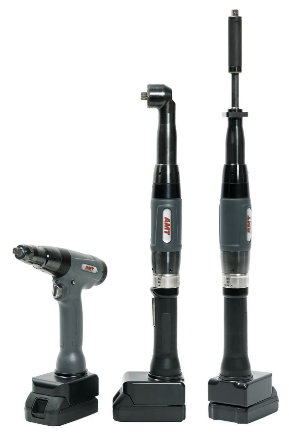
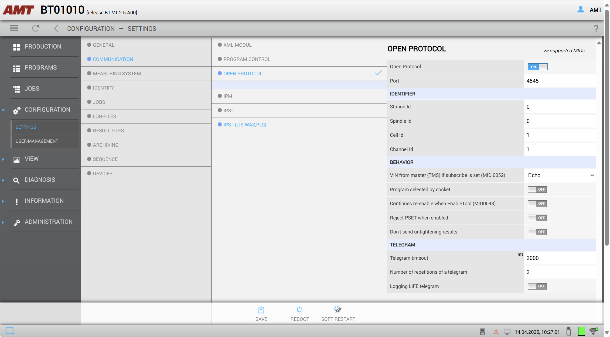
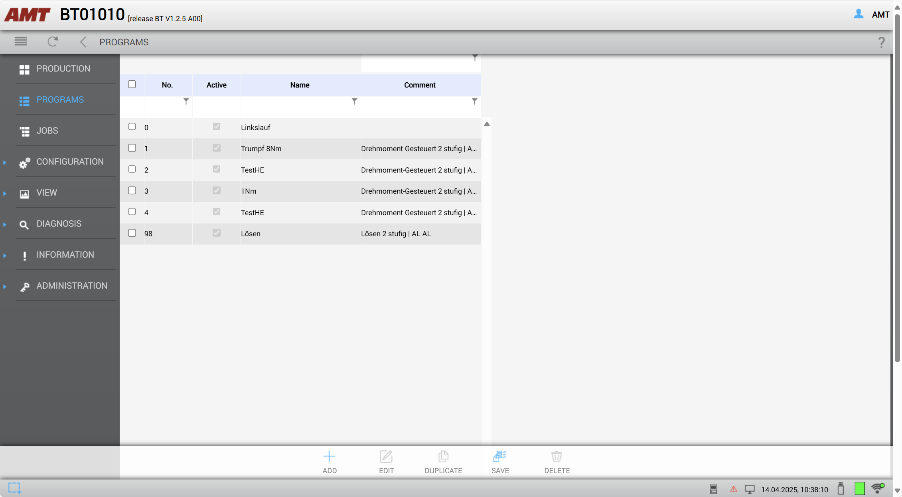
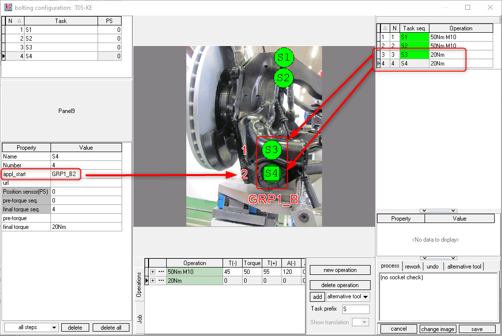

# AMT/EST SX Wifi battery tools

!!! warning

    This page is work in progress! Do not rely on anything written here!

!!! info

    This page describes the specifics for configuring the AMT/EST SX wifi byttery tool to work with OGS, for general information about the OGS OpenProtocol configuration, see [OpenProtocol Tools](README.md).


## Overview

AMT SX-Schrauberfamilie von EST

 {width="300", aligh=right}

(default user: admin/admin, amt/amt)

## OpenProtocol setup



## Program definition

### Nok/acknowledge/retry parameters 




## NOK-Acknowledge

Common settings


### Loosen program

If PSet 0 does not exist, then create a new one as follows:


## OGS configuration

### Overview

Configuring OGS for use with AMT/EST SX tools requires the following:
- Configure the tool connection parameters in `station.ini`
- Database setup, workflow and tool configuration in the heOpCfg workflow editor

### station.ini configuration

Station.ini configuration uses the standard parameters of the OpenProtocol driver (see [OpenProtocol Tools](README.md)).
To work with the `Rexroth OP-Ford R1.0` protocol in the KE350, the channel TYPE parameter must be set to `AMT`.

Here is a sample configuration for tool/channel 1:

``` ini
[OPENPROTO]
# Channel/Tool 1 parameters
CHANNEL_01=10.10.2.163
CHANNEL_01_PORT=4545
CHANNEL_01_TYPE=AMT
CHANNEL_01_CCW_ACK=0
CHANNEL_01_CHECK_TIME_ENABLED=1
CHANNEL_01_CURVE_REQUEST=1
```

### Tool configuration

To add a KE350 tool, add it as any other tool to the tool configuration and define the default loosen program:


### Multi-Spindle configuration

For KE350, OGS uses application start (fastening operations), where a single start command can start a group of spindles.
If more than a single spindle is started, OGS needs to know which bolt is mapped to which spindle. This is done by assigning 
a group (this defines which bolts belong to a single application start) and a sequence number (which actually maps the
bolt to the spindle). The Both parameters are set in the `appl_start` task parameter.

The `appl_start` task parameter can be enabled in the workflow editor in `database --> settings` as follows (check the "Application start" parameter):
{ width=300px }

The `appl_start` parameter is then found in the task properties:


The screenshot also shows how the spindles of the fastening operation is mapped: the `appl_start` property consists of the following two parts:

    appl_start = <group><sequence>

where

- `<group>` is a unique name to group the spindles of a single rundown. All bolts of a spindle group started through a single fastening operation **must** have the same `<group>` name.
- `<sequence>` is the sequential number of the spindle as configured in the BS350 application. 

The following screenshot shows a sample mapping:


Here application number 11 (fastening operation) is defined in BS350 and selected on OGS (operation "20Nm"). The application consists of two bolts:

- Sequence #1: Name="Pos1", Channel 4.3, Program 5
- Sequence #2: Name="Pos2", Channel 4.4, Program 5

The fastening operation in OGS is named `GRP1_B` (the `<group>` name)

!!! note

    If a fastening operation is used multiple times in an OGS
    job, then a unique group name must be used for each
    fastening operation.

If e.g. 3 times the dual-spindle application from the screenshot above shall be used, then the following six tasks can be 
configured:

::spantable::

| Application start | OGS Task  | appl_start | Group  | Sequence |
| ----------------- | --------  | ---------- | ------ | -------- |
| FO start #1 @span | S1        | GRP1_A1    | GRP1_A | 1        |
|                   | S2        | GRP1_A2    |        | 2        |
| FO start #2 @span | S3        | GRP1_B1    | GRP1_B | 1        |
|                   | S4        | GRP1_B2    |        | 2        |
| FO start #3 @span | S5        | GRP1_C1    | GRP1_C | 1        |
|                   | S6        | GRP1_C2    |        | 2        |

::end-spantable::


### Loosen behaviour

Even though there are more option (see the general discussion in [OpenProtocol Tools - Loosen modes](README.md#loosen-modes)), the following section shows the common and recommended configurations.

#### CCWSel used

This is the preferred configuration, as the user-experience is most intuitive. Unfortunately the most often used start grip handles do not provide the neccessary signals, as a start grip handle with two outputs as follows is needed:

- CW: start signal for tightening
- CCWSel: state of the direction switch, true, if CCW selected

With this configuration, the following settings are recommended:

- `CHANNEL_<tool>_CCW_ACK` = 1
- Connect `OP1.1 Input` to `FO 1 CCWLock` 
- Connect `OP1.0 Output` to the CCWSel signal of the handle (using AppIn/AppOut signals to bridge to IM24V/fieldbus)
- Usually `FO 1 NokAck` is not connected

This forces the operator to switch the CW/CCW selection switch to CCW every time a loosen process is needed.
Please note, that only the custom loosen program number can be used for loosen, as the CCW start signal is not
assigned.

#### No CCWSel, but NokAck

As most start handles only provide seperate start CW and start CCW signals (without a signal for indicating the CW/CCW position), CCWSel often cannot be used. To ensure sequence interlock between tightening and loosening, 
the `FO 1 NokAck` signal is connected to an external pushbutton (typically the start handle provides this). In this case, the following signals are typically used:

- CW: start signal for tightening
- CCW: start signal for loosening
- NOKAck: A normally closed (high) signal to acknowledge NOK, re-enable the tool

With this configuration, the following settings are recommended:

- `CHANNEL_<tool>_CCW_ACK` = 0
- Connect `OP1.1 Input` to `FO 1 CCWLock` 
- Connect `FO 1 NokAck` to the external NokAck pushbutton

This blocks the tool after an NOK until the NokAck button is pressed.
The `FO 1 CCWLock` signal ensures that loosen is blocked, if it is
not allowed. 

Note that loosening now uses the given application number set 
in the tool configuration and uses the CW start. If applications
with a different number of spindles are used, then an explicit
rework operation must be defined, matching the tightening operation
spindle set.

#### No CCWSel, no NokAck

See above, but interlock is now not possible. After a NOK rundown
OGS immediately selects the loosen operation, which is started with the next start (CW) signal...
