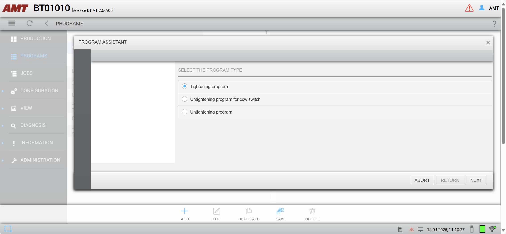
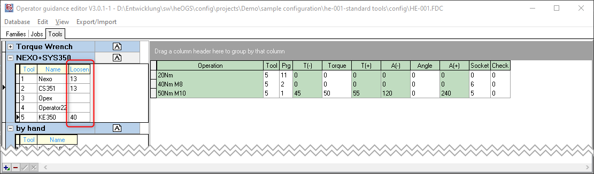

# Cleco CellCore Wifi battery tools

!!! info

    This page describes the specifics for configuring the Cleco CellCore wifi battery tools and their mPro200/300/400 controller to work with OGS. For general information about the OGS OpenProtocol configuration, see [OpenProtocol Tools](README.md).


## Overview

{ width="300", align=right }
The [Cleco CellCore family of cordless tightening tools](https://www.clecotools.com/) are smart, durable and designed to withstand the toughest environments. The lightweight ergonomic design reduces operator fatigue while delivering state-of-the-art power, weight and balance. By combining the tools with Cleco's mPro200/300/400 controllers, advanced tightening features and realtime data connectivity becomes available. A single controller can handle up to 10 tools for a much more compact footprint.

## OpenProtocol setup

To enable the OpenProtocol interface, connect to the tool using a webbrowser and navigate to `Navigator --> Communication` and look for the `OpenProtocol` parameters. Then configure as follows:

## Program definition

### Nok/acknowledge/retry parameters 
<!--
To ensure, that the operator can not incorrectly loosen, typically a tightening program should be set up to not allow loosen (as this is handled by OGS). The AMT tool generally has three different types of tightening programs:

1. Clockwise tightening (pset > 0): Running with the direction switch set to CW and the direction set to "right turning" in the general section of the program parameters 
2. Counterclockwise tightening (pset > 0): Running with the direction switch set to CW and the direction set to "left turning" in the general section of the program parameters
3. Loosening (pset = 0): Running with the direction switch set to CCW

Here is an overview:


The tool internally requires an acknowledge after NOK which can be configured to automatically enable the loosening mode (PSet = 0) and requiring the user to switch the direction switch to CCW. 

For use with OGS there are currently (with firmware `LIB-OP V0.0.4.3`) two options to use with rework/loosen:

1. Don't use PSet 0 (let OGS automatically select a loosen PSet > 0 and start with CW direction switch start). In this case, PSet 0 can be be deleted to prevent it from being selected by the operator. Make sure to enable [NOK acknowledge (see below)](#nok-acknowledge) to prevent OGS from switching directions without acknowledge!
2. Use PSet 0 as loosen. Note, that in this case OGS cannot prevent the operator from (incorrectly) running a loosen operation (e.g. loosen an already good bolt), so the program *must* at least be configured to only run after Nok. OGS will interpret each received rundown result with PSet = 0 as a loosen operation and will reset the state of the current bolt accordingly. However, that this still might allow the operator to falsely run loosen on an already tightened bolt, e.g. if the sequence is changed by manually interacting with the OGS interface! 

Here are the recommended setting for option 1:


!!! note

    Make sure to save and restart (soft restart) the tool after changing a program.
    Note also, that changing a program is only possible, if the tool is not currently enabled - else saving the program will timeout or throw an error!
-->

### CW/CCW switch settings
<!--
With the current firmware version (`LIB-OP V0.0.4.3`), it is neither possible to monitor the start switch direction setting, nor is it possible to block CW or CCW starts specifically. 
-->

### NOK-Acknowledge
<!--
The tool supports integrated NOK acknowledge through OpenProtocol alarms. To make this work, the NOK-acknowledge mode should be set either globally (see below) and used in the tightening programs or set in each tightening program specifically.


The actual flow of events in case of an active NOK-ackowledge is then as follows:

1. NOK rundown sends NOK tightening result to OGS and raises the E356 alarm
2. OGS blocks enable (wait until alarm is released again, effectively waiting for acknowledge)
3. Operator must acknowledge the NOK rundown as configured (switch to CCW, hit start button, ...)
4. The tool releases the alarm after the operator acknowledge, so OGS now can step to the next action (usually select a loosening program) and enable the tool again if needed
-->

## OGS configuration

### Overview

Configuring OGS for use with the Cleco mPro200/300/400 controllers requires the following:
- Configure the tool connection parameters in `station.ini`
- Database setup, workflow and tool configuration in the heOpCfg workflow editor

### station.ini configuration

Station.ini configuration uses the standard parameters of the OpenProtocol driver (see [OpenProtocol Tools](README.md)).
To work with the Cleco version of the `OpenProtocol`, the channel TYPE parameter must be set to `ATG`.

Here is a sample configuration for tool/channel 1:

``` ini
[OPENPROTO]
# Channel/Tool 1 parameters
CHANNEL_01=10.10.2.163
CHANNEL_01_PORT=4545
CHANNEL_01_TYPE=ATG
CHANNEL_01_CCW_ACK=0
CHANNEL_01_CHECK_TIME_ENABLED=1
CHANNEL_01_CURVE_REQUEST=1
```

### Tool configuration

To add a tool, add it as any other tool to the tool configuration and define the default loosen program:



### Loosen behaviour
<!--
Even though there are more options (see the general discussion in [OpenProtocol Tools - Loosen modes](README.md#loosen-modes)), the current firmware of the tools do neither support getting the state of the start switch direction nor do they support selective blocking of CW/CCW starts. So the recommended setting is to use NOK acknowledge and letting OGS select a loosen CW program afterwards (or do a simple retry if that is sufficient).
 -->
#### Simple retry
<!--
Set the rework strategy to 2 (repeat) in `station.ini` by setting the parameter `NOK_STRATEGIE=2` in the `[GENERAL]` section.
 -->
#### Loosen after acknowledge
<!--
Make sure to define a loosen program for the tool in the [tool configuration](#tool-configuration).
 -->


### Setup OpenProtocol parameters

Enable OpenProtocol in `Navigator --> Communications` by selecting the `Open Protocol` Ethernet communication protocol and checking the `Activated` checkbox:


Continue to configure the advanced settings by clicking the `Advanced` button.
Select the `Batch` page and configure as follows:


Then select the `General` page and make sure to set the behaviour for connection loss:


### Setup program selection

To enable program selection over OpenProtocol, open `Navigator --> Advanced`, then select the `Tool Group` tab. Make sure to select the correct tool group (repeat for all tool groups), then select the sub-page `I/O`. Check the `External Application / LG Selection` checkbox and set the `Mode` to `FEP / OpenProtocol`.

Here is a sample screenshot:


### Setup batch parameters

#### Configuration

!!! Important

    Cleco tools defines the batch paramters for each thightening program. To ensure correct operation, one **must** enable batch counting for all tightening programs!

To configure the batch counter, go to `Navigator --> Standard` and do the following:

- Select the `Tool Group` (menu `Tool Groups`) you want to modify (repeat for all tool groups)
- Select the tightening program (menu `Application`) you want to edit (repeat for all programs)
- Open `Settings --> Batch` for each tightening program, then set `Batch count mode` to `Open Protocol` and enable `Lock at batch done`. Here is a sample screenshot:


!!! note

    The setting must be repeated for all groups and all applications!

#### Hints

The "Run Screen" can be set to show the current batch value and configuration. To enable this feature, go to `Navigator --> Run Screen --> Configure` and enable the batch view:


This will then display the current batch counter/values:


### Define disable behaviour

To define the behaviour, if the tool enable signal is removed while the tool is running, open `Navigator --> Advanced`, then select the `Controller` tab. Go to the sub-page `Miscellaneous` and check or uncheck the `Finish Current Tightening in The Event Tool Group Becomes Disabled` as needed.

Here is a sample screenshot:


### Setup backoff behaviour

To define the backoff behaviour, open `Navigator --> Advanced`, then select the `Tool Group` tab. Make sure to select the correct tool group (repeat for all tool groups), then select the sub-page `Evaluation and backoff`. Set the `Back-Off Mode for all Applications and Linking Steps` as needed.

Here is a sample screenshot:


 