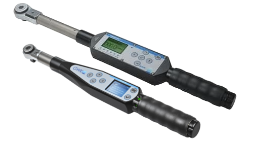
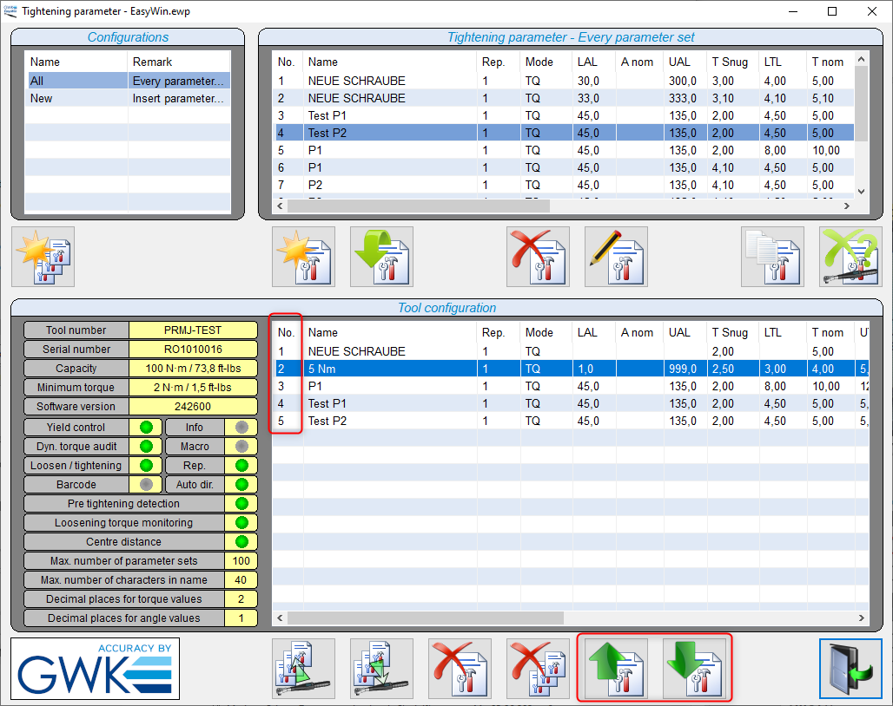

# GWK Operator 22 and Operator+ electronic torque wrench

The [GWK electronic torque wrench family](https://www.gwk-gerlach.com/) is a series of electronic torque wrenches with builtin WiFi communications. They support multiple communication protocols, one of them is [OpenProtocol](../README.md) which is used by OGS to communicate with the tools. 



## Installation and configuration

### OGS project configuration

For generic information about how to configure OGS with OpenProtocol tools, see  [OpenProtocol documentation](../README.md).

### Tool registration and configuration

The `GWK` tools are identified by specifying the tool type `GWK` in the `[OPENPROTO]` section of `station.ini`. 

A typical configuration of the `[OPENPROTO]` section looks like the following :

```ini
[OPENPROTO]
# Channel/Tool 1 parameters
CHANNEL_01=10.10.2.184
CHANNEL_01_PORT=4002
CHANNEL_01_TYPE=GWK
; to enable curve transmission, set to 1:
CHANNEL_01_CURVE_REQUEST=1
```

The typical parameters are (for more details about the possible parameters, see [OpenProtocol documentation](../README.md)):

- `CHANNEL_<channel>`: Define the IP address used to communicate with the tool.
- `CHANNEL_<channel>_PORT`: Define the TCP port number used for OpenProtocol(typically 4002).
- `CHANNEL_<channel>_TYPE`: Defines the OpenProtocol communication variant, **must** be set to `GWK`.
- `CHANNEL_<channel>_CURVE_REQUEST`: Set to 1 to enable curve transmission, set to 0 to disable curve transmission. Set to 1, if you have [tracebility output](#tool-data-output) enabled and want to get the tightening graph included in the data output. Disable (set to zero), if you don't need it (for performance reasons). In general, the new `Operator 22` tools are much faster in curve transmission, the older `Operator+` tools might cause delays up to a few seconds. Contact [GWK-Gerlach](https://www.gwk-gerlach.com/) for recent firmware versions with improved performance!

### Tool data output

Like other tools, the `GWK` tools can use the OGS buit-in connectivity options to send out data and curves (`Traceability` data) to backend data management systems (like [ToolsNet](https://www.atlascopco.com/en-us/itba/products/assembly-solutions/software-solutions/toolsnet-8-sku4531), [CSP I-P.M.](https://www.csp-sw.com/quality-management-software-solutions/error-prevention-with-ipm/), [Sciemetric QualityWorX](https://www.sciemetric.com/data-intelligence/qualityworx-data-collection), [QualityR](https://www.haller-erne.de/qualityr-web/), etc.). 

To understand the system architecture and details on how to use data output in general, please see [OGS Traceability](../dataoutput/traceability.md). To setup `Traceability` for `OPEXplus` tools, enable `Traceability` and add the `OPEXplus` tools channel to the list of channels in the `[FTP_CLIENT]` section.

Here is a sample setup:

```ini
[FTP_CLIENT]
Enabled=1
;... 
; (more settings)
;...
; Parameters for each channel:
CHANNEL_06_INFO={ "ChannelName": "WS010|AC_PF6000", "location name": ["Tool", "Line 2", "WS010", "default", "", "", ""] }
```

The following parameters are **required** for the `GWK` tools, as the tool does not provide them through its interface:

- `ChannelName`: Defines the station and channel name seperated by a pipe symbol (`<station>|<channel>`).
- `location name`: Defines the location name values to use. Note that this setting depends on the Sys3xxGateway settings for processing the tightening results. Make sure to add the relevant information (like data link name, building, line name, etc.), so the tool can be registered in the correct organizational unit.

## Tool configuration

### Firmware version

Please contact [GWK-Gerlach](https://www.gwk-gerlach.com/) for information about current firmware versions - it is recommended to use up-to-date firmware for compatibility, performance and security!

### OpenProtocol operation mode

To check, if the correct operation mode is selected (OpenProtocol), do the following:

- for `Operator+`: while the tool is switched off, press and hold the left and right arrow buttons until the service menu appears. Enter a invalid password to get to the status page. The current protocol is shown in the last line - for use with OGS (OpenProtocol), it should read `BA59_OPP_EXP_STD_OPENPROTOCOL_WLAN_CB_MODE`.
For `Operator 22`: while the tool is switched off, press and hold the right arrow button until the display lights up, then enter a wrong password to get to the status screen. The current protocol is shown in the fourth line - for use with OGS (OpenProtocol), it should read `Open Protocol TCP`.

### Tightening programs

To upload and manage tightening programs, use the `EasyWin` software. The PSET number to select a tightening program is generated in EasyWin automatically besed on the inserting sequence (first column (labeled "No.") in the tool configuration list). To change the order, use the buttons with the green arrow on the bottom of the pane.




