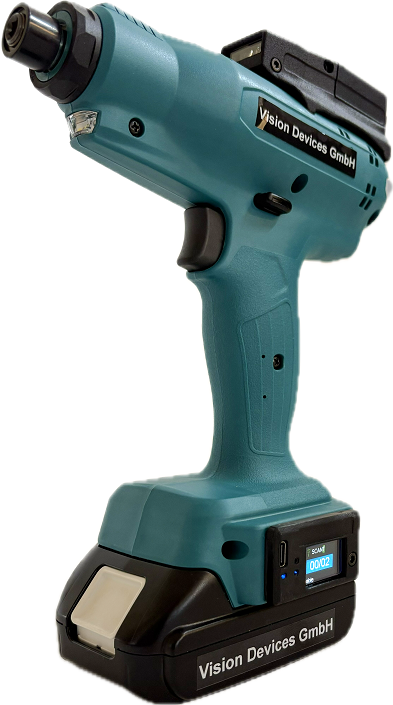
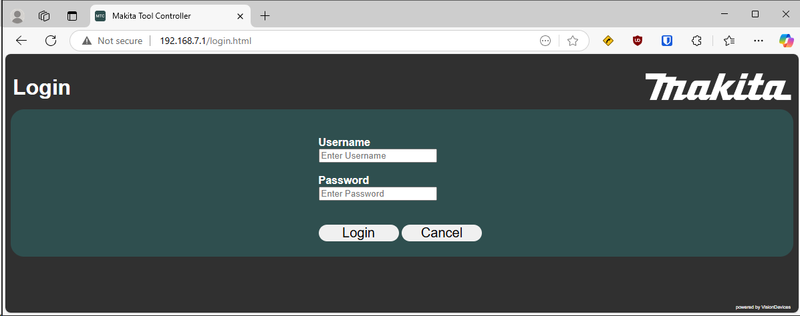
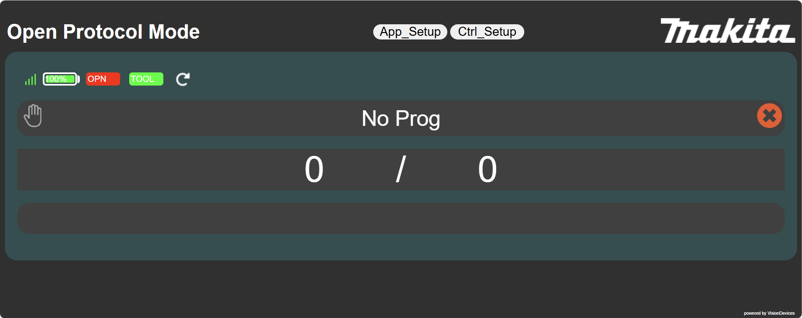
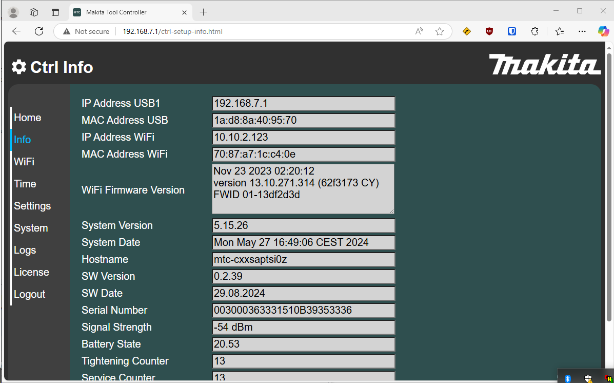
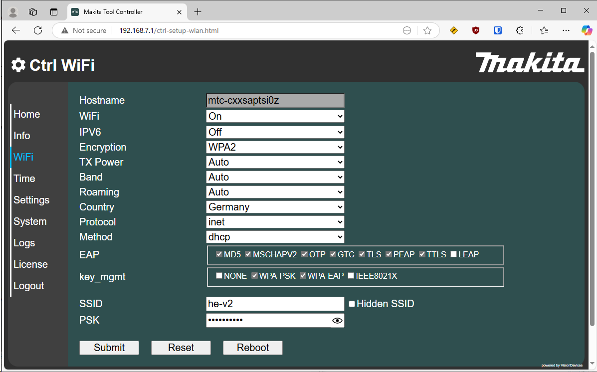
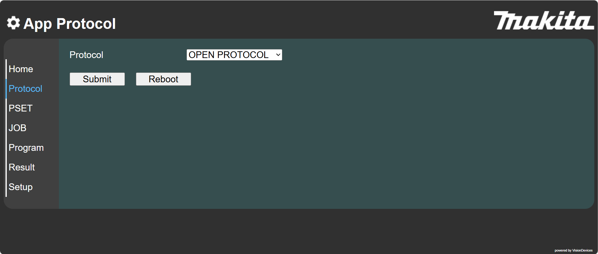
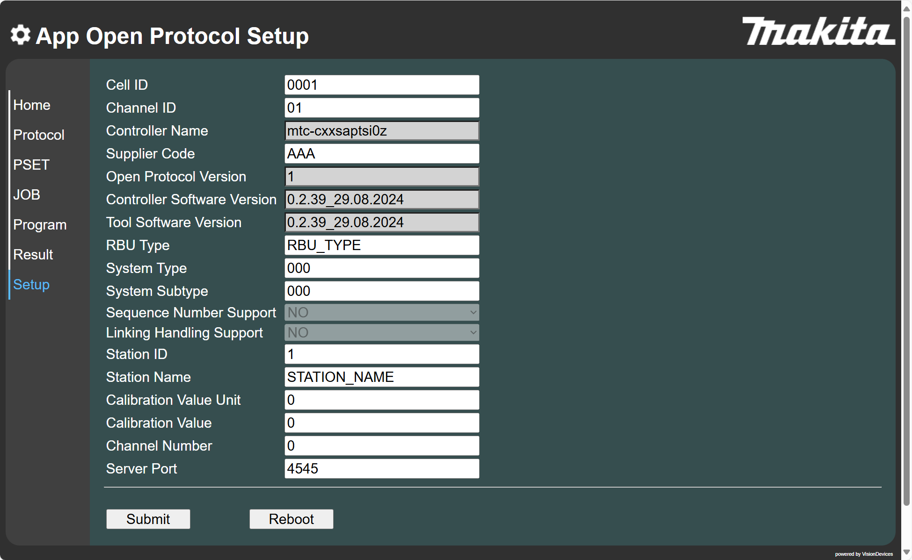
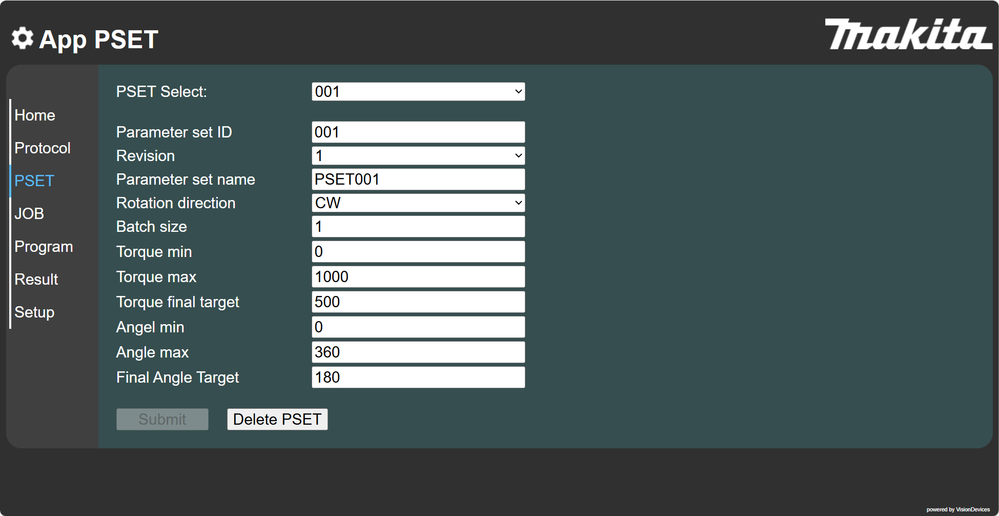
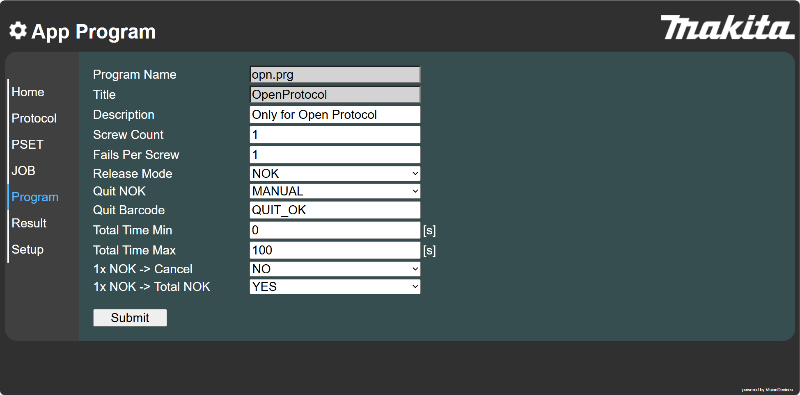
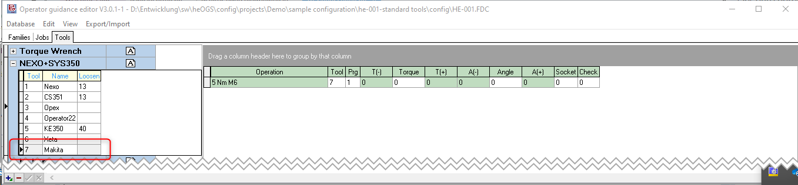

# Makita DFT/DFL wifi battery clutch tool

!!! info

    This page describes the specifics for configuring the Makita 18V wifi battery tools to work with OGS, for general information about the OGS OpenProtocol configuration, see [OpenProtocol Tools](README.md).


## Overview

{ width="200", align=right }
The [Makita](https://www.makita.com) industrial [18V battery clutch tools](https://www.makita.de/data/pam/public/01_kataloge/801425_industrieprospekt_2024_dz_online.pdf) of the `FM4Z` series provide wifi connectivity including OpenProtocol interface support through the [MTC wifi module](https://www.visiondevices.de/seo/produkte/micro-tool-controller/). The clutch tools are available as pistol and angle tools in the range of 0.5-12/40Nm. The speed is programmable to support hard and soft joints, the accuracy is +/- 10% (Cmk > 1.67, VDI/VDE 2647).   

To access the configuration, use the integrated web server of the tool. If the tool is already connected to the wifi, enter its IP address, else connect the USB-C interface of the MTC module. Connecting the tool over USB will load a new RNDIS USB network interface and allows connecting to the tool at the predefined IP address http://192.168.7.1/. After the webbrowser is connected, enter the credentials (default user/password: user/user) to log in:



After logging in, the main page is shown - the configuration is accessible through the buttons `App_Setup` and `Ctrl_Setup`.



To configure the Wifi settings (or read the current settings), select the `Ctrl_Setup` button, else go to `App_Setup` to configure the OpenProtocol settings and the tightening parameters. Here are two sample screenshots from the Wifi configuration:

{ width="100" }
{ width="100" }

## OpenProtocol setup

To enable the OpenProtocol interface, select the `App_Setup --> Protocol` and select `OpenProtocol` from the protocol dropdown and click `Submit` to update the configuration. 



Then navigate to `Setup` (from the lefthand navigation menu) - this allows configuring the OpenProtocol parameters:



The most important settings here are:

- `Supplier Code`: Make sure to set this to `AAA`
- `Server Port`: This is the OpenProtocol listening port, should be set to `4545` (this must match the setting in station.ini, see below)

## Program definition

The following sections provide information about how to setup the tool to ensure smooth operation with OGS. The settings shown here basically do the following:

- After OGS enables the tool, only clockwise start is allowed (no loosen)
- The tool requires acknowledge after an Nok rundown (by switching the direction switch to CCW).
- After an NOK a single loosen run is allowed. 

### PSet configuration

Go to `App_Setup --> PSET` and configure as follows:



Make sure to set the following:

- `Batch size`: set to `1` to allow a single run only

### Program settings

Go to `App_Setup --> Program` and configure as follows:



Make sure to set the following:

- `Screw Count`: set to `1` to only allow a single run
- `Fails Per Screw`: set to `1` to only allow a single Nok run
- `Release Mode`: set to `NOK` to allow loosen after Nok
- `Quit NOK`: set to `Manual` to require switching the direction switch to CCW to acknowledge a previous Nok rundown
- `1xNOK -> Cancel`: set to `NO` to not abort a sequence with the first Nok
- `1xNOK -> Total Nok`: set to `YES` to force an NOK result, if an Nok occurs

## OGS configuration

### Overview

Configuring OGS for use with Makita MTC wifi interface requires the following:
- Configure the tool connection parameters in `station.ini`
- Database setup, workflow and tool configuration in the heOpCfg workflow editor

### station.ini configuration

Station.ini configuration uses the standard parameters of the OpenProtocol driver (see [OpenProtocol Tools](README.md)).
To work with the Makita version of `OpenProtocol`, the channel TYPE parameter must be set to `MTC`.

Here is a sample configuration for tool/channel 1:

``` ini
[OPENPROTO]
# Channel/Tool 1 parameters
CHANNEL_01=10.10.2.163
CHANNEL_01_PORT=4545
CHANNEL_01_TYPE=MTC
CHANNEL_01_CCW_ACK=0
```
<!--CHANNEL_01_CHECK_TIME_ENABLED=1
CHANNEL_01_CURVE_REQUEST=1-->

### Tool configuration

To add a tool, add it as any other tool to the tool configuration, but don't define a loosen program (leave the loosen column empty):



### Loosen behaviour

Even though there are more options (see the general discussion in [OpenProtocol Tools - Loosen modes](README.md#loosen-modes)), it is recommended to setup the tool according to what is described above. Ogs then actually only enabled the tool for a single clockwise rundown (loosen is blocked before). If an Nok happens, then the tool does not report it back to OGS before a loosen run is done (by switching the start switch to CCW and starting the tool using the start button).

### Simple retry

Set the rework strategy to 2 (repeat) in `station.ini` by setting the parameter `NOK_STRATEGIE=2` in the `[GENERAL]` section.

#### Loosen after acknowledge

Make sure to define a loosen program for the tool in the [tool configuration](#tool-configuration).

