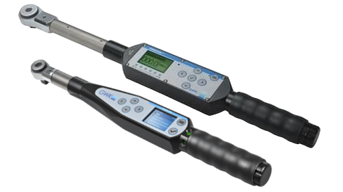
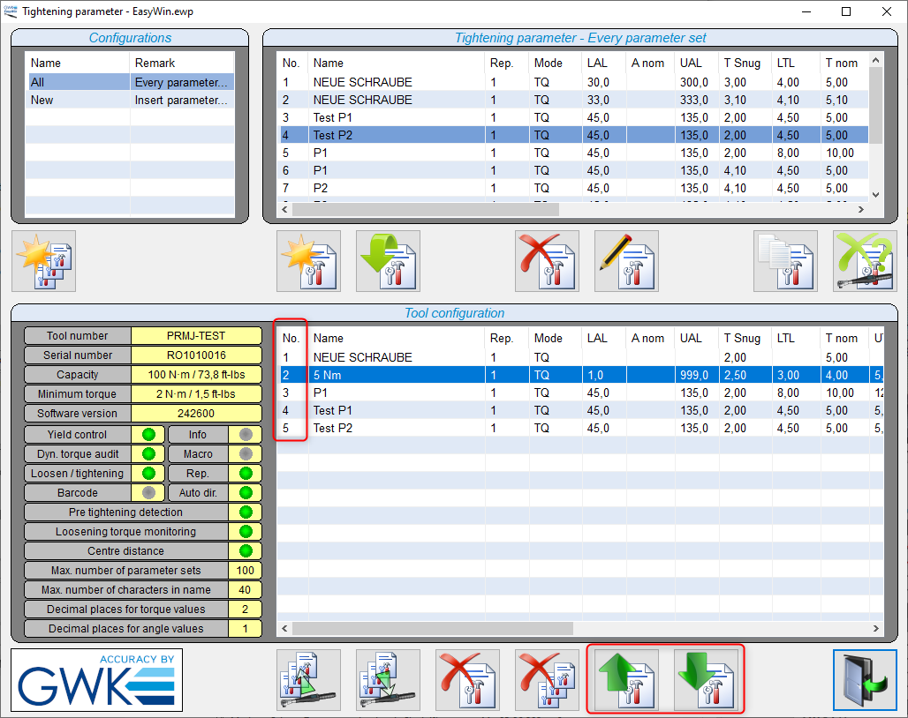

# Bosch Rexroth Nexo and Nexo 2 wireless battery tools

The [Nexo cordless nutrunners](https://store.boschrexroth.com/Schraubtechnik/Funkakkuschrauber-Nexo) are advanced battery powered tightening tools with high accuracy and reliability. They are certified for safety-critical tightening connections according to VDI/VDE 2862. The tools feature built-in controllers with WiFi communications. They use the [OpenProtocol](../README.md) communication protocol to communicate with the heOGS software. They also support traceability data and curve output, see [tool data http output](#tool-data-http-output).


Note, that the Rexroth product site and catalog do not list the Nexo 2 tools at the time of writing this article, but there is a [marketing site with information about Nexo 2](https://www.boschrexroth.com/en/us/products/product-groups/tightening-technology/topics/cordless-nutrunner-nexo/).

## Installation and configuration

### OGS project configuration

For generic information about how to configure OGS with OpenProtocol tools, see  [OpenProtocol documentation](../README.md).

### Tool registration and configuration

The Nexo and Nexo 2 tools are identified by specifying the tool type `NEXO` in the `[OPENPROTO]` section of `station.ini`. 

A typical configuration of the `[OPENPROTO]` section looks like the following :

``` ini
[OPENPROTO]
; Channel/Tool 1 parameters
CHANNEL_01=10.10.2.184
CHANNEL_01_PORT=4545
CHANNEL_01_TYPE=NEXO
; Enable time synchronization 
CHANNEL_01_CHECK_TIME_ENABLED=1
; Force CCW switch selection for rework/loosen
CHANNEL_01_CCW_ACK=1
; to enable curve transmission, set to 1:
CHANNEL_01_CURVE_REQUEST=1
```

The typical parameters are (for more details about the possible parameters, see [OpenProtocol documentation](../README.md)):

- `CHANNEL_<channel>`: Define the IP address used to communicate with the tool.
- `CHANNEL_<channel>_TYPE`: Defines the OpenProtocol communication variant, **must** be set to `NEXO`.
- `CHANNEL_<channel>_PORT`: (optional) Define the TCP port number used for OpenProtocol(typically 4545).
- `CHANNEL_<channel>_CHECK_TIME_ENABLED`: (recommended) If set to a nonzero value, then the tools internal time is synchronized with the OGS date and time. For Nexo 1 this is highly recommended due to issues with the firmware NTP time sync.
- `CHANNEL_<channel>_CCW_ACK`: (optional) If set to a nonzero value, then the CCWSel switch is monitored for
the correct position - i.e. if OGS expects loosen, the switch must be set to the CCW position.
- `CHANNEL_<channel>_CURVE_REQUEST`: Set to 1 to enable curve transmission over OpenProtocol, set to 0 to disable. Set to 1, if you need the curve data in OGS (e.g. for display or dynamic curve analysis with LUA scripting). Disable (set to zero), if you don't need it (for performance reasons). As Nexo and Nexo 2 have built-in data output protocols, it is only needed in special setups, where OGS needs the curve data.

### Tool data output

As Nexo and Nexo 2 have built-in features to send out data and curves (`Traceability` data) to backend data management systems, there is typically no support from OGS needed. 

See [Tool data http output](#tool-data-http-output) for more information about how to configure the tools built-in data output drivers.

## Tool configuration

### Firmware version

Please contact [Bosch Rexroth](https://www.boschrexroth.com) for information about current firmware versions - it is recommended to use up-to-date firmware for compatibility, performance and security!

### Tool mode

The Nexo tools can operate in manual or automatic mode. For OGS to be able to control the tool, automatic mode is required. Depending on your requirements, you can configure the tool to enable switching modes through the tool display (not recommended).

The mode must be setup as follows:

=== "Nexo 2"

    

    The relevant settings are:

    - `ID code source`: must be set to OpenProtocol, so OGS can send the ID
    - `Operation mode settings`: set operation mode to `auto`

    Make sure the set the `active column` to `A`!

=== "Nexo"

    

    The relevant settings are:

    - `ID code source`: must be set to OpenProtocol, so OGS can send the ID
    - `Operation mode settings`: set operation mode to `auto`

    Make sure the set the `active column` to `A`!

### OpenProtocol configuration

As OGS needs OpenProtocol to control the tool, the OpenProtocol (Data --> OpenProtocol) must be configured as follows:

=== "Nexo 2"

    

=== "Nexo"

    


Nexo 1: Wifi notes





### OpenProtocol operation mode

To check, if the correct operation mode is selected (OpenProtocol), do the following:

- for `Operator+`: while the tool is switched off, press and hold the left and right arrow buttons until the service menu appears. Enter a invalid password to get to the status page. The current protocol is shown in the last line - for use with OGS (OpenProtocol), it should read `BA59_OPP_EXP_STD_OPENPROTOCOL_WLAN_CB_MODE`.
For `Operator 22`: while the tool is switched off, press and hold the right arrow button until the display lights up, then enter a wrong password to get to the status screen. The current protocol is shown in the fourth line - for use with OGS (OpenProtocol), it should read `Open Protocol TCP`.

### Tightening programs

To upload and manage tightening programs, use the `EasyWin` software. The PSET number to select a tightening program is generated in EasyWin automatically besed on the inserting sequence (first column (labeled "No.") in the tool configuration list). To change the order, use the buttons with the green arrow on the bottom of the pane.




### Tool data http output

To make Nexo and Nexo 2 to send out data and curves (`Traceability` data) to backend data management systems (like [ToolsNet](https://www.atlascopco.com/en-us/itba/products/assembly-solutions/software-solutions/toolsnet-8-sku4531), [CSP I-P.M.](https://www.csp-sw.com/quality-management-software-solutions/error-prevention-with-ipm/), [Sciemetric QualityWorX](https://www.sciemetric.com/data-intelligence/qualityworx-data-collection), [QualityR](https://www.haller-erne.de/qualityr-web/), etc.), the builtin data output interfaces can be used. 

To understand the system architecture and details on how to use data output in general, please see [OGS Traceability](../dataoutput/traceability.md). To setup `Traceability` for `OPEXplus` tools, enable `Traceability` and add the `OPEXplus` tools channel to the list of channels in the `[FTP_CLIENT]` section.

Here is a sample setup:

```ini
[FTP_CLIENT]
Enabled=1
;... 
; (more settings)
;...
; Parameters for each channel:
CHANNEL_06_INFO={ "ChannelName": "WS010|AC_PF6000", "location name": ["Tool", "Line 2", "WS010", "default", "", "", ""] }
```

The following parameters are **required** for the `GWK` tools, as the tool does not provide them through its interface:

- `ChannelName`: Defines the station and channel name seperated by a pipe symbol (`<station>|<channel>`).
- `location name`: Defines the location name values to use. Note that this setting depends on the Sys3xxGateway settings for processing the tightening results. Make sure to add the relevant information (like data link name, building, line name, etc.), so the tool can be registered in the correct organizational unit.

