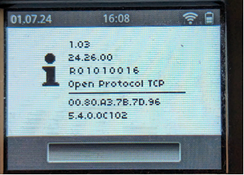

# Rexroth OPEXplus electronic torque wrench

The [Rexroth OPEXplus electronic torque wrench family](https://www.boschrexroth.com/en/us/products/product-groups/tightening-technology/topics/opex-digital-torque-wrench/) is an electronic torque wrench with builtin WiFi communications. It uses the [OpenProtocol](../README.md) communication protocol to communicate with the heOGS software.


## Installation and configuration

### OGS project configuration

For generic information about how to configure OGS with OpenProtocol tools, see  [OpenProtocol documentation](../README.md).

### Tool registration and configuration

The `OPEXplus` tool is identified by specifying the tool type `OPEX` in the `[OPENPROTO]` section of `station.ini`. 

A typical configuration of the `[OPENPROTO]` section looks like the following :

```ini
[OPENPROTO]
# Channel/Tool 1 parameters
CHANNEL_01=10.10.2.184
CHANNEL_01_PORT=4002
CHANNEL_01_TYPE=OPEX
; to enable curve transmission, set to 1:
CHANNEL_01_CURVE_REQUEST=1
```

The typical parameters are (for more details about the possible parameters, see [OpenProtocol documentation](../README.md)):

- `CHANNEL_<channel>`: Define the IP address used to communicate with the tool.
- `CHANNEL_<channel>_PORT`: Define the TCP port number used for OpenProtocol(typically 4002).
- `CHANNEL_<channel>_TYPE`: Defines the OpenProtocol communication variant, **must** be set to `OPEX`.
- `CHANNEL_<channel>_CURVE_REQUEST`: Set to 1 to enable curve transmission, set to 0 to disable curve transmission. Set to 1, if you have [tracebility output](#tool-data-output) enabled and want to get the tightening graph included in the data output. Disable (set to zero), if you don't need it (for performance reasons).

### Tool data output

Like other tools, the `OPEXplus` tools can use the OGS buit-in connectivity options to send out data and curves (`Traceability` data) to backend data management systems (like [ToolsNet](https://www.atlascopco.com/en-us/itba/products/assembly-solutions/software-solutions/toolsnet-8-sku4531), [CSP I-P.M.](https://www.csp-sw.com/quality-management-software-solutions/error-prevention-with-ipm/), [Sciemetric QualityWorX](https://www.sciemetric.com/data-intelligence/qualityworx-data-collection), [QualityR](https://www.haller-erne.de/qualityr-web/), etc.). 

To understand the system architecture and details on how to use data output in general, please see [OGS Traceability](../dataoutput/traceability.md). To setup `Traceability` for `OPEXplus` tools, enable `Traceability` and add the `OPEXplus` tools channel to the list of channels in the `[FTP_CLIENT]` section.

Here is a sample setup:

```ini
[FTP_CLIENT]
Enabled=1
;... 
; (more settings)
;...
; Parameters for each channel:
CHANNEL_06_INFO={ "ChannelName": "WS010|AC_PF6000", "location name": ["Tool", "Line 2", "WS010", "default", "", "", ""] }
```

The following parameters are **required** for the `OPEX` tools, as the tool does not provide them through its interface:

- `ChannelName`: Defines the station and channel name seperated by a pipe symbol (`<station>|<channel>`).
- `location name`: Defines the location name values to use. Note that this setting depends on the Sys3xxGateway settings for processing the tightening results. Make sure to add the relevant information (like data link name, building, line name, etc.), so the tool can be registered in the correct organizational unit.

## Tool configuration

### Firmware version

The officially required firmware version to use the `OPEXplus` tools with OGS is as follows (while the tool is switched off, press and hold the right arrow button until the display lights up, then enter a wrong password to get to the info screen):



Things to check here:

- Controller firmware version >= `24.26.00`
- Wifi module firmware version >= `5.4.0.C102`
- Operation mode set to `OpenProtocol TCP` (see the `OPEXplus` manual on how to change operation mode using the USB cable)

To check the firmware parameters, open a webbrowser and go to the `Status` page of the `OPEXplus` tool (see the tools manual on how to connect it over wifi):


Things to check here:

- Wifi module firmware version >= `5.4.0.C102` 
- Line 1 settings: Protocol == `DUB`, line speed == `230400`

Older firmware versions will likely work, but might show issues especially with curve transmission.

### Tightening programs

To upload and manage tightening programs, use the `EasyWin` software. The PSET number to select a tightening program is generated in EasyWin automatically besed on the inserting sequence (first column (labeled "No.") in the tool configuration list). To change the order, use the buttons with the green arrow on the bottom of the pane.


