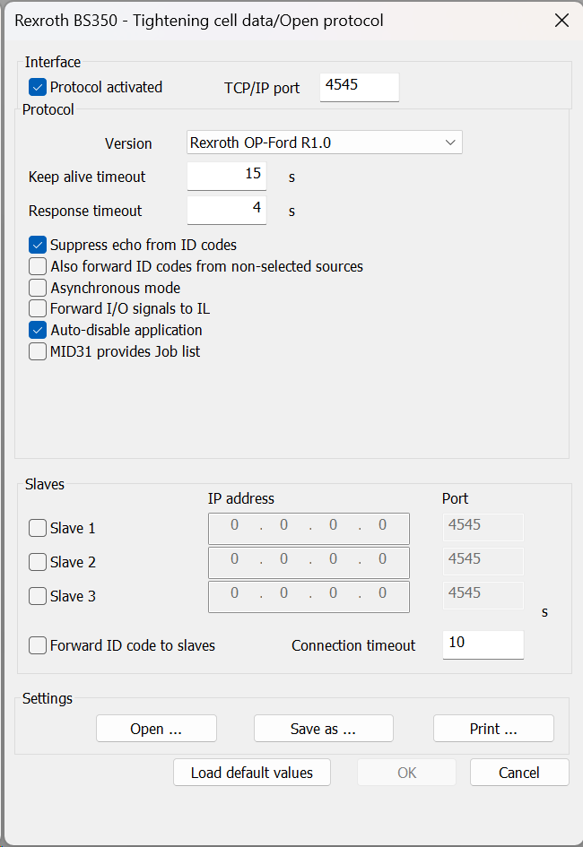
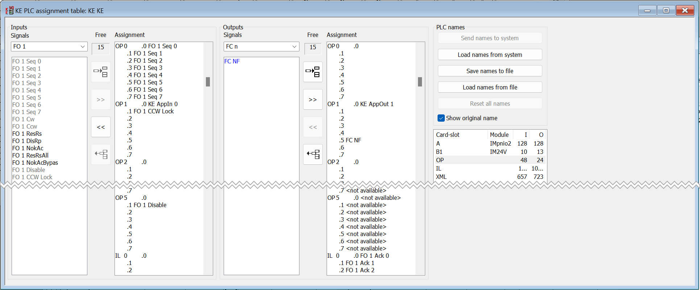
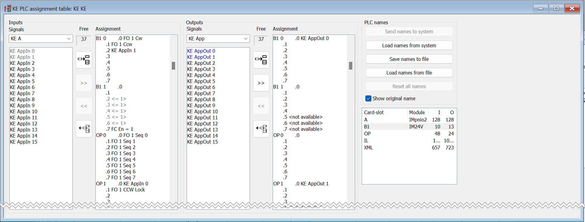
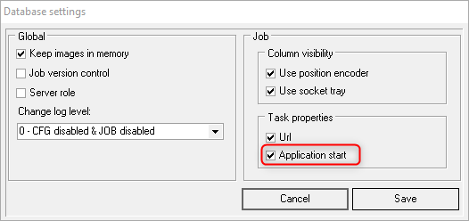
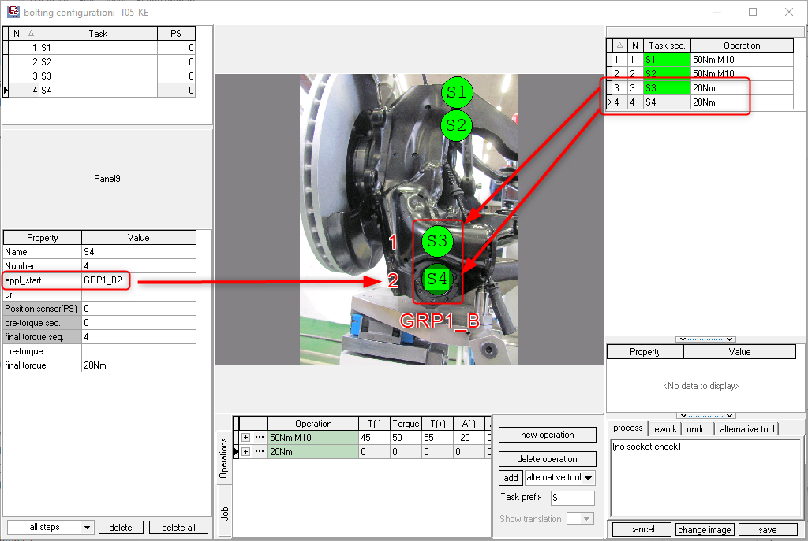
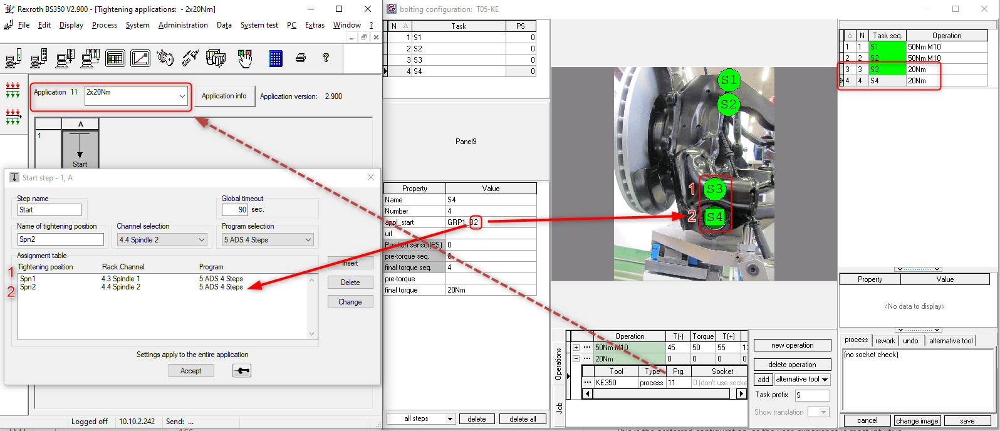

# KE350 Multi-spindle tightening system

!!! info

    This page describes the specifics for configuring the Rexroth KE350 multi-spindle tightening
    system with OGS, for general information about the OGS OpenProtocol configuration, see 
    [OpenProtocol Tools](README.md). 


## Overview

System350 based tools mainly fall into two categories:

- Single spindle tools and ErgoSpin tools used in spindle mode
- Multi-spindle tools
- ErgoSpin tools (used in ErgoSpin hand-tool mode) - these are not considered here, as typically a CS351 controller is used in this case, please see [CS351 OpenProtocol](sys350-cs351.md).

Spindle tools (and ErgoSpin in spindle mode) use externally connected start switches (for start CW, start CCW). All tools are controlled over OpenProtocol using the "Ford OpenProtocol" protocol type and are started in application mode (using fasterning operation FO 1).

Additional notes:

- Check the PSet start step parameter setting "play with start switch"
- Check the `CHANNEL_<tool>_CCW_ACK` setting for the tool in `station.ini`.
- See below on how to configure the PLC assignment table for `FO 1 SSWLock` and the external `CCWSel` signals

For the `CHANNEL_<tool>_CCW_ACK` setting, the following is recommended:

- If you use a spindle tool with seperately wired CW/CCW and start signals, then set `CHANNEL_<tool>_CCW_ACK=1` and connect the direction switch output to the `CCWSel`-Signal
- If you use a spindle tool with only CW start and CCW start signals, then set `CHANNEL_<tool>_CCW_ACK=0`, but make sure to configure the `FO 1 CCWLock` signal
- Follow the [plc signal assignment setup ](#plc-signal-assignment-for-openprotocol) and check the [configuration for loosen](#loosen-behaviour) below.

!!! note

    To reliably prevent loosen it is recommended to use a seperate direction switch connected to the `CCWSel` signal and also connect the `FO 1 CCWLock`-Signal (see [below](#plc-signal-assignment-for-openprotocol)).

## OpenProtocol configuration

### Overview

{ align=right; width="300" }
/// caption
KE350 OpenProtocol settings
///

OGS uses the KE350 `Rexroth OP-Ford R1.0` protocol version. This maps the OpenProtool commands to the application start (fastening operation) `FO 1` signals, so multiple spindles can work in a synchronized way and report the spindle groups result status. 

### PLC signal assignment for OpenProtocol

The PLC signals OGS uses to control the tool are as follows:

::spantable::

| Inputs            |   | Signal        | Assignment | Comments |
| ---               | - | ----          | ----      | ---- |
| OP0.1-OP0.7 @span |   | FO 1 Seq0-7   | Mandatory | Application number, *must* be assigned |
| OP1.0 @span       |   | FO 1 Enabled  | Optional  | True, if the application was enabled by OGS, typically connected to the yellow LED on the tool handle (use internal signal routing `KE AppIn 0` --> `B1:KE AppOut 0` for IM24V output) |
| OP1.1-3.0 @span   |   | Custom I/O    | See below | Signals controlled by OGS |
|       | OP1.1         | (unused)      |           | |
|       | OP1.2         | FO 1 CCWLock  | Optional  | The signal is set by OGS whenever a normal tightening process is expected to run - it is released, if loosening/rework is active instead. If assigned to `FO 1 CCWLock`, this effectively prevents a CCW-Start if OGS expectes a CW-Start (prevent unauthorized loosen). Note, that a user with right `lossen by CCW` always is allowed to loosen, i.e. this signal is then always set to false! |
|       | OP1.3-3.0     | (unused)      |           | |
| OP3.1-5.0 @span   |   | (unused)      | | |
| OP5.1 @span       |   | FO 1 Disable  | Mandatory | This signal enables/disables the tool |
| OP5.2-5.7 @span   |   | (unused)      | | |

::end-spantable::

The PLC signals OGS receives from the tool are as follows:

::spantable::

| Outputs           |   | Signal        | Assignment | Comments |
| ---               | - | ----          | ----      | ---- |
| OP0.1-OP0.7 @span |   | (unused)      |           | Not used for KE application mode |
| OP1.0-2.7 @span   |   | Custom I/O    | See below | Signals sent to OGS |
|       | OP1.0         | CCWSel        | Optional  | If set, indicates, that the start switch on the tool is set to CCW. Typically connected to the external start switch direction selector on the tool handle (use internal signal routing `KE AppOut 1` <-- `B1:KE AppIn 1` for IM24V output |
|       | OP1.1-1.4     | (unused)      | | |
|       | OP1.5         | FC NF         | Mandatory | If false, OGS shows a KE system error message |
|       | OP1.6-2.7     | (unused)      | | |
| OP3.0-5.7 @span   |   | (unused)      | | |

::end-spantable::

The following screenshot shows a typical PLC assignment table setup for the OpenProtocol signals:



Please note, that `Input OP1.0` (FO 1 Enabled) is connected to the `KE AppIn 0` signal and the `Output OP1.0` (CCWSel) to the `KE AppOut 1` signal. These are then bridged (`KE AppIn X` and `KE AppOut X` are internally bridged) to the IM24V I/O-Card in slot B1:



This basically then implements the following (Signals `FO 1 CW` and `FO 1 CCW` also connected):

- The tool can be started clockwise with im24V digital input 0.0
- The tool can be started counter-clockwise with im24V digital input 0.1
- The direction selection switch is connected to im24V digital input 0.2 --> routed to `CCWSel` at `Output OP1.0`, so OGS can read the state of the direction switch (don't get confused with the naming output vs. input)
- The tool enable state is connected to the handles yellow LED at the im24V digital output 0.0
- CCW start is locked by OGS to prevent invalid loosen without proper rights (using the `FO 1 CCWLock` signal)

!!! note

    Make sure to assign and set the `FC EN` signal (should be fixed to 1), else the tightening cell will not be enabled and thightening will not work (see above, `FC EN` set to im24V B1 1.7).

!!! note

    Not shown in the above signal table is the NOK acknowledge functionality. If there is no CCWSel signal available,
    it is highly recommended to connect the `FO 1 NokAc` signal to an external NOK acknowledge button. This will 
    automatically disable the tool after a NOK rundown and requires pushing the NOK acknowledge button to
    re-enable the tool for the next run. This basically makes the operator aware of an NOK result and prevents false
    position tightening/loosening.

## OGS configuration

### Overview

Configuring OGS for use with KE350 application start (fastening operation) requires the following:
- Configure the tool connection parameters in `station.ini`
- Database setup, workflow and tool configuration in the heOpCfg workflow editor

### station.ini configuration

Station.ini configuration uses the standard parameters of the OpenProtocol driver (see [OpenProtocol Tools](README.md)).
To work with the `Rexroth OP-Ford R1.0` protocol in the KE350, the channel TYPE parameter must be set to `KE350`.

Here is a sample configuration for tool/channel 1:

``` ini
[OPENPROTO]
# Channel/Tool 1 parameters
CHANNEL_01=10.10.2.163
CHANNEL_01_PORT=4545
CHANNEL_01_TYPE=KE350
CHANNEL_01_CCW_ACK=0
CHANNEL_01_CHECK_TIME_ENABLED=1
CHANNEL_01_CURVE_REQUEST=1
```

### Tool configuration

To add a KE350 tool, add it as any other tool to the tool configuration and define the default loosen program:


### Multi-Spindle configuration

For KE350, OGS uses application start (fastening operations), where a single start command can start a group of spindles.
If more than a single spindle is started, OGS needs to know which bolt is mapped to which spindle. This is done by assigning 
a group (this defines which bolts belong to a single application start) and a sequence number (which actually maps the
bolt to the spindle). The Both parameters are set in the `appl_start` task parameter.

The `appl_start` task parameter can be enabled in the workflow editor in `database --> settings` as follows (check the "Application start" parameter):
{ width=300px }

The `appl_start` parameter is then found in the task properties:


The screenshot also shows how the spindles of the fastening operation is mapped: the `appl_start` property consists of the following two parts:

    appl_start = <group><sequence>

where

- `<group>` is a unique name to group the spindles of a single rundown. All bolts of a spindle group started through a single fastening operation **must** have the same `<group>` name.
- `<sequence>` is the sequential number of the spindle as configured in the BS350 application. 

The following screenshot shows a sample mapping:



Here application number 11 (fastening operation) is defined in BS350 and selected on OGS (operation "20Nm"). The application consists of two bolts:

- Sequence #1: Name="Pos1", Channel 4.3, Program 5
- Sequence #2: Name="Pos2", Channel 4.4, Program 5

The fastening operation in OGS is named `GRP1_B` (the `<group>` name)

!!! note

    If a fastening operation is used multiple times in an OGS
    job, then a unique group name must be used for each
    fastening operation.

If e.g. 3 times the dual-spindle application from the screenshot above shall be used, then the following six tasks can be 
configured:

::spantable::

| Application start | OGS Task  | appl_start | Group  | Sequence |
| ----------------- | --------  | ---------- | ------ | -------- |
| FO start #1 @span | S1        | GRP1_A1    | GRP1_A | 1        |
|                   | S2        | GRP1_A2    |        | 2        |
| FO start #2 @span | S3        | GRP1_B1    | GRP1_B | 1        |
|                   | S4        | GRP1_B2    |        | 2        |
| FO start #3 @span | S5        | GRP1_C1    | GRP1_C | 1        |
|                   | S6        | GRP1_C2    |        | 2        |

::end-spantable::


### Loosen behaviour

Even though there are more option (see the general discussion in [OpenProtocol Tools - Loosen modes](README.md#loosen-modes)), the following section shows the common and recommended configurations.

#### CCWSel used

This is the preferred configuration, as the user-experience is most intuitive. Unfortunately the most often used start grip handles do not provide the neccessary signals, as a start grip handle with two outputs as follows is needed:

- CW: start signal for tightening
- CCWSel: state of the direction switch, true, if CCW selected

With this configuration, the following settings are recommended:

- `CHANNEL_<tool>_CCW_ACK` = 1
- Connect `OP1.1 Input` to `FO 1 CCWLock` 
- Connect `OP1.0 Output` to the CCWSel signal of the handle (using AppIn/AppOut signals to bridge to IM24V/fieldbus)
- Usually `FO 1 NokAck` is not connected

This forces the operator to switch the CW/CCW selection switch to CCW every time a loosen process is needed.
Please note, that only the custom loosen program number can be used for loosen, as the CCW start signal is not
assigned.

#### No CCWSel, but NokAck

As most start handles only provide seperate start CW and start CCW signals (without a signal for indicating the CW/CCW position), CCWSel often cannot be used. To ensure sequence interlock between tightening and loosening, 
the `FO 1 NokAck` signal is connected to an external pushbutton (typically the start handle provides this). In this case, the following signals are typically used:

- CW: start signal for tightening
- CCW: start signal for loosening
- NOKAck: A normally closed (high) signal to acknowledge NOK, re-enable the tool

With this configuration, the following settings are recommended:

- `CHANNEL_<tool>_CCW_ACK` = 0
- Connect `OP1.1 Input` to `FO 1 CCWLock` 
- Connect `FO 1 NokAck` to the external NokAck pushbutton

This blocks the tool after an NOK until the NokAck button is pressed.
The `FO 1 CCWLock` signal ensures that loosen is blocked, if it is
not allowed. 

Note that loosening now uses the given application number set 
in the tool configuration and uses the CW start. If applications
with a different number of spindles are used, then an explicit
rework operation must be defined, matching the tightening operation
spindle set.

#### No CCWSel, no NokAck

See above, but interlock is now not possible. After a NOK rundown
OGS immediately selects the loosen operation, which is started with the next start (CW) signal...

## Hints

### Start grip handles

[Jäger Handling](https://www.jaeger-handling.de) provides start
a large range of start grip handles. Most [e-Handle](https://www.jaeger-handling.de/produkte/bedienhandgriffe/e-handle)
models *except* the `SD`-series provide a seperate start signal as well as a CWSel signal with the position
of the direction selection ring. All [e-Handle](https://www.jaeger-handling.de/produkte/bedienhandgriffe/e-handle)
models provide LEDs for enable, ok and nok results, some models also provide additional buttons for custom use 
(e.g. NOK acknowledge). 

{ width=500px }

When choosing a handle, check the following:
- Models `EHHRRSD` and `EHARRSD` do not provide the CCWSel signal
- Models without the `SD`-extension provide seperate start and CCWSel signals, e.g. `EHHRR`
 
### Possible combinations

Please see the following document for the behaviour of the options depending on the selected configuration: 
[OGS Rexroth EC tools configuration behaviour for OGS](<resources/Rexroth tightening KE350-CS351-NEXO.pdf>).
