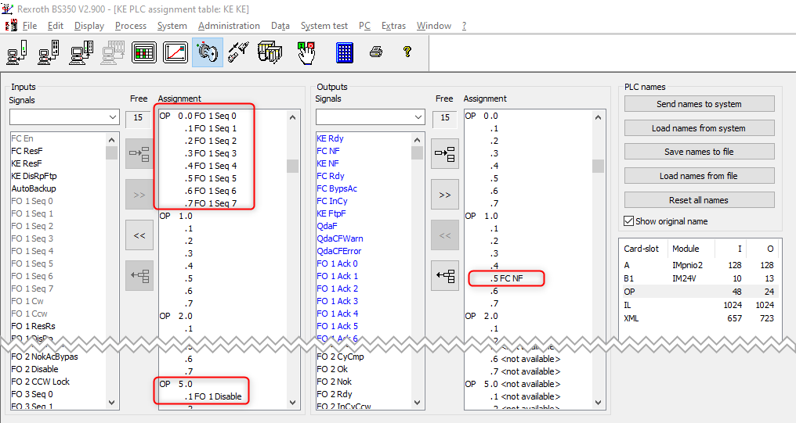

# (DRAFT) KE350 MultiSpindle controller

## Test spantable

::spantable::

| Country      | Address                                                  |
| ------------ | -------------------------------------------------------- |
| France @span | 8 Rue St Ferréol - 92190 City: Meudon (Île-de-France)    |
|              | 50 boulevard Amiral Courbet - 94310 Orly (Île-de-France) |
|              | ...                                                      |
|              | ...                                                      |
| Italy @span  | Str. S. Maurizio, 12, 10072 Caselle torinese TO          |
|              | S.S. Torino-Asti - 10026 Santena (TO)                    |
|              | ...                                                      |
| Poland @span | al. Jana Pawła II 22, 00-133 Warszawa                    |
|              | plac Trzech Krzyży 4/6, 00-535 Warszawa                  |
|              | ...                                                      |
|              | ...                                                      |

::end-spantable::

## Overview

System350 based tools mainly fall into two categories:

- Single spindle tools and ErgoSpin tools used in spindle mode
- Multi-spindle tools
- ErgoSpin tools (used in ErgoSpin hand-tool mode) - these are not considered here, as typically a CS351 controller is used in this case, please see [CS351 OpenProtocol](sys350-cs351.md).

Spindle tools (and ErgoSpin in spindle mode) use externally connected start switches (for start CW, start CCW). All tools are controlled over OpenProtocol using the "Ford OpenProtocol" protocol type and are started in application mode (using fasterning operation FO 1).

Additional notes:

- Check the PSet start step parameter setting "play with start switch"
- Check the `CHANNEL_<tool>_CCW_ACK` setting for the tool in `station.ini`.
- See below on how to configure the PLC assignment table for `FO 1 SSWLock` and the external `CCWSel` signals

For the `CHANNEL_<tool>_CCW_ACK` setting, the following is recommended:

- If you use a spindle tool with seperately wired CW/CCW and start signals, then set `CHANNEL_<tool>_CCW_ACK=1` and connect the direction switch output to the `CCWSel`-Signal
- If you use a spindle tool with only CW start and CCW start signals, then set `CHANNEL_<tool>_CCW_ACK=0`, but make sure to configure the `FO 1 CCWLock` signal

!!! note

    To reliably prevent loosen it is recommended to use a seperate direction switch connected to the `CCWSel` signal and also connect the `FO 1 CCWLock`-Signal (see [below](#plc-signal-assignment-for-openprotocol)).

## OpenProtocol configuration

### Overview

OGS uses the KE350 `Rexroth OP-Ford R1.0` protocol version. This maps the
OpenProtool commands to the application start (fastening operation) `FO 1` signals, so multiple spindles can work in a synchronized way and report the spindle groups result status. 

{ align=right; width=300 }
/// caption
KE350 OpenProtocol settings
///

### PLC signal assignment for OpenProtocol

The PLC signals OGS uses to control the tool are as follows:

::spantable::
| Inputs            |   | Signal        | Assignment | Comments |
| ---               | - | ----          | ----      | ---- |
| OP0.1-OP0.7 @span |   | FO 1 Seq0-7   | Mandatory | Application number, *must* be assigned |
| OP1.0 @span       |   | FO 1 Enabled  | Optional  | True, if the application was enabled by OGS, typically connected to the yellow LED on the tool handle (use internal signal routing `KE AppIn 0` --> `B1:KE AppOut 0` for IM24V output) |
| OP1.1-3.0 @span   |   | Custom I/O    | See below | Signals controlled by OGS | 
|       | OP1.1         | (unused)      |           | | 
|       | OP1.2         | FO 1 CCWLock  | Optional  | The signal is set by OGS whenever a normal tightening process is expected to run - it is released, if loosening/rework is active instead. If assigned to `FO 1 CCWLock`, this effectively prevents a CCW-Start if OGS expectes a CW-Start (prevent unauthorized loosen). Note, that a user with right `lossen by CCW` always is allowed to loosen, i.e. this signal is then always set to false! |
|       | OP1.3-3.0     | (unused)      |           | | 
| OP3.1-5.0 @span   |   | (unused)      | | | 
| OP5.1 @span       |   | FO 1 Disable  | Mandatory | This signal enables/disables the tool | 
| OP5.2-5.7 @span   |   | (unused)      | | | 
::end-spantable::

The PLC signals OGS receives from the tool are as follows:

::spantable::
| Outputs           |   | Signal        | Assignment | Comments |
| ---               | - | ----          | ----      | ---- |
| OP0.1-OP0.7 @span |   | (unused)      |           | Not used for KE application mode |
| OP1.0-2.7 @span   |   | Custom I/O    | See below | Signals sent to OGS | 
|       | OP1.0         | CCWSel        | Optional  | If set, indicates, that the start switch on the tool is set to CCW. Typically connected to the external start switch direction selector on the tool handle (use internal signal routing `KE AppOut 1` <-- `B1:KE AppIn 1` for IM24V output |
|       | OP1.1-1.4     | (unused)      | | |
|       | OP1.5         | FC NF         | Mandatory | If false, OGS shows a KE system error message |
|       | OP1.6-2.7     | (unused)      | | |
| OP3.0-5.7 @span   |   | (unused)      | | | 
::end-spantable::

The following screenshot shows a typical PLC assignment table setup for the OpenProtocol signals:

Please note, that `Input OP1.0` (FO 1 Enabled) is connected to the `KE AppIn 0` signal and the `Output OP1.0` (CCWSel) to the `KE AppOut 1` signal. These are then bridged (`KE AppIn X` and `KE AppOut X` are internally bridged) to the IM24V I/O-Card in slot B1:

This basically then implements the following (Signals `FO 1 CW` and `FO 1 CCW` also connected):

- The tool can be started clockwise with im24V digital input 0.0
- The tool can be started counter-clockwise with im24V digital input 0.1
- The direction selection switch is connected to im24V digital input 0.2 --> routed to `CCWSel` at `Output OP1.0`, so OGS can read the state of the direction switch (don't get confused with the naming output vs. input)
- The tool enable state is connected to the handles yellow LED at the im24V digital output 0.0

!!! note

    Make sure to assign and set the `FC EN` signal (should be fixed to 1), else the tightening cell will not be enabled and thightening will not work (see above, `FC EN`set to im24V B1 1.7).

### Multi channel tool

For multi-spindle tools, the following PLC assignment table is used:

{ width=300 }

Note that the tool is started through the external start signals `FO 1 Cw` or `FO 1 Ccw`. 

## OGS configuration

