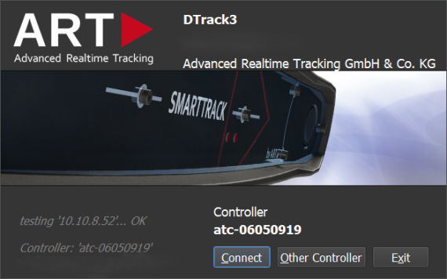
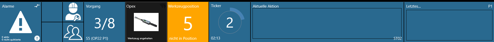
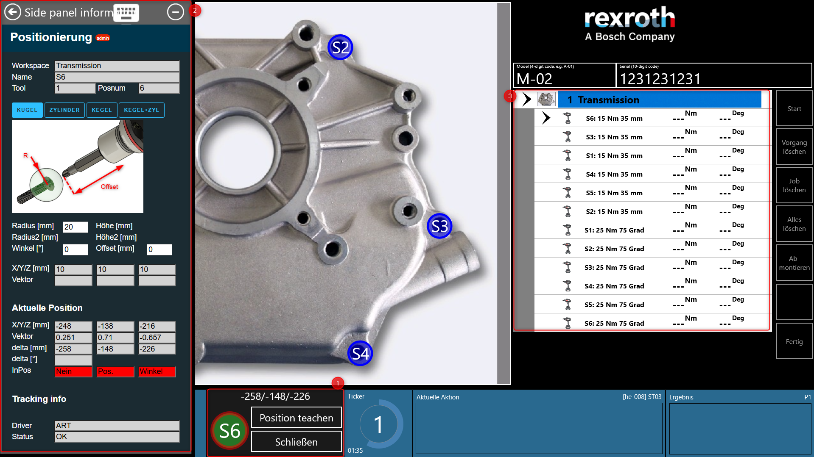
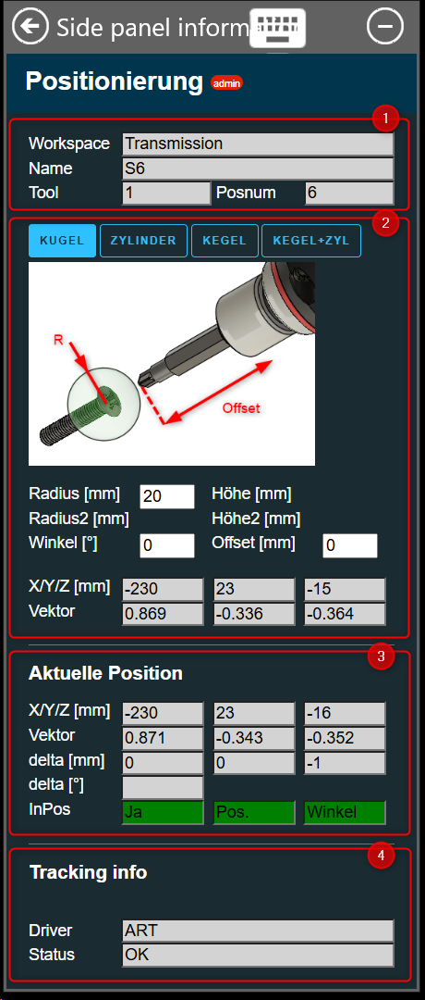
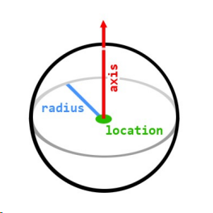
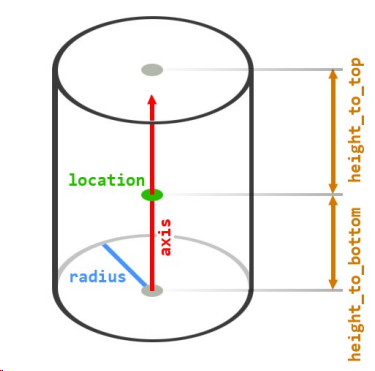

# ART-DTrack Positioning and Tool Tracking

{ align=right }
[ART DTrack](https://ar-tracking.com/en/product-program/products-connection-software-dtrack) is a realtime high precision infrared camera based tool tracking system with support for passive and active markers. It can be flexibly used with different tool types and models (tightening, riveting, hand-tracking using gloves, etc.) due to the passive markers. It is used to implement a large range of applications and is able to cover large rooms. Scalability is available from plug-and-play pre-calibrated stero cameras (`SmartTrack`) for a quick start in typical single-user assembly stations up to large multi-camera setups for covering huge areas. OGS provides a deep integration including teaching positions and setting tolerance definitions directly from within the OGS gui. It also supports advanced positioning deatures like multi-tool tracking, angle deviation checking and realtime coordinate tracking view), so there is typically no need to run a seperate application to configure the system.

!!! note

    One of the greatest features of the SmartTrack cameras is that they come factory-calibrated with linear cartesian coordinate system which provides mm-accuracy on all axis. With a few mouse clicks, the origin and orientation can be set using a provided ruler, so absolute measurements in workplace or workpiece-coordinates are possible out of the box! 

## Usage

If the system is correctly set up (see [Initial system setup](#initial-system-setup) below for more details), then you can specifiy which tasks are position controlled (in the [workflow configuration](#workflow-configuration)). On the station, you can then teach-in the positions and tolerances for the task.  

### Basic functionality

As the underlying idea for positioning is to enable the tool depending on some external information, this is actually similar to the concept of a socket tray / nut selector (enable the tool only, if the correct socket was used): both only enable the tool, if the correct conditions are met. OGS shows the state of "external enable", "socket tray selection" and "positioning" in the same spot in the OGS runtime GUI - next to the tools tile in the status bar.

Here is a sample screenshot of the OGS toolbar when the tool is not in the correct position (expected position 5 - yellow background):



As all three conditions might be required, OGS processes the information in a sequence:

1. Check if the correct socket is used (if any)
2. If a correct socket is available (or no check active), check the position
3. If the position is ok, check any additional external signals (external enable)

If any of the preconditions fail, then OGS jumps back in the sequence to the first missing condition - e.g. if the socket is switched while in the correct position, OGS again shows the socket request.

If the position on the part has changed (not set up initially, the camera has been moved (if not using a reference tracker), ...), then the correct position can be teached through the OGS interface. To start teaching, the following prerequisites must be met:

1. The workflow must be in the `stopped` state (click the `stop` button in the righthand action bar)
2. The current user needs the rights to do teach-in (see [OGS user rights](../../v3/lua/userrights.md))
3. The task must be position controlled (see [workflow configuration](#workflow-configuration) below)

If all preconditions are met, then clicking the tool tile will switch to the teach-in view:


The teach-in view changes the bottom status bar (and optionally opens the [teach-in sidepanel](#teach-in-sidepanel), see below):



You can now select the current task (❶) and see/edit its positioning parameters in the side-panel (❷, see [teach-in sidepanel](#teach-in-sidepanel) below for more information). The bottom status bar pane (❸) shows the current position difference (changes to green color if in tolerance for the selected task) and allows to update the recorded position by clicking the `teach position` button. To exit teach-mode, click the `close`button. Note, that the sidepanel can be kept open, so you can see the positioning parameters also in automatic/production mode.

!!! info

    The typical workflow for teaching in a set of tasks/bolts is to switch to teach-in mode, then 

    1. Select the task from the task list [❶]
    2. Modify the tolerance parameters and the tool offset (socket/nut length) [❷]
    3. Move the tool into the correct position
    4. Hit the `teach position` button [❸]
    5. Repeat from 1. until all tasks are teached.

    Finally exit the teaching mode.

### Workflow configuration

Conceptionally, positioning is connected to the bolts position on the part, whereas the socket information belongs to the tightening operation (i.e. likely the same for all bolts with the same tightening parameters). OGS therefore uses different spots in the GUI of the workflow editor to configure these parameters (external enable is scripting only):


A task is marked as positioning-enabled by setting the task parameter Position sensor(PS) (column PS in the jobs editor tasks list) to a non-zero value. If a tasks PS-value is set to zero, then the position is not tracked for the task.

!!! note

    If you can't see the PS column, then use `Database --> Settings` and check 
    the"Use Position Encoder" in the Job section or set the `POSITION_ENCODER_IN_USE` in the GLOBAL-Section of the INI Parameters on the Tools tab to 1 - see the bottom part of the screenshot above)

### Teach-in sidepanel

For information about how to access the teach-in view and howto open the sidepanel, see [basic functionality](#basic-functionality) above. 

<div class="mdx-columns" markdown>

{ align=right, width="200" }
The side panel consists of four sections:

1. Information: Shows the currently selected job, task, tool and position number as configured in the workflow editor (see [workflow configuration](#workflow-configuration)).
2. Tolerance parameters for the currently selected task. This includes the type of the tolerance body (sphere, cylinder, frustum, frustum+cylinder) and its parameters as well as the offset and the actually recorded 6DOF coordinates. The offset is used to add a linear offset along the tool axis for the actually used socket/bit. The "Vector" values are the coordinates of the normalized vector of the tool axis orientation.
3. Current position: The current position information received from the ART DTrack/SmartTrack camera system. This also shows the difference values between the recorded position and the current position of the tool. The InPos row shows the calculated state (position within tolerance, angle within tolerance).
4. Tracking info: Shows the current type of positioning driver active (OGS supports multiple drivers) and the current state. You can find some cleartext error messages, e.g. if the tool is not visible to the system, etc. 

Notes:
- If the position is not teached, the tolerance parameters default to sphere, radius = 20mm, offset = 0mm or the last teached parameters
- To teach a number of tasks, ideally set the tolerance parameters on the first task and teach. Subsequently teached tasks will then show the previously defined tolerance parameters by default
- Fields with white background are editable (rights required!). 

</div>

!!! important

    Changes to the parameters in the side panel are only saved, if the 
    bottom status bar button `teach position` is clicked!

The following tolerance bodys are available:

=== "Sphere"

    { width="200" }

=== "Cylinder"

    { width="200" }

=== "Frustum"

    { width="200" }

=== "Frustum+Cylinder"

    { width="200" }


## Initial system setup

### OGS configuration

As described in [OGS positioning overview](README.md), OGS provides all drivers needed to integrate ART-DTrack positioning into your project. However a few manual steps are still needed to configure the project:

- Load the tool tracking support in `config.lua`
- Configure the tracking parameters and tool, body, etc. mapping in `station.ini`
- Configure the OGS webserver and add the html pages to support the sidepanel teach-in ui to the project


#### config.lua and station.ini

To load the tool tracking support, include the `positioning.lua` file in your project (through the `config.lua` requires list or directly by adding a 
`require('positioning)` somewhere in the code).

Adding it to the `requires` table in the projects `config.lua` will then look as follows:

```  lua hl_lines="7"
-- add the shared folder (..\shared)
OGS.Project.AddPath('../shared')

requires = {
	"barcode",
	"user_manager",
	"positioning",      -- (1)!
    -- possibly more...
}
current_project.logo_file = '../shared/logo-rexroth.png'
current_project.billboard = 'http://127.0.0.1:60000/billboard.html'
```

1.  Add this line to include the `positioning.lua` driver in the project.

As described in [OGS positioning overview](README.md), OGS automatically scans the `[OPENPROTO]` and `[CHANNELS]` sections for positioning references. If found, then the assigned section is read to determine the driver to be used and to read the associated parameters.

To configure the ART DTrack/SmartTrack driver, the following configuration is needed (the sample shown below includes a single linked OpenProtocol tool, but you can link multiple tools to the ART driver, too):

``` ini
[OPENPROTO]
CHANNEL_01=192.168.1.42
CHANNEL_01_TYPE=GWK
CHANNEL_01_PORT=4002
; --> this channel shall use ART positioning
CHANNEL_01_POSITIONING=POSITIONING_ART_CH1

; Define the tracking parameters for CHANNEL_01
;
[POSITIONING_ART_CH1]
; Use the AR-Tracking positioning system
DRIVER=ART
; Positioning timeout in milliseconds. Defines the grace time before enable
; is removed for the tool, when leaving a position. If not set, defaults to 0.
TIMEOUT=1000
; Define the target tracker and tool adapter for this tool
; Target-ID: this is the model of the target mounted to the tool. By default,
; T1-T8 are provided, other targets can be defined in "targets.atti"-file 
TARGET_ID=T5
; Target-Mount-ID: specify the adapter geometry, so the ART driver can calulate
; the tool center point depending on where the target is mounted on the tool.
; By default, "Rexroth ESA030G" and "GWK Operator Plus" are provided, custom
; mounts may be added in "targetmounts.atti"
TARGET_MOUNT_ID=Rexroth ESA030G
; Default-length of the adapter mounted to the tool (tool center point)
OFFSET_MM=0

; Define The ART system setup 
;
[POSITIONING_ART]
; Define the IP-Address of the SmartTrack camera system
IP=10.10.2.108
; If you want to use custom targets or custom target_mounts, then you can
; specify these in "targets.atti" and "targetmounts.atti" in the following
; folder. If the folder is not specified, it defaults to the current projects
; folder.
;DB_FOLDER=
; If you want to set the reference tracker, then add the name of the tracker here.
; NOTE: the reference tracker must be configured through DTrack and *must* have
;       then name "reference" or "referenz" (case insensitive) as part of the
;       body name, else it will not be accepted.
REFERENCE_TRACKER=Claw Target 21 Reference
```

The ART system parameters must be set in the `[POSITIONING_ART]` section in `station.ini`. The following parameters are available:

- `IP` (required): Defines the hostname or IP address of the SmartTrack camera to use. See [DTrack configuration](#dtrack-configuration) below for more information about setting up the camera itself.
- `DB_FOLDER` (optional): Defines the folder, where the ART driver searches for custom target or tool mount definition data. If not given, defaults to the current OGS project folder.
- `REFERENCE_TRACKER` (optional): If a reference tracker (for relative positioning) shall be used, then the name of the body must be entered here. Note that the name **must** include the work `reference` (see [nominating a reference tracker](#nominating-a-reference-tracker) below). If not given or empty, then no reference tracker is used (absolute coordinates based on the camera coordinate system).

For each tool, additional parameters are set through a seperate section linked to the tool. The tool specific section uses the following parameters:

- `DRIVER` (required): Defines the driver to use. Must be set to `ART` to use the DTrack/SmartTrack system.
- `TIMEOUT` (optional): Defines a grace timeout if the tool gets out of position for a small time. If the tool returns into position before the time is exceeded, the enable signal is kept active. If the tool is out of position for longer than the given time, it gets disabled. If not given, it defaults to 0s.
- `TARGET_ID` (required): Defines the type of the target (body) mounted to the tool. The current version includes the predefined bodies T1-T8, other targets can be defined in "targets.atti"-file (see [custom bodies and tool mounts](#custom-bodies-and-tool-mounts) below)
- `TARGET_MOUNT_ID` (required): Defines the adapter geometry to use, so the ART driver can calulate the tool center point depending on where the target is mounted on the tool. The current version includes the "Rexroth ESA030G" and "GWK Operator Plus" adapter definitions. Custom mounts may be added in "targetmounts.atti" (see [custom bodies and tool mounts](#custom-bodies-and-tool-mounts) below)
- `OFFSET_MM` (optional, default = 0): Defines the default-length of the adapter mounted to the tool (distance to tool center point). Note, that the bit/socket length can also be specified when defining the positioning tolerances for a bolt.

{ align=right } Note that the body specified in `TARGET_ID` and the tool adapter specified in `TARGET_MOUNT_ID` together define the coordinate system for the tool, so the tool center point (as shown in the graphic) is the tip of the tools square output drive connector. Note, that typically a socket holder or quick-change adapter is mounted - this should be specified in the `OFFSET_MM`, so the offset compensates for the adapter length. Finally any bit or socket added will change the tool center point - but this is then defined by bit/socket/bolt in the OGS teach-in settings.   

#### Custom bodies and tool mounts 

Custom bodies and tool mounts are defined by adding their geometric data ([please contact ART](https://ar-tracking.com/)) into the following files (the location is defined through the `DB_FOLDER` setting, see above):

- `targets.atti`: Defines additional bodies
- `targetmounts.atti`: Defines additional (tool specific) target mounts/adapters

#### Sidepanel teach-in setup

To enable the side panel with teach-in functionality, the html files must be copied into the projects web root. Note that this also requires enabling the OGS integrated web server.

Here is the relevant fragment of `station.ini`:

``` ini title="station.ini"
[WebServer]
; The integrated web server is enabled, if a non-empty URL is given. Please note, that
; this uses the Microsoft http.sys Windows builtin web server, so you will have to
; register the listening URL with apropriate permissions using the `netsh http add urlacl`
; commmand (running elevated) from the windows command line, e.g.:
;   netsh http add urlacl url=http://127.0.0.1:60000/ sddl=D:(A;;GA;;;WD)
;
URL=http://127.0.0.1:60000/
;SDDL=D:(A;;GX;;;S-1-0-0)(A;;GA;;;S-1-5-11)
; Set the document root folder (if not given, defaults to the project base folder),
; this might be either a relative path (to the project folder) or an absolute one.
RootFolder=../shared/webroot
```

The html files for the positioning system are located in in the OGS installation directory at `<installdir>\lualib\libpositioning\webroot`. Copy all files into your projects webroot (as specified in the `[Webserver]` section in `station.ini`).


### DTrack configuration

Usually, there is no need to use DTrack for SmartTrack camera setups, as OGS configures the relevant parameters needed for data exchange automatically. However it is recommended to install DTrack anyway and run it for the following:

- Search for cameras to find the IP addresses (must be added to OGS `station.ini`, see above). To change the IP address of a Camera, see [changing SmartTrack IP address](#changing-smarttrack-ip-address) below.
- nominate a reference traget (see [nominating a reference tracker](#nominating-a-reference-tracker) below)
- Check tracker/target visibility (for quick debugging)
- Setup gain levels/filtering (to optimize the camera view)

See the DTrack system manual for more details.

!!! note

    Please make sure to not run DTrack and OGS at the same time, as the camera data stream can only be consumed by one application! 

#### Licensing

Using the camera with OGS requires a license for the `ART-ToolTrackingInterface (AddOn)`. To check the state and eventually request a license, open `DTRACK3 --> Licenses` from the DTrack main menu. This will show the following dialog:


If the state of the "system feature" `ART-ToolTrackingInterface (AddOn)` is "not supported", then click the `Hardware Info` button (hint: select one of the system features to enable the button) to get the cameras MAC address - this is required to request a license.

#### Nominating a reference tracker

To use a target (tracker, body) as a reference tag (so other trackers can report coordinates relative to this), the name of the body must be changed through DTrack. 

To do so, open DTrack and select `Tracking --> Body Administration (F8)` from the main menu. This will show the following dialog:


Select the body you want to rename and change its name (double click on the name) to include the word `reference` (lower/upper caps allowed). 

If you can't see your bodies, then click the `start search` button to start DTrack searching for bodies in the current camera view area.

!!! important

    To make a body a reference body, the name **must** include the work `reference`!

#### Changing SmartTrack IP address

The IP address of a SmartTrack camera can be conveniently read out by inserting an  USB-thumbdrive into the cameras USB port (or a SD-Card for cameras with SD-Card slot), then waiting for the camera to sound a double-beep (usually takes about 2-5 seconds). After the beep, the thumbdrive can be removed and inserted into a PC. On the thumbdrive you will find two new files addad to the root-directory:

- `ART_Controller_<serno>_info.txt`: This file has the current settings
- `ART_Controller_<serno>_setup.txt`: This file can be used to change the settings. It provides a template for modifying all parameters - to change, read the comments in the file and set the values according to your needs.

To change the IP address of the camera, modify one of the `SETNET=` sample parameters in the `ART_Controller_<serno>_setup.txt` file. Then save and unplug from the PC. 

To actually update the changed parameters in the camera, do the following:
- Plug the USB-thumbdrive into the camera
- Wait until the camera beeps three times
- Remove the USB-thumbdrive
- Power cycle the camera

The settings will now be activated. If you want, you can inset the USB-thumbdrive again to readout the settings again.


