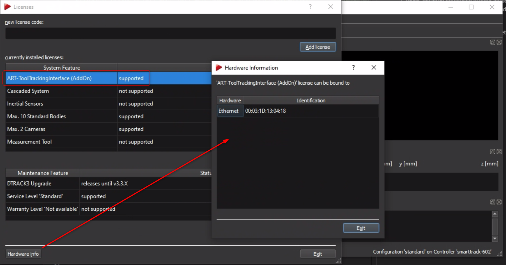
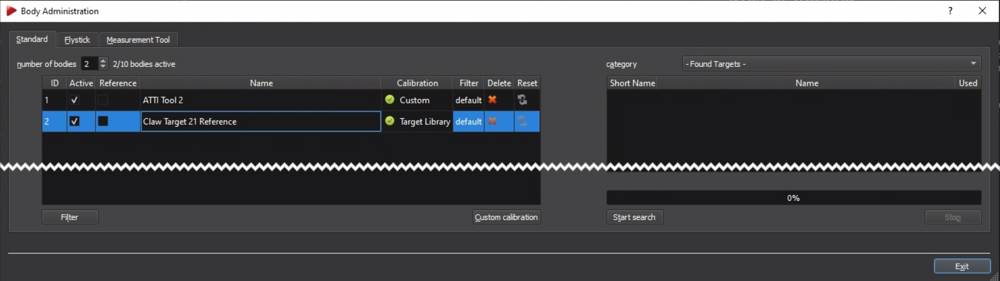

# ART-DTrack Positioning and Tool Tracking

{ align=right }
[ART DTrack](https://ar-tracking.com/en/product-program/products-connection-software-dtrack) is a realtime high precision infrared camera based tool tracking system with support for passive and active markers. It can be flexibly used with different tool types and models (tightening, riveting, hand-tracking using gloves, etc.) due to the passive markers. It is used to implement a large range of applications and is able to cover large rooms. Scalability is available from plug-and-play pre-calibrated stero cameras (`SmartTrack`) for a quick start in typical single-user assembly stations up to large multi-camera setups for covering huge areas. OGS provides a deep integration including teaching positions and setting tolerance definitions directly from within the OGS gui. It also supports advanced positioning deatures like multi-tool tracking, angle deviation checking and realtime coordinate tracking view), so there is typically no need to run a seperate application to configure the system.

## Usage

If the system is correctly set up (see [Initial system setup](#initial-system-setup) below for more details), then ...

### Basic functionality

### Workflow configuration

### Teach-in

## Initial system setup

### OGS configuration

As described in [OGS positioning overview](README.md), OGS provides all drivers needed to integrate ART-DTrack positioning into your project. However a few manual steps are still needed to configure the project:

- Load the tool tracking support in `config.lua`
- Configure the tracking parameters and tool, body, etc. mapping in `station.ini`
- Configure the OGS webserver and add the html pages to support the sidepanel teach-in ui to the project

#### config.lua and station.ini

### DTrack configuration

Usually, there is no need to use DTrack for SmartTrack camera setups, as OGS configures the relevant parameters needed for data exchange automatically. However it is recommended to install DTrack anyway and run it for the following:

- Search for cameras to find the IP addresses (must be added to OGS `station.ini`, see above). To change the IP address of a Camera, see [changing SmartTrack IP address](#changing-smarttrack-ip-address) below.
- nominate a reference traget (see [nominating a reference tracker](#nominating-a-reference-tracker) below)
- Check tracker/target visibility (for quick debugging)
- Setup gain levels/filtering (to optimize the camera view)

See the DTrack system manual for more details.

!!! note

    Please make sure to not run DTrack and OGS at the same time, as the camera data stream can only be consumed by one application! 

#### Licensing

Using the camera with OGS requires a license for the `ART-ToolTrackingInterface (AddOn)`. To check the state and eventually request a license, open `DTRACK3 --> Licenses` from the DTrack main menu. This will show the following dialog:

If the state of the "system feature" `ART-ToolTrackingInterface (AddOn)` is "not supported", then click the `Hardware Info` button (hint: select one of the system features to enable the button) to get the cameras MAC address - this is required to request a license.

#### Nominating a reference tracker

To use a target (tracker, body) as a reference tag (so other trackers can report coordinates relative to this), the name of the body must be changed through DTrack. 

To do so, open DTrack and select `Tracking --> Body Administration (F8)` from the main menu. This will show the following dialog:

Select the body you want to rename and change its name (double click on the name) to include the word `reference` (lower/upper caps allowed). 

If you can't see your bodies, then click the `start search` button to start DTrack searching for bodies in the current camera view area.

!!! important

    To make a body a reference body, the name **must** include the work `reference`!

#### Changing SmartTrack IP address

The IP address of a SmartTrack camera can be conveniently read out by inserting an  USB-thumbdrive into the cameras USB port (or a SD-Card for cameras with SD-Card slot), then waiting for the camera to sound a double-beep (usually takes about 2-5 seconds). After the beep, the thumbdrive can be removed and inserted into a PC. On the thumbdrive you will find two new files addad to the root-directory:

- `ART_Controller_<serno>_info.txt`: This file has the current settings
- `ART_Controller_<serno>_setup.txt`: This file can be used to change the settings. It provides a template for modifying all parameters - to change, read the comments in the file and set the values according to your needs.

To change the IP address of the camera, modify one of the `SETNET=` sample parameters in the `ART_Controller_<serno>_setup.txt` file. Then save and unplug from the PC. 

To actually update the changed parameters in the camera, do the following:
- Plug the USB-thumbdrive into the camera
- Wait until the camera beeps three times
- Remove the USB-thumbdrive
- Power cycle the camera

The settings will now be activated. If you want, you can inset the USB-thumbdrive again to readout the settings again.

