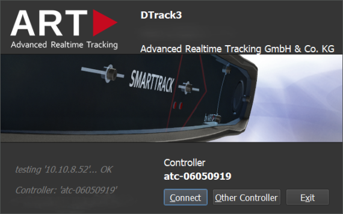

# ART-DTrack Positioning and Tool Tracking

 [ART DTrack](https://ar-tracking.com/en/product-program/products-connection-software-dtrack) is a realtime high precision infrared camera based tool tracking with passive (and active) markers. It can be flexibly used with different tool types and models (tightening, riveting, hand-tracking using gloves) due to the passive markers. Provides a large range of applications and covered space through the available range of cameras: from plug-and-play pre-calibrated stero cameras for a quick start in typical single-user assembly stations up to large multi-camera setups for covering huge areas. Highly integrated into OGS including teching and tolerance definitions through the OGS gui.
{ align=right }

