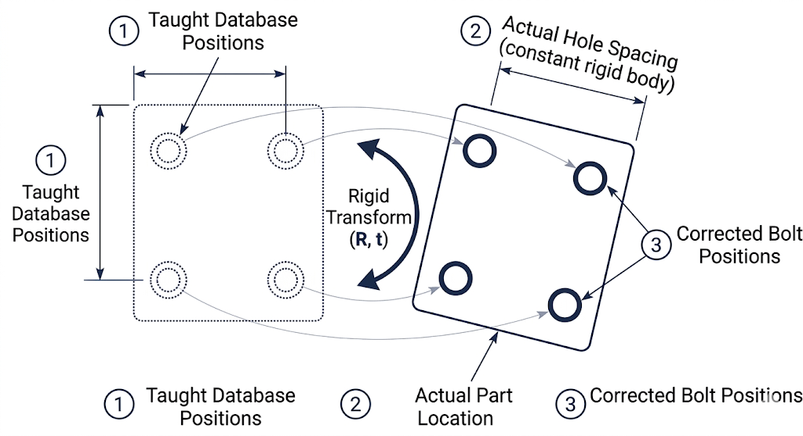
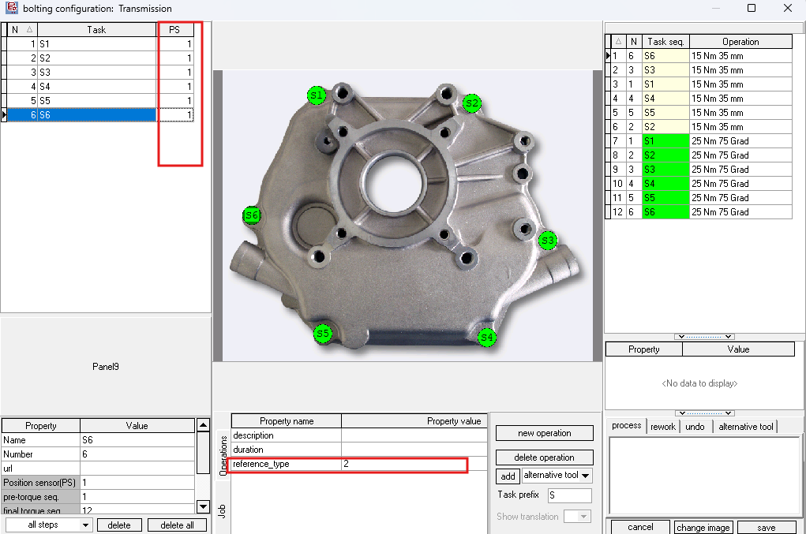
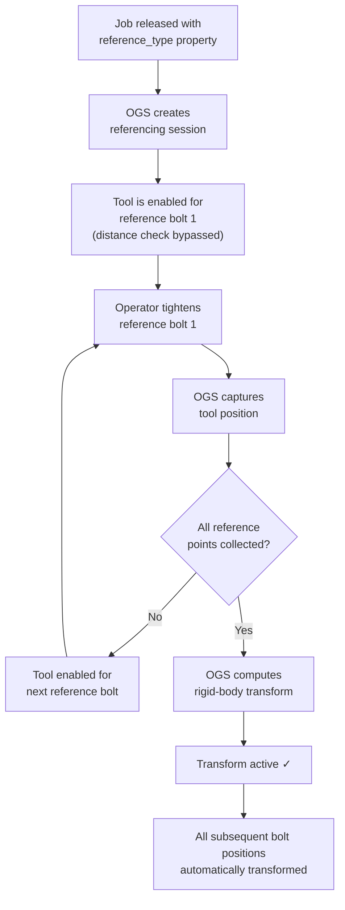
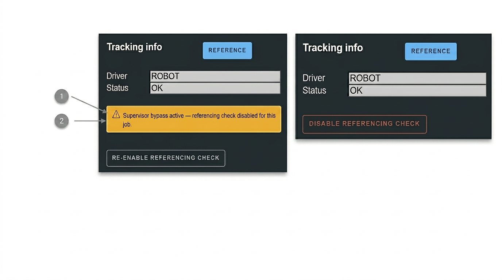
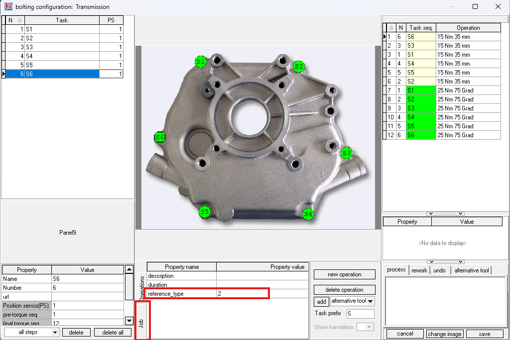
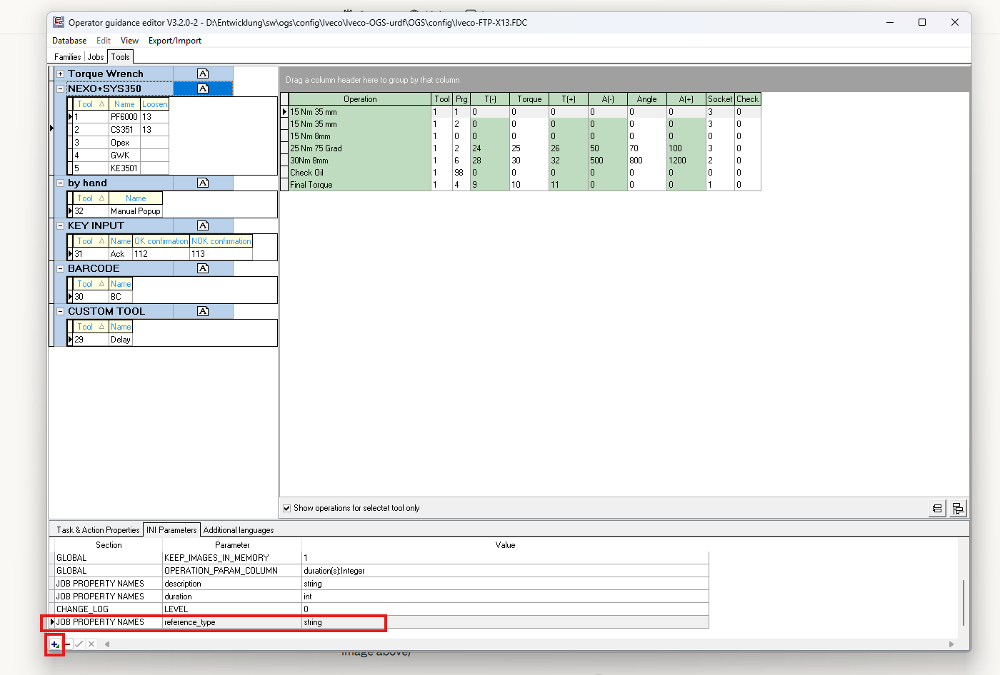
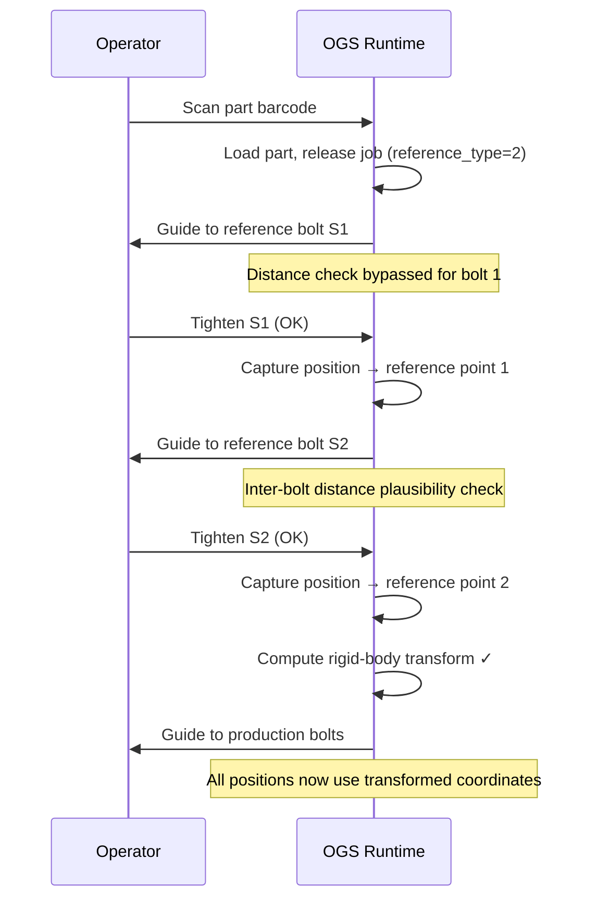
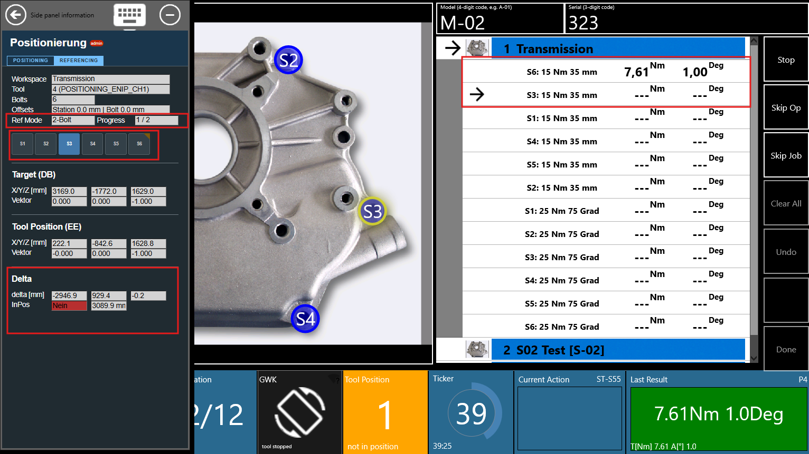
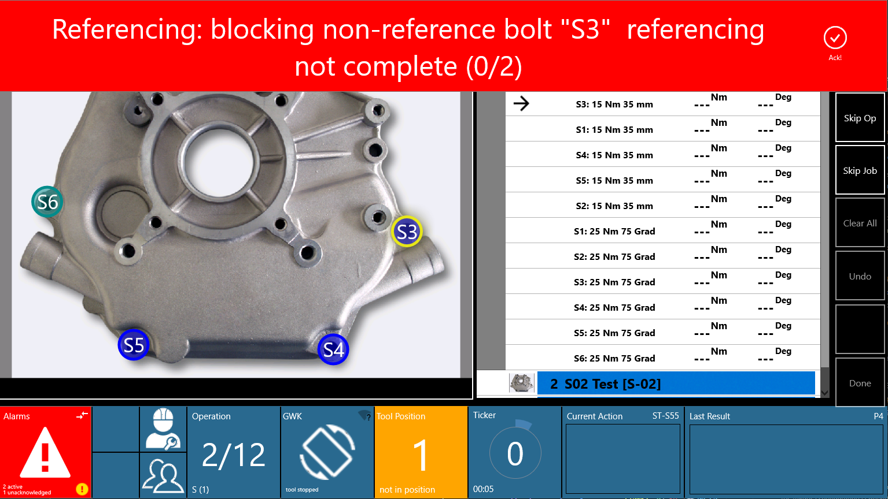

# Part Referencing

Part referencing compensates for variation in how a workpiece is placed in the station. When a new part arrives, it may be shifted or rotated compared to the position where bolt positions were originally taught. Referencing captures known positions on the actual part and computes a rigid-body transform to map the taught (database) coordinates to the actual part position, so that all subsequent positioning checks use corrected coordinates automatically.

<!-- TODO: screenshot — conceptual diagram showing a shifted part with taught positions (dotted) vs actual positions (solid) -->


## When to use referencing

| Scenario | Referencing needed? |
|---|---|
| Part always placed in the exact same position (fixture, jig) | No — absolute coordinates work |
| Part placed by hand, position varies each cycle | **Yes** — reference before each part |
| Part on a conveyor with variable stop position | **Yes** — reference after part is positioned |
| Positions imported from CAD (part coordinates) | **Yes** — map from part-local to machine coordinates |
| Fixed handling system (ROBOT driver), part always at same location | No — teach directly in machine coordinates |

## Referencing modes

Three referencing modes are available, configured per **job** via the `reference_type` property in the OGS workflow editor (see [configuration](#configuration) below):

| Mode | `reference_type` | Reference points | Best for |
|---|---|---|---|
| None | absent or `0` | 0 | Fixed part placement |
| Single position | `1` | 1 | Small translation offsets, known orientation |
| Two positions | `2` | 2 | Translation + rotation in one plane |
| Three positions | `3` | 3 | Full 3D translation + rotation |

!!! note "Mode 2 behaviour differs by driver"

    Mode 2 automatically adapts its computation depending on the positioning driver:

    - **ROBOT driver** — the direction vector is rigidly attached to the part (derived from kinematics), so OGS uses the full 6D pose (position + orientation) for a more accurate result.
    - **ART / optical driver** — the tool axis always approaches from the same direction regardless of part orientation, so OGS uses only the 3D positions with a minimum-rotation constraint.

    This is detected automatically from the `DRIVER=` setting in `station.ini`.

## Prerequisites

Before referencing can work, the following conditions must be met:

- The positioning system must be configured and operational (see the [OGS positioning overview](README.md) and the driver-specific setup guides for [ROBOT](positioning-robot-urdf.md) or [ART](positioning-art-dtrack.md))
- Reference bolt tasks **must have positioning enabled** (PS value > 0 in the workflow editor). Only tasks with a non-zero PS value participate in position tracking — tasks with PS=0 are invisible to the referencing system. See [workflow configuration](README.md#workflow-configuration) for how to set the PS column.
- Reference bolt positions must be **taught** (recorded coordinates exist in the database)
- The `reference_type` job property must be set (see [configuration](#configuration) below)

<!-- TODO: screenshot — heOpCfg jobs editor showing the PS column with non-zero values on reference bolt tasks -->


!!! info

    If you can't see the PS column in the workflow editor, go to `Database --> Settings` and check the "Use Position Encoder" option — see the [OGS positioning overview](README.md#workflow-configuration) for details.

## How it works

### Overview



### Auto-referencing flow

Referencing is **automatic** — the operator simply tightens bolts in order. OGS detects which bolt is a reference bolt and captures the position during the normal tightening cycle:

1. A job with the `reference_type` property is released
2. OGS reads the property and activates referencing in the requested mode (1, 2, or 3 points)
3. The **first N bolts** in the job's action sequence (with positioning enabled) become the reference bolt slots
4. When the operator tightens reference bolt 1, OGS captures the current tool position as reference point 1
5. For each subsequent reference bolt, OGS performs an **inter-bolt distance plausibility check** before capture (measured distance vs. database distance must match within tolerance)
6. Once all N points are collected, OGS computes the rigid-body transform (rotation + translation)
7. From this point on, every bolt position is automatically transformed to match the actual part placement

!!! warning "Reference bolts must be taught and positioning-enabled"

    Reference points are only captured when:
    
    - The task has positioning enabled (PS > 0 in the workflow editor)
    - The bolt position has been **taught** (exists in the database)
    - The tightening result is **OK**
    
    If any of these conditions are not met, the capture is skipped and OGS retries on the next attempt.

### Position guards

During the referencing collection phase (before the transform is active), OGS enforces several position-check guards:

| Guard | Condition | Behaviour |
|---|---|---|
| **Guard 0** | Supervisor bypass active | Skip ALL position checks — tool always enabled |
| **Guard 1** | Current bolt is next reference slot | First bolt: distance check bypassed (no prior anchor). Subsequent bolts: inter-bolt distance plausibility check. |
| **Guard 2** | Non-reference bolt, referencing incomplete | **Block tool** — prevents tightening against untransformed coordinates |
| **Guard 3** | Transform lost (e.g. OGS restart mid-job) | **Block tool** + alarm — operator must restart job or supervisor must bypass |

### Supervisor bypass

A supervisor (user level ≥ 2) can bypass the referencing check via the sidepanel. When bypass is active:

- All position checks are skipped (tool is always enabled)
- An alarm message "Supervisor Bypass Active" is shown
- The bypass persists across workflow pause/resume within the same part
- The bypass is cleared when a new part is scanned

<!-- TODO: screenshot — sidepanel showing the referencing bypass toggle for a supervisor -->


!!! tip "Important"

    Use the supervisor bypass only as a last resort (e.g. after OGS restart mid-job). When bypass is active, bolt positions are **not** checked against the referencing transform, so the operator must ensure the correct position manually.

### Restart detection

If OGS is restarted while a referenced job is in progress, the in-memory transform is lost. OGS detects this by checking whether reference bolt tasks are already marked as tightened in the workflow state:

- If tightened reference bolts are found but no transform exists, OGS sets an alarm and blocks all bolts
- The operator must either **restart the job from the beginning** or ask a supervisor to **bypass referencing**

### Error classification

When the solver fails, errors are classified into two categories:

| Category | Description | Action |
|---|---|---|
| **CONFIG** | Bolt layout unsuitable (collinear bolts, identical positions) | Always fails — change the reference bolt configuration |
| **MEASUREMENT** | Transient failure (measurement noise, distance mismatch) | May succeed on retry — retighten the reference bolt |

CONFIG errors trigger a persistent alarm with guidance text. MEASUREMENT errors allow the operator to retry the bolt (OGS rejects the tightening result and prompts for a retry).

## Configuration

### Setting `reference_type` in the workflow editor

The referencing mode is configured as a **job property** in the OGS workflow configurator (heOpCfg):

1. Open the workflow editor (heOpCfg)
2. Select the job that requires referencing
3. Open the **Job Properties** editor (right-click the job → Properties, or use the properties panel)
4. Add a new property with the name `reference_type`
5. Set the value to `1`, `2`, or `3` depending on the desired referencing mode

<!-- TODO: screenshot — heOpCfg showing the Job Properties editor with reference_type = 2 -->


<!-- TODO: screenshot — heOpCfg right-click menu showing "Properties" option on a job -->


| Property | Value | Effect |
|---|---|---|
| `reference_type` | absent or empty | Referencing disabled for this job |
| `reference_type` | `1` | Single-position 6D referencing |
| `reference_type` | `2` | Two-position referencing |
| `reference_type` | `3` | Three-position referencing |

!!! tip "Per-job configuration"

    Each job can have a different `reference_type` value. This allows mixing referenced and non-referenced jobs within the same part/workflow. The referencing state is initialised fresh each time a job is released.

### Which bolts become reference points?

OGS automatically selects the reference bolts from the job's **action sequence**:

1. Actions are sorted by their sequence number (ascending)
2. Only actions whose tool is assigned to a positioning channel **and** whose task has positioning enabled (PS > 0) are considered
3. The **first N** such actions become the reference bolt slots (where N = `reference_type`)

The reference bolt names are taken from the corresponding task names in the workflow.

<!-- TODO: screenshot — heOpCfg action sequence showing the first 2 actions highlighted as reference bolt slots -->


!!! note

    All reference measurements use the **same tool** — the tool from the first positioning action is locked for the entire referencing session. This means the same tightening tool must be used for all reference bolts, even if other tools are configured for subsequent production bolts.

### station.ini parameters

No additional `station.ini` parameters are required for referencing — it is driven entirely by the `reference_type` job property. The referencing engine uses the existing positioning driver configuration (`DRIVER=ROBOT` or `DRIVER=ART`).

However, one optional parameter exists for special cases:

``` ini title="station.ini"
[POSITIONING]
; Force position-only mode for 2-bolt referencing.
; Required for ROBOT arms that have no rotation sensor — the direction vectors
; are constant and cannot distinguish part rotation.
ROBOT_REF_USE_POSITION_ONLY=1
```

!!! note

    This parameter is read from the `[VPGSERVER]` section in `station.ini` (for backward compatibility). If your project does not have this section, simply add it.

### Plausibility thresholds

When adding subsequent reference points (2nd, 3rd), OGS checks whether the measured inter-bolt distance matches the database distance. The threshold is:

$$\text{threshold} = \max(2 \times \max(r1_i, r1_\text{new}), 50\text{mm})$$

Where $r1_i$ is the taught tolerance radius of the previously collected reference bolt, and $r1_\text{new}$ is the radius of the current bolt. The minimum threshold is 50 mm.

If the distance error exceeds this threshold, the reference point is **rejected** and the operator must retry.

## Referencing modes in detail

### Single position (mode 1)

**Input:** One 6D reference point (position + orientation).

**What OGS computes:** The rigid-body transform from a single taught/measured pose pair.

**Best for:** Parts that are always placed in a similar orientation but shifted in position. Requires only one reference bolt tightening.

**Limitation:** Assumes the part's Z-plane is approximately parallel to the machine Z-plane. If the part is also rotated, use mode 2 or 3.

### Two positions (mode 2)

**Input:** Two 3D reference points (with optional orientation for the ROBOT driver).

**ROBOT driver:** Uses the full 6D pose at each reference point. The direction vector from the kinematic chain is rigidly attached to the part, giving the computation additional orientation information.

**ART / optical driver:** Uses only the 3D positions with a minimum-rotation constraint. The tool axis direction is not part-fixed for optical trackers.

**Best for:** Parts that can shift and rotate in one plane (typical for horizontal assembly). Two reference bolts provide enough constraints for 2D rotation + 3D translation.

**Limitation:** The rotation around the line connecting the two reference points is underdetermined. Choose reference bolts that are **well separated** — collinear or nearly overlapping bolts will cause a CONFIG error.

### Three positions (mode 3)

**Input:** Three 3D reference points.

**What OGS computes:** The full 3D rigid-body transform from three point pairs.

**Best for:** Parts with full 3D orientation variation. Three non-collinear bolts fully define the rigid body transform.

**Limitation:** The three reference bolts must form a **triangle** (not a straight line). Collinear bolts will cause a CONFIG error.

## Typical operator workflow

### Normal operation (no issues)

Here is a typical 2-point referencing workflow:



Step by step:

1. Scan the part barcode → OGS loads the part
2. First job is released → OGS reads `reference_type=2` → referencing session starts
3. OGS guides operator to reference bolt S1 → tool is enabled (distance check bypassed)
4. Operator tightens S1 → position captured as reference point 1
5. OGS guides operator to reference bolt S2 → tool is enabled (inter-bolt distance check)
6. Operator tightens S2 → position captured as reference point 2 → transform computed and active
7. OGS guides operator through remaining production bolts → all positions use transformed coordinates
8. Repeat for subsequent jobs (each may have its own `reference_type`)

<!-- TODO: screenshot — OGS runtime process page showing the referencing progress indicator -->


<!-- TODO: screenshot — OGS runtime status bar tile showing "Ref 1/2" or similar progress indicator -->


### Handling errors

**Tightening result NOK on a reference bolt:**

- OGS keeps the referencing state unchanged
- The bolt is retried (standard NOK handling)
- Once the bolt tightening is OK, the reference point is captured

**Distance mismatch on reference bolt 2 or 3:**

- The reference point is rejected, alarm is shown
- The operator must retighten the bolt (move tool to the correct position)
- The rejection does not affect previously collected reference points

**OGS restart mid-referenced-job:**

- OGS detects that reference bolts are already tightened but no transform exists
- An alarm is shown: "Referencing data lost during restart!"
- Operator must restart the job from the beginning, or supervisor must bypass

<!-- TODO: screenshot — alarm message "Referencing data lost during restart" -->


<!-- TODO: screenshot — alarm popup with restart/bypass options -->


## Side panel integration

The positioning sidepanel shows referencing state information when referencing is active:

<div class="mdx-columns" style="display:grid; grid-template-columns: auto 250px;" markdown>

<div markdown>

- ❶ **Referencing state:** Shows the current mode and progress (e.g. "2-point referencing: 1/2 collected")
- ❷ **Bypass toggle:** Supervisors (level ≥ 2) can enable/disable the referencing bypass
- ❸ **Transform status:** Shows whether the rigid-body transform is active

</div>

<div markdown>

<!-- TODO: screenshot — sidepanel with referencing state section visible, annotated with ❶❷❸ -->
{ width="250" }

</div>

</div>

## Troubleshooting

### Reference bolt issues

| Symptom | Cause | Solution |
|---------|-------|----------|
| Reference point not captured | Bolt position not taught in DB | Teach the reference bolt position first |
| Reference point not captured | Tightening result was NOK | Retry the bolt — capture only happens on OK results |
| "Distance mismatch" on bolt 2/3 | Tool position too far from expected | Verify the tool is at the correct bolt; check sensor accuracy |
| "Reference bolts are collinear" | All reference bolts on a straight line | Choose bolts that form a triangle |
| "Two reference bolt positions are identical" | Same bolt taught at same position | Use distinct bolt locations for reference points |

### Workflow issues

| Symptom | Cause | Solution |
|---------|-------|----------|
| Referencing not activating | `reference_type` property missing on job | Add property in heOpCfg (see [configuration](#setting-reference_type-in-the-workflow-editor)) |
| Non-reference bolts blocked | Referencing incomplete | Complete the reference bolt tightening first, or use supervisor bypass |
| "Referencing data lost" alarm | OGS restarted mid-referenced-job | Restart the job from the beginning, or supervisor bypass |
| Transform not applying | `reference_type` = 0 or absent | Set `reference_type` to 1, 2, or 3 on the job |
| Wrong reference bolts selected | Action sequence order unexpected | Check the action sequence in heOpCfg — first N positioning actions become reference slots |

### Configuration errors

| Symptom | Cause | Solution |
|---------|-------|----------|
| CONFIG error: "collinear" | Bolt geometry unsuitable | Choose reference bolts forming a triangle |
| CONFIG error: "degenerate" | Positions too close or identical | Use bolts at distinct, well-separated locations |
| MEASUREMENT error: "determinant" | Measurement noise distorted the result | Retry — check tracking/sensor accuracy |
| Solver always fails for mode 2 (ROBOT) | Arm has no rotation sensor | Set `ROBOT_REF_USE_POSITION_ONLY=1` in `station.ini` (see [station.ini parameters](#stationini-parameters)) |
