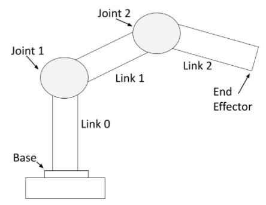
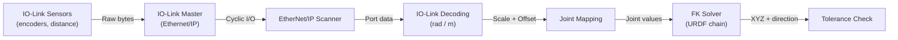
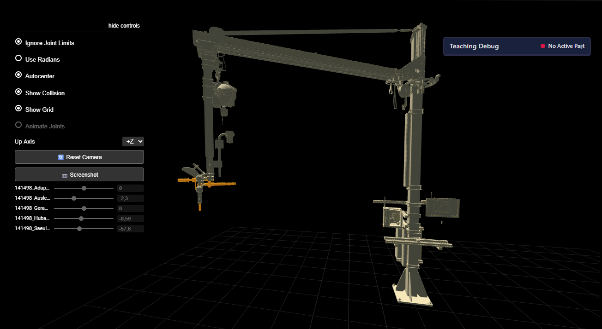
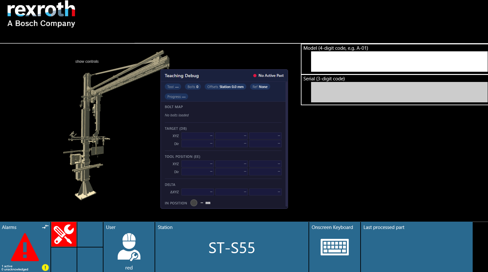
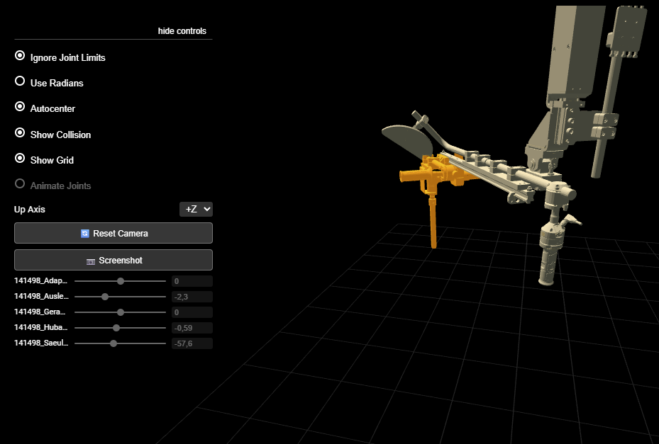
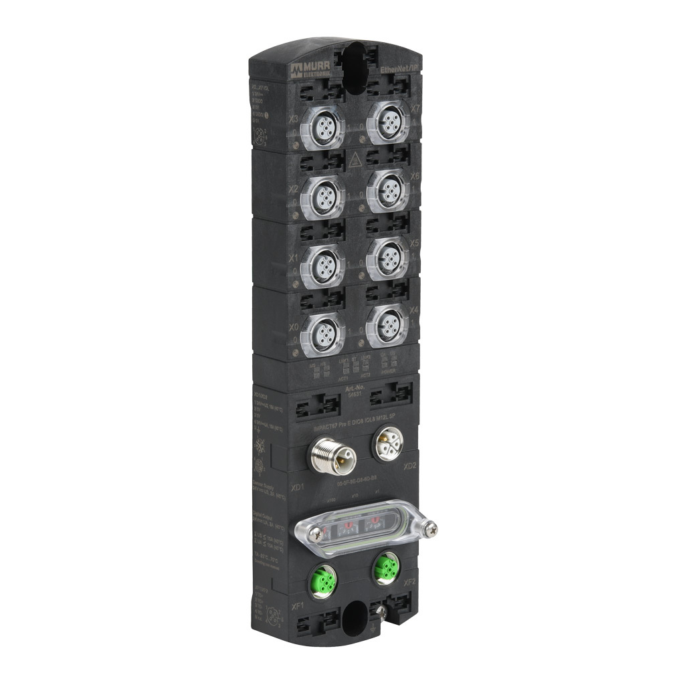
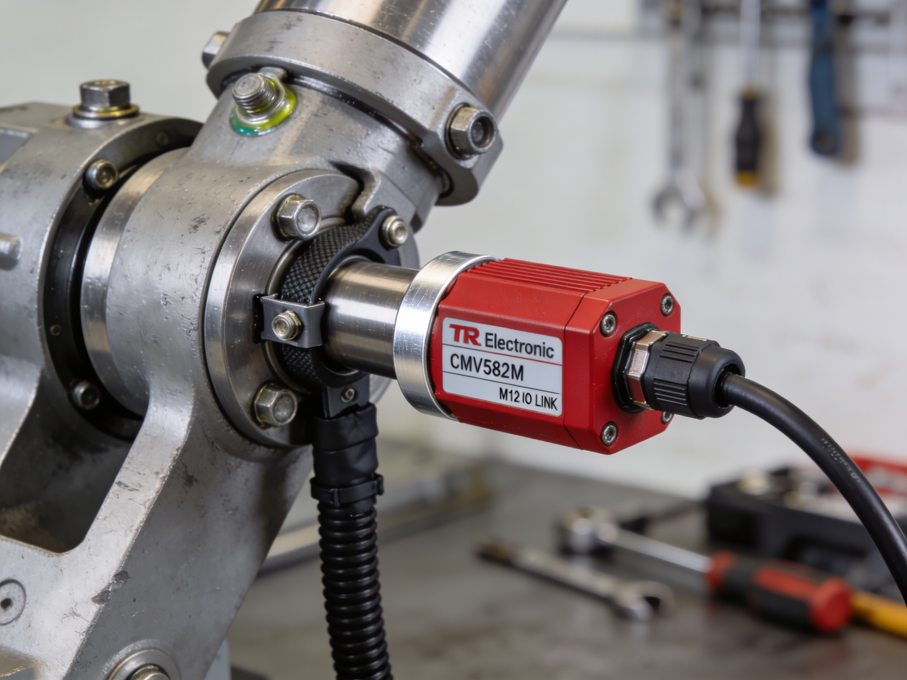
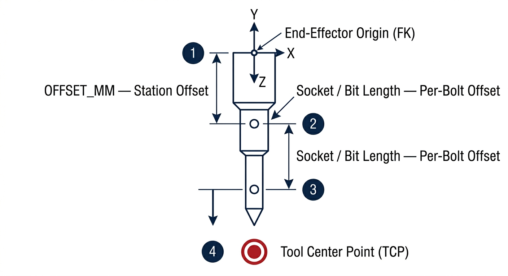
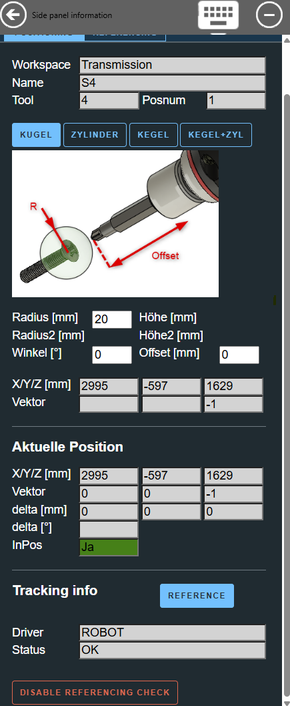
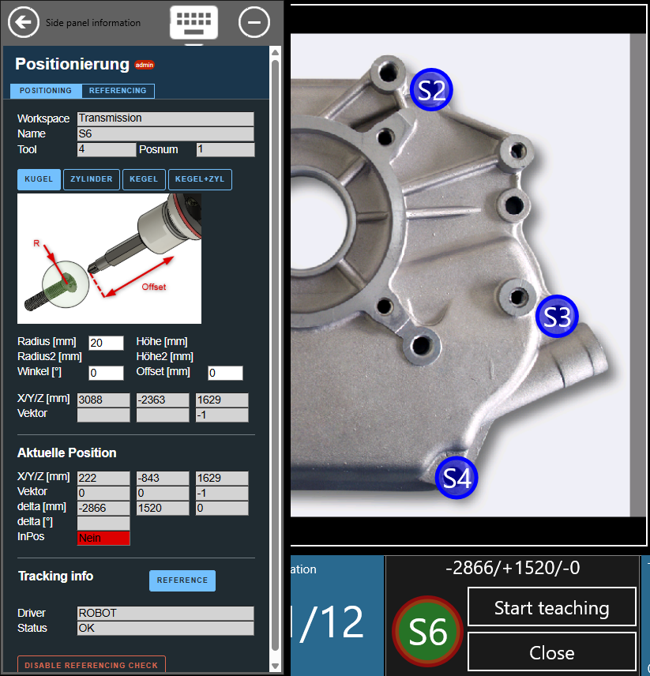

# URDF Robot FK Positioning

The ROBOT positioning driver uses **forward kinematics** (FK) computed from standard [URDF](https://wiki.ros.org/urdf) (Unified Robot Description Format) files to determine the real-time tool-tip position. Instead of tracking an optical marker, the system reads joint sensor values (rotary encoders and linear distance sensors) over an **Ethernet/IP** fieldbus, feeds them through the kinematic chain defined in the URDF model, and outputs the 3D Cartesian position and orientation of the end-effector. OGS then checks whether the tool is within the configured tolerance body and enables/disables the tightening tool accordingly.

<!-- TODO: screenshot — photo of a typical handling arm (crane/column-boom) with mounted tightening tool -->


!!! note

    The ROBOT driver is well suited for **mechanically constrained handling systems** (crane arms, column-boom manipulators, linear units) where every movable joint has a physical sensor. For free-space tracking of hand-held tools, see the [ART-DTrack driver](positioning-art-dtrack.md).

## Usage

If the system is correctly set up (see [Initial system setup](#initial-system-setup) below), you can specify which tasks are position-controlled in the workflow editor and teach-in positions and tolerances on the station. For details on the general positioning workflow (basic functionality, workflow configuration, teach-in, sidepanel, tolerance bodies), see the [OGS positioning overview](README.md).

!!! info

    A task is marked as positioning-enabled by setting the **PS** (Position Sensor) column to a non-zero value in the workflow editor (heOpCfg). Tasks with PS=0 are not tracked. See [workflow configuration](README.md#workflow-configuration) for details.

### How the ROBOT driver works

The ROBOT driver operates entirely through computation — no external camera or optical system is needed:



1. **IO-Link sensors** on each joint continuously report raw measurements (encoder increments or millimeters) over Ethernet/IP.
2. The I/O layer reads sensor data, decodes it to engineering units (radians or meters), and applies per-joint **scale** and **offset** corrections.
3. The **FK solver** walks the URDF kinematic chain and computes the 4×4 homogeneous transform for the end-effector link.
4. The resulting **XYZ position** (converted from meters to millimeters) and **direction vector** (Z-column of the rotation matrix) are stored in the channel's position record.
5. The positioning system computes the distance to the expected bolt position and determines whether the tool is within the configured tolerance body.

### Tool-tip offset

The tool-tip position is computed by projecting a distance along the tool's Z-axis from the end-effector origin. The total offset is the sum of:

- **Station offset** (`OFFSET_MM` in `station.ini`) — compensates for fixed adapters or quick-change couplings mounted on the tool
- **Per-bolt offset** — set in the tolerance parameters during teach-in (socket/bit length)

This matches the same offset concept used by the [ART driver](positioning-art-dtrack.md) — the difference is that the ROBOT driver computes the tool center point via FK instead of receiving it from an optical tracker.

### URDF 3D viewer

The OGS start page can display an interactive 3D visualization of the URDF robot model in the browser. The viewer renders the robot meshes and shows joint positions updating in real-time as sensor values change.

To enable the viewer, include `startpage_urdf` in `config.lua` and set the billboard:

``` lua
requires = {
    "lib.positioning",
    "startpage_urdf",           -- 3D URDF robot viewer
    "station_io",
    -- ...
}
current_project.billboard = 'startpage_urdf.html'
```

The viewer reads `KINEMATIC_FILE` from the positioning section in `station.ini` and loads the corresponding URDF model and mesh files. The initial camera view can be configured in the same section (see [camera configuration](#camera-configuration)).

<!-- TODO: screenshot — OGS start page showing the 3D URDF viewer with a loaded robot model -->


## Initial system setup

### Prerequisites

- **OGS V3.1.10 or later**
- **Network access** to the IO-Link master(s) connected to the joint sensors
- A **URDF robot model** describing the handling system's kinematics (generated from CAD)
- IO-Link sensors mounted on each movable joint

### Project folder structure

```
MyProject/
├── ST-MyStation/
│   ├── config.lua           # Module loading
│   ├── station.ini          # Hardware and positioning configuration
│   ├── station_io.lua       # Station I/O (uses station_io_robot_enip)
│   ├── custom.lua           # Station-specific code (optional)
│   └── model/
│       ├── my_robot.urdf    # URDF kinematic model
│       └── meshes/          # STL mesh files for visualization
│           ├── base_link.stl
│           ├── arm_link.stl
│           └── ...
```

### OGS configuration

#### config.lua

As described in [OGS positioning overview](README.md#project-configuration), include `lib.positioning` in your `config.lua`. The ROBOT driver additionally needs the station I/O module for reading sensors, and optionally the URDF viewer:

``` lua hl_lines="4 5 6"
OGS.Project.AddPath('../shared')

requires = {
    "lib.positioning",              -- (1)!
    "startpage_urdf",               -- (2)!
    "station_io",                   -- (3)!
    "custom",
}
current_project.billboard = 'startpage_urdf.html'
```

1. Core positioning — automatically loads the ROBOT driver based on `DRIVER=ROBOT` in `station.ini`
2. Optional: browser-based 3D URDF robot viewer on the start page
3. Station I/O — reads sensor data via Ethernet/IP and maps to FK joints

<!-- TODO: screenshot — OGS start page with the URDF 3D viewer loaded, showing the robot model in the billboard area -->


#### station.ini — Driver parameters

As described in [OGS positioning overview](README.md#project-configuration), link a tool channel to the positioning section. Then configure the ROBOT-specific parameters:

``` ini
[OPENPROTO]
CHANNEL_01=10.10.2.164
CHANNEL_01_TYPE=Nexo
CHANNEL_01_PORT=4545
; --> Enable positioning for this channel
CHANNEL_01_POSITIONING=POSITIONING_ENIP_CH1
; IMPORTANT: cyclic external condition checking must be enabled
CHANNEL_01_CHECK_EXT_COND=1

[POSITIONING_ENIP_CH1]
; Use the ROBOT (forward kinematics) positioning driver
DRIVER=ROBOT
; Grace period (ms) before disabling tool after leaving position (default: 0)
TIMEOUT=1000
; Station-level tool-tip offset in mm (adapter/quick-change length, NOT socket)
OFFSET_MM=0
; Path to URDF kinematic model (relative to project folder)
KINEMATIC_FILE=model/my_robot.urdf
; End-effector link name in the URDF. If omitted, auto-detected as the
; terminal link of the kinematic chain.
KINEMATIC_END_EFFECTOR=my_tool_link
; Debug trace level (0=off, ≥1=log TCP position, ≥2=verbose FK)
DEBUG=0
```

<!-- TODO: screenshot — OGS XTRACE window showing ROBOT driver initialization messages at startup -->


**Parameter reference:**

| Parameter | Required | Default | Description |
|-----------|----------|---------|-------------|
| `DRIVER` | **Yes** | — | Must be `ROBOT` |
| `TIMEOUT` | No | `0` | Grace period (ms) before disabling tool after leaving position. Set to `-1` for one-shot enable. |
| `OFFSET_MM` | No | `0` | Station-level tool-tip offset in mm. Added to per-bolt offset from teach-in. Use for fixed adapters. |
| `KINEMATIC_FILE` | **Yes** | — | Relative path to the URDF file |
| `KINEMATIC_END_EFFECTOR` | No | *(auto)* | End-effector link name. If omitted, the terminal link in the chain is used. |
| `DEBUG` | No | `0` | XTRACE debug level. `0`=off, `≥1`=log offsets and TCP, `≥2`=verbose FK. |

#### Camera configuration

Optional parameters in the same positioning section control the initial view of the 3D URDF viewer:

``` ini
; Camera position (XYZ in meters, in URDF base-frame coordinates)
CAMERA_POSITION_X=1.11
CAMERA_POSITION_Y=2.42
CAMERA_POSITION_Z=2.25
; Camera look-at target (XYZ in meters)
CAMERA_TARGET_X=0.96
CAMERA_TARGET_Y=2.40
CAMERA_TARGET_Z=1.86
; Zoom level (1 = default)
CAMERA_ZOOM=1
```

You can adjust the camera interactively in the 3D viewer and then copy the values back to `station.ini`.

<!-- TODO: screenshot — 3D viewer showing camera position controls or the camera gizmo -->


#### Joint-to-sensor mapping

Each movable URDF joint that has a physical sensor requires a mapping section. The section name follows the pattern `[<POSITIONING_SECTION>:<URDF_JOINT_NAME>]`:

``` ini
; Rotary encoder on IO-Link port 1
[POSITIONING_ENIP_CH1:base_rotation]
DEVICE=IOLINK_MASTER
PORT=1

; Distance sensor on port 2, inverted direction
[POSITIONING_ENIP_CH1:arm_extension]
DEVICE=IOLINK_MASTER
PORT=2
SCALE=-1
OFFSET=0
```

| Parameter | Required | Default | Description |
|-----------|----------|---------|-------------|
| `DEVICE` | **Yes** | — | Logical name of the IO-Link master (as defined in `[STATION_IO_ENIP]`) |
| `PORT` | **Yes** | — | IO-Link port number (1–8) on the master |
| `SCALE` | No | `1.0` | Multiplier applied to the decoded sensor value. Use `-1` to invert direction if sensor mounting is reversed. |
| `OFFSET` | No | `0.0` | Value added after scaling (radians for rotary, meters for linear sensors) |

!!! note

    Only joints with a physical sensor need a mapping section. URDF `fixed` joints are automatically skipped. If a movable joint has no mapping, a warning is logged but the system continues — that joint will stay at its URDF default value (clamped to joint limits).

### Ethernet/IP and IO-Link setup

<!-- TODO: screenshot — IO-Link master device (e.g. Murr Impact67) with connected sensor cables -->
{ width="400" }

#### IO-Link master

Define Ethernet/IP devices in the `[STATION_IO_ENIP]` section:

``` ini
[STATION_IO_ENIP]
; Format: <logical_name>=<ip_address>,<device_model>
IOLINK_MASTER=192.168.100.150,MURR_IMPACT67_PROE
; Debug level: 0=off, 1=errors, 2=warnings, 3=verbose
DEBUG=0
```

**Supported IO-Link masters:**

| Model | Manufacturer | Ports | Notes |
|---|---|---|---|
| `MURR_IMPACT67_PROE` | Murrelektronik | 8 | Impact67 Pro-E, 40 bytes per port |
| `BalluffBNI006A` | Balluff | 8 | BNI006A, full EDS connection |

#### IO-Link port assignments

Map ports to sensor models in a section named after the logical master name:

``` ini
[IOLINK_MASTER]
PORT1=TR_CMV582M-00028        ; Rotary encoder
PORT2=Wenglor_P1PY101         ; Linear distance sensor
PORT3=TR_CMV582M-00028
PORT4=Wenglor_P1PY101
; Ports 5-8 unused
```

#### Supported sensors

**TR Electronic CMV582M — Rotary encoder**

| Property | Value |
|---|---|
| Model | `TR_CMV582M-00028` |
| Type | Absolute rotary encoder (IO-Link) |
| Output unit | Radians |
| Resolution | 4096 increments/revolution |
| Conversion | $\theta = 2\pi \times \frac{\text{increments}}{4096}$ |

Supports writing a preset value for homing/referencing.

<!-- TODO: screenshot — TR Electronic CMV582M rotary encoder mounted on a joint -->
{ width="300" }

**Wenglor P1PY101 — Laser distance sensor**

| Property | Value |
|---|---|
| Model | `Wenglor_P1PY101` |
| Type | Laser distance sensor (IO-Link) |
| Output unit | Meters |
| Conversion | $d = \frac{\text{raw}}{1000}$ (raw is in mm) |

Special status values (returned as sensor error, no numeric value):

| Raw value | Meaning |
|---|---|
| `0x7FF8` | Object too far |
| `0x8008` (signed) | Object too near |
| `0x7FFC` | No signal |

<!-- TODO: screenshot — Wenglor P1PY101 laser distance sensor mounted on a linear joint -->
{ width="300" }

!!! tip "Adding new sensor types"

    New IO-Link sensor types can be added by defining their decode/encode functions in `iolink_devices.lua`. Each entry provides `fnDecodeInput(raw)` returning the engineering-unit value and an optional status string.

### URDF model preparation

The URDF file defines the kinematic chain of the handling system. It uses standard [ROS URDF format](https://wiki.ros.org/urdf/XML).

**Requirements:**

- **Joint types:** `revolute`, `prismatic`, and `fixed` are supported. Fixed joints define static geometry and require no sensor.
- **Units:** Positions in meters, angles in radians (standard URDF convention).
- **Mesh files:** STL format, referenced as `<mesh filename="meshes/link_name.stl" scale="0.001 0.001 0.001" />`. The `scale` converts from CAD units (typically mm) to meters.
- **Joint limits:** Define `<limit lower="..." upper="..." />` for all movable joints. The FK solver clamps initial joint values to these limits.

!!! warning "Joint default clamping"

    A prismatic joint with `lower="0.5"` will **not** start at zero — the FK solver clamps the initial default into `[lower, upper]`. This is intentional to prevent physically impossible starting positions.

#### Example URDF fragment

```xml
<robot name="my_arm">
    <link name="base_link">
        <visual>
            <geometry>
                <mesh filename="meshes/base_link.stl" scale="0.001 0.001 0.001" />
            </geometry>
        </visual>
    </link>

    <joint name="base_rotation" type="revolute">
        <parent link="base_link" />
        <child link="arm_link" />
        <origin xyz="0 0 1.5" rpy="0 0 0" />
        <axis xyz="0 0 1" />
        <limit lower="-3.14" upper="3.14" />
    </joint>

    <link name="arm_link">
        <visual>
            <geometry>
                <mesh filename="meshes/arm_link.stl" scale="0.001 0.001 0.001" />
            </geometry>
        </visual>
    </link>

    <!-- Fixed joint to tool (no sensor needed) -->
    <joint name="tool_mount" type="fixed">
        <parent link="arm_link" />
        <child link="tool_link" />
        <origin xyz="0 0 -0.3" rpy="0 0 0" />
    </joint>

    <link name="tool_link" />
</robot>
```

#### File placement

Place the URDF and mesh files in the station's `model/` directory:

```
ST-MyStation/
└── model/
    ├── my_robot.urdf
    └── meshes/
        ├── base_link.stl
        ├── arm_link.stl
        └── tool_link.stl
```

The web server maps the `/model` URL to this directory automatically, so the 3D viewer can load the mesh files.

<!-- TODO: screenshot — tool offset diagram showing station offset + bolt offset along the Z-axis -->
{ width="300" }

!!! tip "Generating URDF from CAD"

    URDF files are typically exported from CAD assemblies. The STL meshes should be placed in a `meshes/` subfolder. URDF `<mesh>` references use paths relative to the URDF file location.

### Sidepanel teach-in setup

The webserver configuration for the side panel is identical to the general OGS positioning setup — see [OGS positioning overview](README.md) and [ART sidepanel setup](positioning-art-dtrack.md#sidepanel-teach-in-setup) for the `[WebServer]` and `[SidePanel]` configuration.

<div class="mdx-columns" style="display:grid; grid-template-columns: auto 250px;" markdown>

<div markdown>

The sidepanel shows `ROBOT` in the "Tracking info" section (section ❹) instead of `ART`. All other functionality (tolerance body selection, offset, teach position) works identically:

- ❶ Job, task and position information
- ❷ Tolerance parameters and taught coordinates
- ❸ Current position and difference values
- ❹ Tracking info showing `ROBOT` driver status

</div>

<div markdown>

<!-- TODO: screenshot — sidepanel with ROBOT driver showing "Driver: ROBOT" in section ❹ -->
{ width="250" }

</div>

</div>

<!-- TODO: screenshot — sidepanel teach-in view with position difference values highlighted (green = in tolerance) -->
{ width="400" }

## Complete configuration example

A full working `station.ini` for a station with a Nexo tool and a 4-joint handling arm (2 rotary encoders + 2 linear sensors):

<!-- TODO: screenshot — photo of the actual ST-C91 handling arm installation at the station -->


``` ini title="station.ini"
[OPENPROTO]
CHANNEL_01=10.10.2.164
CHANNEL_01_TYPE=Nexo
CHANNEL_01_PORT=4545
CHANNEL_01_CHECK_TIME_ENABLED=1
CHANNEL_01_CCW_ACK=1
CHANNEL_01_POSITIONING=POSITIONING_ENIP_CH1
CHANNEL_01_CHECK_EXT_COND=1

[POSITIONING_ENIP_CH1]
DRIVER=ROBOT
TIMEOUT=1000
OFFSET_MM=0
KINEMATIC_FILE=model/141497_C91_heat_exchanger.urdf
KINEMATIC_END_EFFECTOR=141497_Schraubwerkzeug-v1

CAMERA_POSITION_X=1.11
CAMERA_POSITION_Y=2.42
CAMERA_POSITION_Z=2.25
CAMERA_TARGET_X=0.96
CAMERA_TARGET_Y=2.40
CAMERA_TARGET_Z=1.86
CAMERA_ZOOM=1

; Joint-to-sensor mapping (section name = POSITIONING_SECTION:URDF_JOINT_NAME)
[POSITIONING_ENIP_CH1:141497_Saeule-v1_Schwenken-Ausleger]
DEVICE=IOLINK_MASTER
PORT=1

[POSITIONING_ENIP_CH1:141497_Schwenkarm-v1_Y-Hub-Ausleger]
DEVICE=IOLINK_MASTER
PORT=2
SCALE=-1

[POSITIONING_ENIP_CH1:141497_Hubachse-v1_schwenken_Adaption]
DEVICE=IOLINK_MASTER
PORT=3
SCALE=-1

[POSITIONING_ENIP_CH1:141497_hl-v1_Z-Hub-Geraet]
DEVICE=IOLINK_MASTER
PORT=4

; Ethernet/IP fieldbus
[STATION_IO_ENIP]
IOLINK_MASTER=192.168.100.150,MURR_IMPACT67_PROE
DEBUG=0

[IOLINK_MASTER]
PORT1=TR_CMV582M-00028
PORT2=Wenglor_P1PY101
PORT3=TR_CMV582M-00028
PORT4=Wenglor_P1PY101

; Webserver (required for sidepanel and URDF viewer)
[WebServer]
URL=http://127.0.0.1:60000/
RootFolder=../shared/webroot

[SidePanel]
URL=local://sidepanel.html
Key=112
Width=24
```

## Troubleshooting

### Sensor issues

| Symptom | Cause | Solution |
|---------|-------|----------|
| "No position info available" | IO-Link master not connected | Check Ethernet cable and IP in `[STATION_IO_ENIP]` |
| Joint stuck at default value | Missing joint mapping section | Add `[POSITIONING_SECTION:joint_name]` to `station.ini` |
| Position jumps or oscillates | Incorrect `SCALE` | Verify sensor mounting direction; use `SCALE=-1` to invert |
| Constant position offset | Wrong `OFFSET` value | Measure at a known reference point and adjust `OFFSET` |
| Sensor returns no data | Object out of range (Wenglor) | Check that workpiece is within sensor measurement range |

### URDF / FK issues

| Symptom | Cause | Solution |
|---------|-------|----------|
| "Error loading URDF file" | File not found or invalid XML | Verify `KINEMATIC_FILE` path is relative to the project folder |
| "Could not determine end-effector" | No terminal link in URDF | Set `KINEMATIC_END_EFFECTOR` explicitly |
| Position scaled incorrectly | Wrong mesh `scale` in URDF | Ensure `scale="0.001 0.001 0.001"` if CAD is in mm |
| Joint starts at unexpected value | Default clamped to URDF limits | Expected for joints where `lower > 0` |

### Configuration errors

| Symptom | Cause | Solution |
|---------|-------|----------|
| "Positioning without cyclic enable check" | `CHECK_EXT_COND` not set | Add `CHANNEL_xx_CHECK_EXT_COND=1` to `[OPENPROTO]` |
| "unknown/missing DRIVER" | Typo in `DRIVER=` value | Must be exactly `ROBOT` |
| "No IO-Link joints mapped" | No sensor sections defined | Add at least one `[POSITIONING_SECTION:joint_name]` section |
