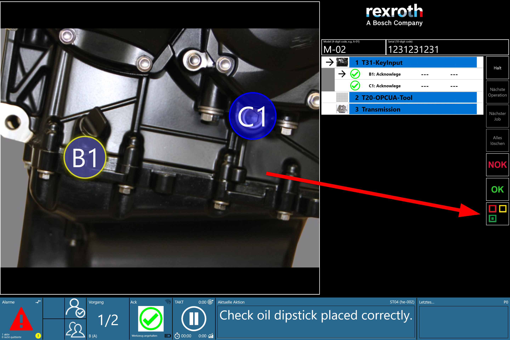

# Lean button

## Overview 

The OGS runtimes UI provides an optional button to allow the operator to execute some custom actions. This is typically used to open the side panel (see [Sidepanel](./sidepanel.md)) with a specific web page which allows custom interactions (e.g. reporting some issues or calling for help - typically for lean management purposes - that's where the name comes from).



The button must be enabled through `station.ini` (see [Prerequisites](#prerequisites)) and an action must be implemented through Lua code (see sample below). Without custom Lua code, the button does not provide any action.

## Prerequisites

To enable the the Lean button, modify `station.ini` by adding a `[LEAN]` section and setting the `ENABLED` parameter to a non-zero value. Here is a sample:

``` ini title="station.ini"
[LEAN]
; Enable the Lean button by setting ENABLED=1
ENABLED=1
```

## Lua interface

The Lua interface consists of only has a single function (`Lean_OnButtonClicked()`). The function must be implemented in the global scope by the user code. The function is called by the OGS core whenever the Lean button is clicked in the user interface.

### Functions

| Function Name | Return Type | Description |
| -------- | ----------- | ----------- |
| `Lean_OnButtonClicked()` | (none) | Called by OGS whenever the Lean button is clicked | 


### Sample code

The following sample code (add it to a file and reference it through `config.lua`) opens the side panel whenever the Lean button is clicked.

```LUA
-- Register the function in the global scope
-- The function is called everytime a user clicks the Lean button
Lean_OnButtonClicked = function()
    -- Process the Lean button click event 

    -- e.g. open the side panel with a custom url
    -- Make the SidePanel visible, set the width to 25% and navigate the
    -- web browser to https://www.my-url.com/mypage
    Browser.Show('SidePanel', 'https://www.my-url.com/mypage', 0, '25')
end
```


