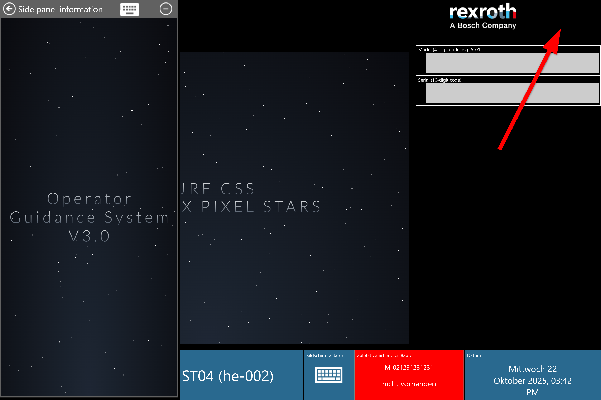

# Sidepanel

## Overview 

The OGS runtimes UI provides an optional side panel to display additional information or to interact with the system. If activated, the side panel appears on the left hand side of the screen and overlaps the main UI. The side panel can be opened by double-clicking the top right corner (as indicated on the screenshot below - works on both the idle and the process screen): 



The sidepanel mainly host a web browser control (the default URL is specified in `station.ini`) but also provides a few buttons in the header row:

- :material-arrow-left-circle: Hide the side panel
- :material-keyboard: Show the on-screen keyboard
- :material-minus-circle: Minimize the OGS application to the windows status bar

The side panel can also be accessed from Lua (show, hide, interact with the web browser) code, so this can be used for various purposes and customizations (e.g. for [Lean Management](lean-button.md)).  

## Prerequisites

To enable the the side panel, modify `station.ini` by adding a `[SidePanel]` section and setting the `Url` parameter to a non-empty value. Here is a sample:

``` ini title="station.ini"
[SidePanel]
; Set the side panel URL - this can be a full URL (e.g. https://www.google.com) or
; a local URL (this usually requires enabling the web server) in the [WebServer] section.
; If no protocol prefix is given (e.g. "sidepanel.html") and the WebServer is enabled,
; the configured WebServer URL is automatically prefixed (same for the local:// protocol)
; to the given url (i.e. "sidepanel.html" --> "http://127.0.0.1:60000/sidepanel.html).
Url=sidepanel.html

; Optionally define the sidepanel with (as percentage of the screen width: 1-99)
; If not set, defaults to 30%
Width=20

; Define a key code to hide the side panel (windows virtual key code)
; If not specified, no key is assigned.
;Key=
```

## Lua interface

There is no special Lua interface for accessing the side panel. All features are available through the [web browser interface](./webbrowser.md) of the `SidePanel` instance.

### Sample code

#### Show the side panel
```LUA
-- Make the SidePanel visible, set the width to 25% and navigate the
-- web browser to https://www.my-url.com/mypage
local oldUrl = Browser.Show('SidePanel', 'https://www.my-url.com/mypage', 0, '25')
```

#### Hide the side panel
```LUA
-- Hide the SidePanel
Browser.Hide('SidePanel')
```

